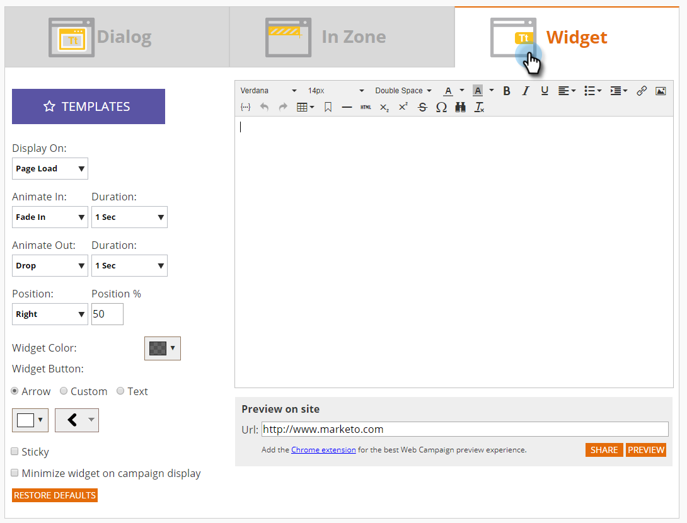

# Erstellen einer neuen Widget-Web-Kampagne {#create-a-new-widget-web-campaign}

Eine Web-Kampagne ist eine benutzerdefinierte Reaktion, die mit einem bestimmten Segment verknüpft ist und ein [Dialogfeld](/help/marketo/product-docs/web-personalization/working-with-web-campaigns/create-a-new-dialog-web-campaign.md) auf Ihrer Website, ein [In-Zone-Ersatz](/help/marketo/product-docs/web-personalization/working-with-web-campaigns/create-a-new-in-zone-web-campaign.md) eine Widget-Funktion oder ein E-Mail-Warnhinweis sein kann. Die Widget-Web-Kampagne ist ein Text oder Banner, das auf der vertikalen Seite Ihrer Web-Seite angezeigt wird und die Möglichkeit bietet, sich zu erweitern und zusammenzuziehen, während es während des gesamten Besuchs auf der Web-Seite unverändert bleibt.

## Erstellen einer Widget-Web-Kampagne {#create-a-widget-web-campaign}

1. Gehen Sie zu **[!UICONTROL Web-Kampagnen]**.

   

1. Wählen **[!UICONTROL Neue Web-Kampagne erstellen]**.

   

1. Wählen Sie den Kampagnentyp **[!UICONTROL Widget]** aus.

   

1. Verwenden Sie die verschiedenen Optionen, um Ihr Widget anzupassen.

   

1. Klicken Sie **[!UICONTROL Vorschau]**, um zu sehen, wie die Web-Kampagne auf Ihre Site reagieren wird.

   

<table> 
 <thead> 
  <tr> 
   <th colspan="1" rowspan="1">Name</th> 
   <th colspan="1" rowspan="1">Beschreibung</th> 
  </tr> 
 </thead> 
 <tbody> 
  <tr> 
   <td colspan="1"><strong>Vorlagen</strong></td> 
   <td colspan="1">Wählen Sie aus einer von mehreren vorgefertigten Vorlagen.</td> 
  </tr> 
  <tr> 
   <td colspan="1"><strong>Anzeige am</strong></td> 
   <td colspan="1">Ermöglicht die <a href="/help/marketo/product-docs/web-personalization/working-with-web-campaigns/set-how-your-web-campaign-displays.md" rel="nofollow"> (wann und wie) </a> Anzeige Ihrer Web-Kampagne.</td> 
  </tr> 
  <tr> 
   <td colspan="1"><strong>Animieren von Ein-/Ausgängen</strong></td> 
   <td colspan="1">Wird beim Ein- und/oder Beenden eines Dialogfelds festgelegt. Wählen Sie den Effekt (Drop, Blind, Slide, Fade, No Effect), die Dauer (in Sekunden) und die Richtung (nach oben, unten, links, rechts).</td> 
  </tr> 
  <tr> 
   <td colspan="1"><strong>Position</strong></td> 
   <td colspan="1">Wählen Sie eine der vier Optionen für die Position des Widgets auf der Seite: Rechts, Links, Oben, Unten. Position % ist der Prozentsatz der Positionierung bezüglich der Position, an der das Widget auf der Browser-Seite angezeigt wird (z. B. wird „50 % unten“ dazu führen, dass das Widget halb unten auf der Seite angezeigt wird, „10 % links“ bewirkt, dass das Widget oben links auf der Seite angezeigt wird usw.). </td> 
  </tr> 
  <tr> 
   <td colspan="1" rowspan="1"><strong>Widget-Farbe</strong></td> 
   <td colspan="1" rowspan="1">
Wählen Sie die Widget-Farbe aus einem Farbdiagramm aus oder geben Sie sie als RGB-Farbcode ein. Sie können auch die Transparenzstufe des Widget-Hintergrunds auswählen, indem Sie die Leiste am unteren Rand in beide Richtungen verschieben.
</td> 
  </tr> 
  <tr> 
   <td colspan="1" rowspan="1">
<strong>Widget-Schaltfläche</strong> 
</td> 
   <td colspan="1" rowspan="1">Passen Sie die Widget-Schaltfläche selbst an. Pfeil: Ermöglicht die Auswahl aus mehreren verschiedenen Symbolen im rechten Dropdown-Menü. Die linke Dropdown-Liste bestimmt die Farbe. Benutzerdefiniert: Fügen Sie die URL eines gehosteten Bilds ein. Akzeptierte Dateitypen: .JPEG, .GIF (einschließlich animierte), .PNG, .APNG, .SVG, .BMP. Text: Ein Widget kann Text sein: Passen Sie seine Farbe, Größe und Schriftart an.</td> 
  </tr> 
  <tr> 
   <td colspan="1"><strong>Anhaftend</strong></td> 
   <td colspan="1">Durch Auswahl dieser Option wird sichergestellt, dass das Widget während der gesamten Besuchersitzung auf allen Web-Seiten angezeigt wird.</td> 
  </tr> 
  <tr> 
   <td colspan="1"><strong>Minimieren eines Widgets in der Kampagnenanzeige</strong></td> 
   <td colspan="1">Fügt ein Widget ein, hält es jedoch minimiert, sodass der Benutzer es anklicken muss, um es zu maximieren.</td> 
  </tr> 
  <tr> 
   <td colspan="1"><strong>Standard wiederherstellen </strong></td> 
   <td colspan="1">Stellt die ursprüngliche Standardeinstellung für das Widget wieder her, indem die Widget-Farbe auf die Standardoption Transparentes Grau festgelegt wird.</td> 
  </tr> 
  <tr> 
   <td colspan="1"><strong>Vorschau auf Website </strong></td> 
   <td colspan="1">Zeigen Sie Kampagnen eine Vorschau an, bevor sie gestartet werden.  
    <ul> 
     <li>URL : Geben Sie eine Beispiel-URL ein, unter der die Kampagne ausgeführt werden soll, um ein Vorschaubeispiel dafür zu erhalten, wie die Kampagne live aussehen würde.</li> 
     <li>Vorschau : Klicken Sie auf <strong>Vorschau</strong>, um ein neues Fenster der Beispiel-URL zu öffnen und zu sehen, wie die Kampagne reagiert (für <a href="https://chrome.google.com/extensions/detail/ldiddonjplchallbngbccbfdfeldohkj?hl=en" rel="nofollow"> beste Web-Kampagnenvorschau die Erweiterung </a>Chrome hinzufügen). </li> 
     <li>Freigeben : Verwenden Sie die Schaltfläche Freigeben , um eine E-Mail an einen Kollegen mit einem Link zur Proxy-Kampagne zu senden.</li> 
    </ul></td> 
  </tr> 
 </tbody> 
</table>

>[!NOTE]
>
>**Möchten Sie Ihre Web-Kampagnen mit A/B-Tests testen?** Eine oder mehrere Web-Kampagnen können [A/B-Tests durchgeführt werden, um optimale Ergebnisse zu ](/help/marketo/product-docs/web-personalization/working-with-web-campaigns/ab-test-your-web-campaign.md). Mit der [!UICONTROL AutoTune]-Funktion erkennt die Plattform automatisch die Kampagnen mit besseren Ergebnissen, setzt die Konvertierungskampagnen mit den höchsten Werten fort und setzt die anderen Kampagnen aus.

## Bearbeiten einer Web-Kampagne {#edit-a-web-campaign}

Klicken Sie auf der [!UICONTROL Web]Kampagnen **[!UICONTROL auf der Kampagne auf]** Bearbeiten“.

>[!NOTE]
>
>Um das Auffinden der gewünschten Kampagne zu vereinfachen, verwenden Sie die [Filterfunktion](/help/marketo/product-docs/web-personalization/working-with-web-campaigns/filter-web-campaigns.md).

## Klonen einer Web-Kampagne {#clone-a-web-campaign}

Siehe [Klonen einer Web-](/help/marketo/product-docs/web-personalization/working-with-web-campaigns/clone-a-web-campaign.md).

## Vorschau einer Web-Kampagne {#preview-a-web-campaign}

Klicken Sie auf [!UICONTROL &#x200B; Seite &#x200B;]Web-Kampagnen **[!UICONTROL auf]** Vorschau“ der Web-Kampagne, die Sie in der Vorschau anzeigen möchten

## Löschen einer Web-Kampagne {#delete-a-web-campaign}

1. Klicken Sie auf der [!UICONTROL Web]&#x200B;**[!UICONTROL Kampagnen]** auf die Web-Kampagne, die Sie löschen möchten.

   

1. Es wird eine Bestätigungsmeldung angezeigt, die bestätigt, ob Sie die Web-Kampagne löschen möchten.

>[!MORELIKETHIS]
>
>* [Erstellen einer neuen Zone in einer Web-Kampagne](/help/marketo/product-docs/web-personalization/working-with-web-campaigns/create-a-new-in-zone-web-campaign.md)
>* [Erstellen eines neuen Dialogfelds für eine Web-Kampagne](/help/marketo/product-docs/web-personalization/working-with-web-campaigns/create-a-new-dialog-web-campaign.md)
