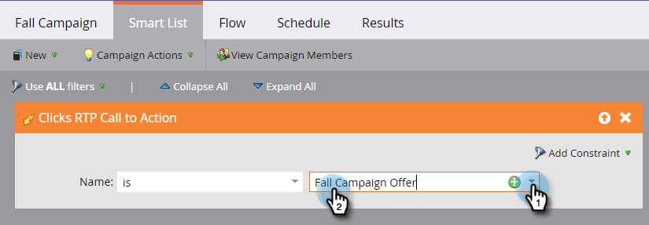

# Definieren einer Smart-Liste für [!DNL Web Personalization] Aktivitäten {#define-a-smart-list-for-web-personalization-activities}

Sie können [!DNL Web Personalization] Aktivitäten in Filtern und Triggern verwenden, wenn Sie eine Smart-Liste in einer Smart-Kampagne definieren. Hier möchten Sie alle erfassen, die auf eine [!DNL Web Personalization] call to action (Kampagne) geklickt haben.

Verwenden Sie einen Trigger, um eine E-Mail oder einen Warnhinweis zu senden oder einen Wert oder eine Punktzahl basierend auf den Besucherinnen und Besuchern zu ändern, die auf eine [!DNL Web Personalization] call to action geklickt haben und mit dieser interagiert haben. Sie können auch die Leads filtern und anzeigen, die auf eine [!DNL Web Personalization] call to action geklickt haben.

1. Klicken Sie in Ihrer Smart-Kampagne auf die Registerkarte **[!UICONTROL Smart-Liste]** .

   

   >[!NOTE]
   >
   >Intelligente Listen können erstaunliche Dinge tun. Weitere Informationen finden Sie unter [Smart List Deep Dive](/help/marketo/product-docs/core-marketo-concepts/smart-campaigns/understanding-smart-campaigns.md).

1. Suchen Sie nach dem Trigger und ziehen Sie den Trigger per Drag-and-Drop auf die Arbeitsfläche.

   

   >[!NOTE]
   >
   >Eine Smart-Kampagne mit Triggern wird im Trigger-Modus ausgeführt. Sie wird immer nur für eine Person ausgeführt, basierend auf den ausgelösten Ereignissen und den hinzugefügten Filtern.

1. Klicken Sie auf das Dropdown-Menü und wählen Sie einen Operator aus.

   

   >[!CAUTION]
   >
   >Rote schielende Linien zeigen einen Fehler an. Wenn er nicht korrigiert wird, wird die Kampagne ungültig und sie wird nicht ausgeführt.

1. Definieren Sie den Trigger.

   

1. Fügen Sie Filter nach Bedarf hinzu.

   

   >[!TIP]
   >
   >In einer intelligenten Kampagne mit sowohl Triggern als auch Filtern gehen die Trigger an die Spitze. Wenn sie ausgelöst wird, durchlaufen nur Personen den Fluss, die die Filterkriterien erfüllen.

   >[!NOTE]
   >
   >Bei mehreren Triggern wechselt eine Person in den Fluss, wenn einer der Trigger aktiviert wird.

   Wenn Sie die Kampagne für mehrere Personen gleichzeitig ausführen möchten, erfahren Sie hier, wie Sie [ Smart-Liste für Smart-Kampagnen definieren | Batch](/help/marketo/product-docs/core-marketo-concepts/smart-campaigns/creating-a-smart-campaign/define-smart-list-for-smart-campaign-batch.md).

   >[!MORELIKETHIS]
   >
   >* [Definieren der Smart-Liste für intelligente Kampagnen | Batch](/help/marketo/product-docs/core-marketo-concepts/smart-campaigns/creating-a-smart-campaign/define-smart-list-for-smart-campaign-batch.md)
   >* [Hinzufügen eines Flussschritts zu einer Smart-Kampagne](/help/marketo/product-docs/core-marketo-concepts/smart-campaigns/flow-actions/add-a-flow-step-to-a-smart-campaign.md)
   >* [Definieren einer Smart-Liste für Aktivitäten mit prädiktiven Inhalten](/help/marketo/product-docs/predictive-content/define-a-smart-list-for-predictive-content-activities.md)
