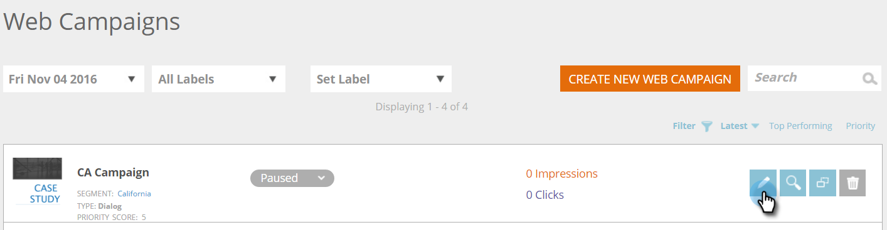

# Eine vorhandene Web-Kampagne bearbeiten {#edit-an-existing-web-campaign}

1. Gehen Sie zu **Web-Kampagnen**.

   

1. Klicken Sie auf der Seite **Web-Kampagnen** auf **Bearbeiten **auf der Kampagne, die Sie bearbeiten möchten.

   

   >[!NOTE]
   >
   >Um die gewünschte Web-Kampagne leichter zu finden, verwenden Sie die [Filterfunktion](filter-web-campaigns.md).

>[!NOTE]
>
>**Verwandte Artikel**
>
>* [Eine Web-Kampagne löschen](delete-a-web-campaign.md)
>* [Starten/Anhalten einer](launch-pause-a-web-campaign.md) [Kampagne](launch-pause-a-web-campaign.md)

>

