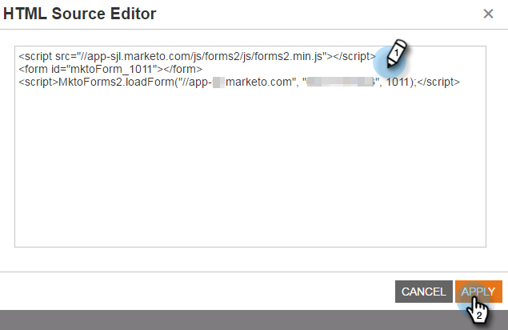

# Einbetten eines Formulars in eine Web-Kampagne {#embed-a-form-into-a-web-campaign}

Erfahren Sie, wie Sie ein Marketo-Formular in eine Web-Kampagne einbetten können (Dialog, In-Zone oder Widget).

1. Klicken Sie mit der rechten Maustaste auf ein genehmigtes Formular. Wählen Sie **Einbettungscode**.

   ** 

   **

1. Kopieren Sie den Code.

   

1. Wechseln Sie in Web-Personalisierung zu **Web-Kampagnen**.

   

1. Klicken Sie auf **Neue Kampagne erstellen**.

   ** 

   **

1. Klicken Sie im Rich-Text-Editor auf das HTML-Symbol.

   

1. Fügen Sie den Formulareinbettungscode in den HTML-Quell-Editor ein. Klicken Sie auf **Aktualisieren**.

   

1. Das Formular wird nicht in der Editor-Ansicht angezeigt, Sie können es jedoch auch so Vorschauen vornehmen, dass es in einer Kampagne wiedergegeben wird.
1. Klicken Sie auf **Launch**, um die Kampagne Beginn.

   >[!NOTE]
   >
   >Änderungen an den Formularfeldern müssen in den Marketing-Aktivitäten von Marketo unter Formularentwurf bearbeiten vorgenommen werden.

## Drei Methoden zum Hinzufügen eines Hintergrundbilds zu einem Formular {#three-ways-to-add-a-background-image-to-a-form}

Um ein Hintergrundbild zu Ihrem Formular hinzuzufügen, können Sie:

* CSS eines Formularthemas bearbeiten
* Ändern der Dialog- oder Widget-Farben in der Kampagne &quot;Festlegen&quot;
* CSS-Code in das Skript Hinzufügen

Informationen zum Bearbeiten der CSS eines Formularthemas finden Sie in [diesem Artikel](../../../product-docs/demand-generation/forms/form-design/edit-the-css-of-a-form-theme.md).

So ändern Sie die Dialog- oder Widget-Farben in der Kampagne &quot;Festlegen&quot;:

1. Wählen Sie im Rich-Text-Editor einen Dialogfeldtyp und einen Dialogstil, eine Kopfzeilenfarbe und eine Hintergrundfarbe aus, um die Hintergrundfarben des Formulars anzupassen. Klicken Sie auf **Speichern**.

   

1. Hier ist ein Beispiel dafür, wie ein moderner Trim-Dialog mit einer hellvioletten Kopf- und Hintergrundfarbe aussieht.

   

So fügen Sie dem Skript CSS-Code hinzu:

1. Klicken Sie im Rich-Text-Editor auf das HTML-Symbol.

   

1. Fügen Sie den Einbettungscode des Formulars mit dem Code des Hintergrundstils in den HTML-Quell-Editor ein. Klicken Sie auf **Aktualisieren**.

   

1. Klicken Sie auf **Vorschau**, um zu sehen, wie es in einer Kampagne dargestellt wird (das Formular wird nicht in der Editor-Ansicht angezeigt). Hier ein Beispiel, wie der oben aufgeführte Formularcode in einer Kampagne mit einem Hintergrundbild wiedergegeben wird.

   

>[!MORELIKETHIS]
>
>* [CSS eines Formularthemas bearbeiten](https://docs.marketo.com/display/public/DOCS/Edit+the+CSS+of+a+Form+Theme)
>* [Danksagungsnachricht ohne Follow-up-Landingpage anzeigen](http://developers.marketo.com/blog/show-thank-you-message-without-a-follow-up-landing-page/)
>* [Forms 2.0](http://developers.marketo.com/documentation/websites/forms-2-0/)

>

