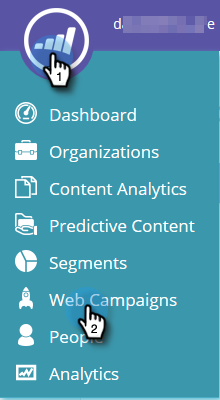
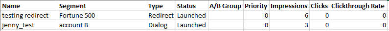

# Exportieren von Web-Kampagnendaten {#export-web-campaign-data}

Führen Sie diese einfachen Schritte aus, um Ihre Web-Kampagnendaten zu exportieren.

1. Gehen Sie zu **[!UICONTROL Web-Kampagnen]**.

   

1. Klicken Sie oben rechts auf der Seite auf das Symbol CSV exportieren .

   

1. Öffnen oder speichern Sie die Datei.

   

1. In der Datei finden Sie hilfreiche Statistiken.

   
