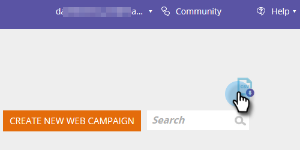

# Web-Kampagnendaten exportieren {#export-web-campaign-data}

Führen Sie diese einfachen Schritte aus, um Ihre Webkampagnendaten zu exportieren.

1. Wechseln Sie zu **Web-Kampagnen**.

   

1. Klicken Sie oben rechts auf der Seite auf das Symbol CSV exportieren .

   

1. Öffnen oder speichern Sie die Datei.

   

1. Zeigen Sie Ihre Datei an, um sich nützliche Statistiken anzusehen.

   
