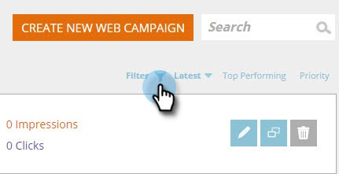

# Filtern von Web-Kampagnen {#filter-web-campaigns}

Nachdem Sie Hunderte von [!DNL Web Personalization] Kampagnen erstellt haben, ist es wirklich hilfreich, Filter verwenden zu können, um nur die anzuzeigen, die Sie interessieren.

1. Gehen Sie zu **[!UICONTROL Web-Kampagnen]**.

   

1. Klicken Sie auf der [!UICONTROL Web]KampagnenSeite auf **[!UICONTROL Filter]**.

   

1. Aktivieren Sie das Kontrollkästchen für den Status und/oder den Kampagnentyp, nach dem Sie filtern möchten, z. B **[!UICONTROL „Paused]** oder **[!UICONTROL Dialog]**. Klicken Sie auf **[!UICONTROL Übernehmen]**.

   

   >[!TIP]
   >
   >Aktivieren Sie das Kontrollkästchen **[!UICONTROL Alle auswählen]**, um alle auszuwählen, oder klicken Sie auf den Link **[!UICONTROL Löschen]**, um alle Kontrollkästchen zu deaktivieren.

1. Jetzt werden nur noch Kampagnen angezeigt, die Ihrem Filter entsprechen.

   

   Ein Stück Kuchen!
