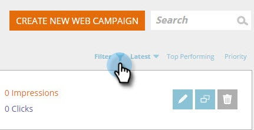

# Webkampagnen filtern {#filter-web-campaigns}

Nachdem Sie Hunderte von Web-Personalization-Kampagnen erstellt haben, ist es wirklich hilfreich, Filter zu verwenden, um nur diejenigen anzuzeigen, die Sie interessieren.

1. Wechseln Sie zu **Web-Kampagnen**.

   

1. Klicken Sie auf der Seite &quot;Web-Kampagnen&quot;auf **Filter**.

   

1. Aktivieren Sie das Kontrollkästchen für den Status und/oder Kampagnentyp, nach dem Sie filtern möchten, z. B. &quot;**Angehalten**&quot;oder &quot;**Dialogfeld**&quot;. Klicken Sie auf **Anwenden**.

   

   >[!TIP]
   >
   >Verwenden Sie das Kontrollkästchen **Alle auswählen** , um alle oder den Link **Löschen** auszuwählen, um alle Kontrollkästchen zu löschen.

1. Jetzt werden nur Kampagnen angezeigt, die Ihrem Filter entsprechen.

   

   Kuchen!
