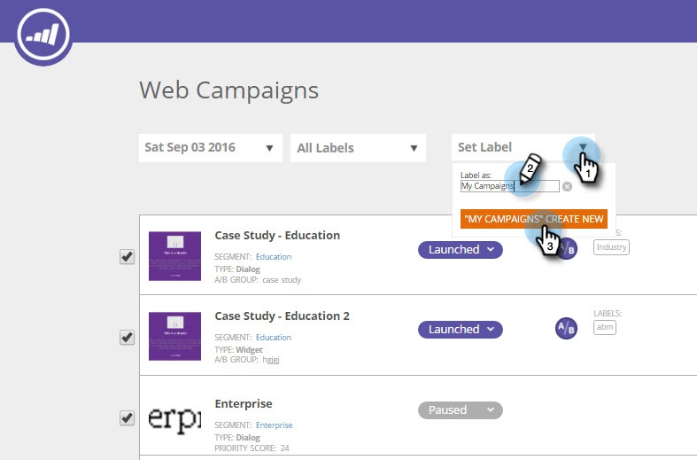

# Beschriften Ihrer Web-Kampagnen {#label-your-web-campaigns}

Haben Sie so viele Kampagnen, dass das Scrollen mühsam wird? Kennzeichnungen verwenden, um Ihre Kampagnen zu taggen, damit Sie sie sortieren und schnell finden können.

## Hinzufügen eines Titels zu einer Web-Kampagne {#add-a-label-to-a-web-campaign}

1. Melden Sie sich bei [!DNL Web Personalization] an und gehen Sie zum Bereich [!UICONTROL Web-Kampagnen] .

   

   >[!NOTE]
   >
   >Um das Auffinden der gewünschten Kampagne zu vereinfachen, verwenden Sie die [Filterfunktion](/help/marketo/product-docs/web-personalization/working-with-web-campaigns/filter-web-campaigns.md).

1. Wählen Sie die Kampagnen aus, die Sie mit einem Titel versehen möchten.

   

1. Geben Sie den gewünschten Bezeichnungsnamen ein und klicken Sie auf Neu erstellen.

   >[!TIP]
   >
   >Wenn die Bezeichnung bereits vorhanden ist, wählen Sie sie aus und erstellen Sie keine neue.

   

Cool! Jetzt wissen Sie, wie Sie Kennzeichnungen erstellen und sie Kampagnen zuweisen.

## Nach vorhandenen Kennzeichnungen filtern {#filter-by-existing-labels}

1. Wählen Sie in der Dropdown-Liste Bezeichnungen die Bezeichnung aus, die Sie als Filter verwenden möchten.

   

1. Jetzt zeigen wir nur noch die Kampagnen an, die mit der ausgewählten Kennzeichnung verknüpft sind.

   

>[!MORELIKETHIS]
>
>[Beschriften eines Segments](/help/marketo/product-docs/web-personalization/using-web-segments/label-your-segment.md)
