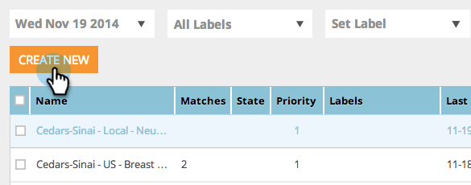

# Vorschau und Test einer Web-Kampagne {#preview-and-test-a-web-campaign}

Dieser Artikel zeigt Ihnen verschiedene Möglichkeiten, eine Web-Kampagne in der Vorschau anzuzeigen und sie mit einem Sandbox-Segment live auf Ihrer Website zu testen.

>[!NOTE]
>
>Die Vorschau zeigt nur, wie die Kampagne auf der ausgewählten Website aussehen wird. Links und Widgets funktionieren nicht, da fehlerhafte Klicks/Ansichten in der Analyse vermieden werden.

## Vorschau einer Web-Kampagne auf der Erstellungsseite {#preview-a-web-campaign-on-the-creation-page}

1. Gehen Sie zu **Web-Kampagnen**.

   

1. Klicken Sie **Neue Web-Kampagne erstellen** oder auf das Symbol, um eine vorhandene Kampagne zu bearbeiten.

   

1. Fügen Sie in der Vorschau auf der Site die Seiten-URL hinzu und klicken Sie auf **Vorschau**. Ein neues Fenster/eine neue Registerkarte wird mit der Kampagnenvorschau geöffnet.

   

   >[!TIP]
   >
   >Klicken Sie **Freigeben**, um eine E-Mail mit einer festen URL der Kampagnenvorschau zu öffnen.

   >[!NOTE]
   >
   >Sie haben außerdem die Möglichkeit, ein Browser-Plug-in (entweder [Chrome](https://chrome.google.com/webstore/detail/marketo-web-personalizati/ldiddonjplchallbngbccbfdfeldohkj) oder [Firefox](https://rtp-static.marketo.com/rtp/libs/mwp-0.0.0.8.xpi)) zu installieren, um eine optimale Vorschau Ihrer Kampagne zu erhalten. Siehe folgenden Abschnitt.

## Vorschau einer Web-Kampagne auf der Erstellungsseite mithilfe des Browser-Plug-ins {#preview-a-web-campaign-on-the-creation-page-using-the-browser-plug-in}

1. Führen Sie die Schritte 1 und 2 aus dem obigen Abschnitt aus.

1. Klicken Sie auf den Link zum Browser-Plug-in (in diesem Fall verwenden wir Chrome).

   

1. Ein neues Fenster/eine neue Registerkarte wird geöffnet. Klicken Sie **Zu Chrome hinzufügen**.

   

1. Klicken Sie **Erweiterung hinzufügen**.

   

1. Zurück zu Marketo. Fügen Sie die Seiten-URL hinzu und klicken Sie auf **Vorschau**.

   

1. Ein neues Fenster/eine neue Registerkarte wird geöffnet, in dem bzw. der Sie eine Vorschau des Erscheinungsbilds Ihrer Kampagne auf einem Desktop, Smartphone oder Tablet anzeigen können.

   

## Vorschau einer Web-Kampagne auf der Web-Kampagnenseite {#preview-a-web-campaign-on-the-web-campaigns-page}

1. Wenn Sie sich die Liste Ihrer Web-Kampagnen ansehen, wählen Sie einfach eine Kampagne aus und klicken Sie auf das Symbol **Vorschau**.

   

   Einfach!

## Vorschau einer Web-Kampagne auf Ihrer Website {#preview-a-web-campaign-on-your-website}

Erstellen Sie ein Sandbox-Segment und eine Kampagne.

1. Navigieren Sie zu **Segmente**.

   

1. Klicken Sie auf **Neu erstellen**.

   

1. Benennen Sie das Segment.

1. Ziehen Sie unter Verhalten die Option Einschließende Seiten auf die Arbeitsfläche. Fügen Sie den Wert &#42;sandbox=1) &#42;. Klicken Sie auf **Speichern und Kampagne definieren**.

   

1. Ändern Sie auf der Seite Web-Kampagne festlegen das Zielsegment in das Sandbox-Segment, indem Sie es aus der Liste auswählen.

   

1. Schließen Sie die kreative Kampagne ab und klicken Sie auf **Starten**.

   

1. Fügen Sie auf Ihrer Website den URL-Parameter &quot;?sandbox=1“ am Ende der URL hinzu. Beispiel: `www.marketo.com?sandbox=1`.

1. Zeigen Sie die Kampagne React auf Ihrer Website an.

>[!NOTE]
>
>Kampagnen reagieren nur einmal während einer Besuchersitzung. Um die Kampagne erneut zu sehen, löschen Sie Ihre Browser-Cookies.

>[!NOTE]
>
>Umleitungskampagnen können nicht in der Vorschau angezeigt werden. Die einzige Möglichkeit, sie zu testen, besteht in der Verwendung eines Sandbox-Segments (das bestimmte Seiten anspricht - &#42;sandbox=redirect&#42;)
