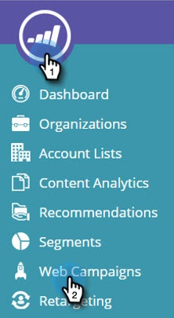

# Priorisieren von Web-Kampagnen {#prioritizing-web-campaigns}

Priorisieren Sie Ihre Web-Kampagnen, wenn sich zwei oder mehr Web-Kampagnen überschneiden, indem Sie einen Prioritätswert festlegen.

>[!NOTE]
>
>**Überschneidende Kampagnen**
>
>Eine Web-Kampagnenüberschneidung tritt auf, wenn:
>
>* Zwei oder mehr Widgets und/oder Dialogfeldkampagnen reagieren gleichzeitig auf derselben Seite
>* Zwei oder mehr In-Zonen mit derselben Zonen-ID reagieren gleichzeitig auf derselben Web-Seite
>
>Eine In-Zone-Kampagne und eine Kampagne (Widget oder Dialogfeld) können auf derselben Seite reagieren.

1. Gehen Sie zu **[!UICONTROL Web-Kampagnen]**.

   

   >[!NOTE]
   >
   >Um das Auffinden der gewünschten Web-Kampagne zu vereinfachen, verwenden Sie die [Filterfunktion](/help/marketo/product-docs/web-personalization/working-with-web-campaigns/filter-web-campaigns.md).

1. Legen Sie auf der Seite Kampagne bearbeiten den [!UICONTROL Prioritätswert] fest (9999 = Höchste Priorität 1 = Niedrigste Priorität).

   

   >[!TIP]
   >
   >Es wird empfohlen, [!UICONTROL &#x200B; Kampagne „Prioritätswert] nur zu verwenden, wenn eine potenzielle Kampagnenüberschneidung vorliegt, bei der eine der Kampagnen eine höhere Bedeutung hat. Sie müssen nicht für jede Kampagne eine Priorität festlegen.

1. Speichern oder Starten der Kampagne.

1. Siehe [!UICONTROL Prioritätswert], der auf der Seite [!UICONTROL Web-Kampagnen] angezeigt wird.

