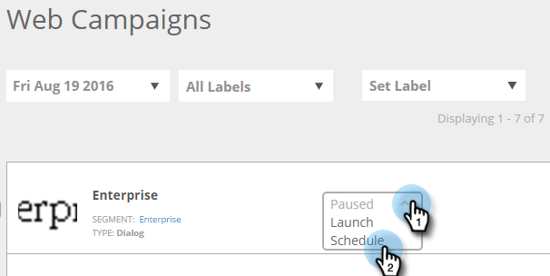

# Planen einer Web-Kampagne {#schedule-a-web-campaign}

Wenn Sie wissen, wann Ihre Web-Kampagne ausgeführt werden soll, können Sie sie im Voraus planen. Es ist einfach, Start- und Enddaten, Wiederholungen und mehrere Tage einzurichten.

Sie können die Web-Kampagne basierend auf der Zeit des Web-Besuchers oder einer ausgewählten Zeitzone planen.

>[!NOTE]
>
>**Beispiel**
>
>Die Planung von Start- und Enddaten eignet sich hervorragend für geplante Ereignisse wie Webinare, die für einen bestimmten Zeitraum ausgeführt werden. Wiederholungen sind perfekt für ein spezielles Angebot, das jede Woche nur an einem bestimmten Tag ausgeführt wird.

1. Gehen Sie zu **Web-Kampagnen**.

   

   >[!NOTE]
   >
   >Um das Auffinden der gewünschten Kampagne zu vereinfachen, verwenden Sie die [Filterfunktion](/help/marketo/product-docs/web-personalization/working-with-web-campaigns/filter-web-campaigns.md).

1. Öffnen Sie das Menü Kampagnenstatus und wählen Sie **Zeitplan** aus.

   

1. Wählen Sie im Dialogfeld „Intervall planen“ die Zeitzone für die Kampagne aus

   

   >[!TIP]
   >
   >Mit der Standardeinstellung werden Kampagnen in der Zeitzone des Web-Besuchers ausgeführt.

1. Wählen Sie ein Startdatum und eine Uhrzeit sowie ein Enddatum und eine Endzeit aus.

   

   >[!NOTE]
   >
   >Sie können Datum und Uhrzeit aus dem Dropdown-Menü und dem Kalender auswählen oder manuell eingeben. Die Zeiten sind 12-Stunden-Uhr-Zeit.

1. Standardmäßig wird die Kampagne jeden Tag zwischen dem Start- und dem Enddatum ausgeführt. Wenn Sie die Kampagne nur an bestimmten Tagen oder zu bestimmten Zeiten ausführen möchten, verwenden Sie die **Wiederholen**. Wählen Sie den Tag sowie die Start- und Endzeit aus, um die Kampagne anzuzeigen. Verwenden Sie das Pluszeichen + , um weitere Tage hinzuzufügen.

   

1. Klicken Sie auf **Zeitplan**.

   

1. Der Status der Kampagne auf der Seite Kampagnen ändert sich in **Geplant** und das Uhren-/Kalendersymbol wird angezeigt. Klicken Sie auf dieses Symbol, um den Kampagnenkalender zu bearbeiten.

   

   >[!NOTE]
   >
   >Der Kampagnenstatus bleibt **Geplant** auch dann erhalten, wenn die Kampagne zu den ausgewählten geplanten Zeiten ausgeführt wird. Nach Ablauf eines geplanten Enddatums ändert sich der Kampagnenstatus in **Paused**.
