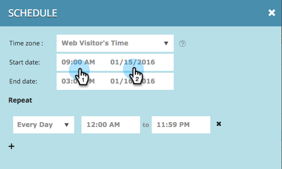

# Planen einer Web-Kampagne {#schedule-a-web-campaign}

Wenn Sie wissen, wann Ihre Web-Kampagne ausgeführt werden soll, können Sie sie im Voraus planen. Beginn- und Stoppdaten, Wiederholungen und mehrere Tage lassen sich einfach einrichten.

Sie können die Web-Kampagne auf Grundlage der Zeit des Web-Besuchers oder einer bestimmten Zeitzone planen.

>[!NOTE]
>
>**Beispiel**
>
>Das Planen von Beginns- und Stoppdaten ist ideal für ein geplantes Ereignis, z. B. ein Webinar, das für einen bestimmten Zeitraum ausgeführt wird. Wiederholungen sind perfekt für ein spezielles Angebot, das jede Woche nur an einem bestimmten Tag ausgeführt wird.

1. Gehen Sie zu **Web-Kampagnen**.

   

   >[!NOTE]
   >
   >Um die gewünschte Kampagne leichter zu finden, verwenden Sie die [Filterfunktion](filter-web-campaigns.md).

1. Öffnen Sie das Menü &quot;Status der Kampagne&quot;und wählen Sie &quot; **Planen&quot;**.

   

1. Wählen Sie im Dialogfeld &quot;Wiederholung planen&quot;die Zeitzone für die Kampagne aus

   

   >[!TIP]
   >
   >Die Standardeinstellung führt Kampagnen in der Zeitzone des Web-Besuchers aus.

1. Wählen Sie Datum und Uhrzeit des Beginns sowie Enddatum und -zeit aus.

   

   >[!NOTE]
   >
   >Sie können das Datum und die Uhrzeit im Dropdown-Menü und im Kalender auswählen oder manuell eingeben. Die Zeiten sind um 12 Uhr nachmittags.

1. Standardmäßig wird die Kampagne täglich zwischen dem Beginn- und dem Enddatum ausgeführt. Wenn Sie die Kampagne nur an bestimmten Tagen oder zu bestimmten Zeitpunkten ausführen möchten, verwenden Sie die **Wiederholungseinstellungen** . Wählen Sie den Tag, den Beginn und die Endzeit aus, um die Kampagne anzuzeigen. Verwenden Sie das Pluszeichen +, um weitere Tage hinzuzufügen.

   

1. Klicken Sie auf **Planen**.

   

1. Der Status der Kampagne auf der Seite &quot;Kampagnen&quot;ändert sich in **Geplant **und das Uhren-/Kalendersymbol wird angezeigt. Klicken Sie auf dieses Symbol, um den Zeitplan für die Kampagne zu bearbeiten.

   

   >[!NOTE]
   >
   >Der Status &quot;Kampagne&quot;bleibt auch dann als **geplant** , wenn die Kampagne während der ausgewählten geplanten Zeiten ausgeführt wird. Nach Ablauf eines geplanten Enddatums ändert sich der Status der Kampagne in **Angehalten**.

