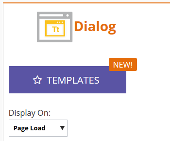

# Festlegen, wie Ihre Web-Kampagne angezeigt wird {#set-how-your-web-campaign-displays}

Es gibt mehrere Methoden, die bei der Anzeige Ihrer Web-Kampagne verwendet werden können.

## Seite laden {#page-load}

Standardmäßig ausgewählt zeigt diese Auswahl einfach die Kampagne beim Laden der Seite an.

## Zeitlicher Abstand {#delay}

Geben Sie eine Zeitverzögerung (in Sekunden) an, damit Web-Kampagnen auf Ihrer Website reagieren.

1. Klicken Sie auf **Dropdown-Liste &quot;**&quot; und wählen Sie **Verzögerung** aus.

   

1. Klicken Sie auf **Warten** und wählen Sie die gewünschte Zeitdauer aus.

   

## Scrollen {#scroll}

1. Klicken Sie auf **Dropdown-Menü** Display ein“ und wählen Sie **Scroll** aus.

   

1. Klicken Sie auf die **Wann** und wählen Sie aus, wann Ihre Web-Kampagne angezeigt werden soll.

   

<table> 
 <tbody> 
  <tr> 
   <td><strong>Unter Übergang</strong></td> 
   <td>Zeigt die Kampagne an, wenn ein Besucher unter den Falz scrollt. Die Kampagne verschwindet, wenn ein Besucher über den Falz zurückscrollt.</td> 
  </tr> 
  <tr> 
   <td><strong>Prozent</strong></td> 
   <td>Zeigt die Kampagne an, wenn ein Besucher zu einem vordefinierten Prozentsatz der Seite scrollt.</td> 
  </tr> 
  <tr> 
   <td><strong>Pixel</strong></td> 
   <td>
Zeigt die Kampagne an, wenn ein Besucher auf der Seite zum vordefinierten oberen Pixel scrollt.
</td> 
  </tr> 
 </tbody> 
</table>

## Seite verlassen {#exit-intent}

Mit der Absichtserklärung wird die Web-Kampagne beim Beenden des Browsers mit dem Mauszeiger angezeigt.

1. Klicken Sie auf **Dropdown-Liste** und wählen Sie **Exitintent**.

   

1. Es wird eine Meldung angezeigt, die Sie daran erinnert, dass die Abbruchabsicht nicht mit Mobilgeräten kompatibel ist.

   

>[!TIP]
>
>Möchten Sie sehen, wie Ihre gewählten Effekte im Voraus aussehen werden? Sehen Sie sie über eine [Web-Kampagnenvorschau](/help/marketo/product-docs/web-personalization/working-with-web-campaigns/preview-and-test-a-web-campaign.md).
