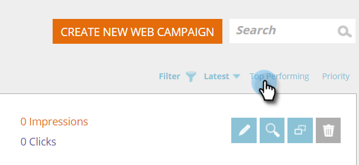

# Sortieren von Web-Kampagnen nach neuesten oder Top-Kampagnen {#sort-web-campaigns-by-latest-or-top-performing}

Sie können Ihre Web-Kampagnen auf verschiedene Weise sortieren.

1. Gehen Sie zu **[!UICONTROL Web-Kampagnen]**.

   

1. Wählen Sie einen Sortiertyp.

   >[!NOTE]
   >
   >**Definition**
   >
   >**[!UICONTROL Neueste]** - wird nach dem Datum sortiert, an dem die Kampagne erstellt wurde. Neueste Kampagne am Anfang.
   >
   >**[!UICONTROL Beste Leistung]** - Sortiert Kampagnen anhand der Klickrate. Höchster Clickthrough oben.

   

   Ja, es ist wirklich so einfach.
