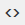

# Verwenden des [!DNL Web Personalization] Rich-Text-Editors {#using-the-web-personalization-rich-text-editor}

Der [!DNL Web Personalization] Rich-Text-Editor auf der Seite [!UICONTROL Kampagnen festlegen] ermöglicht Textformatierung, Verknüpfung und Bildeinfügung. Es enthält Formatierungsoptionen, die den standardmäßigen Textverarbeitungsprogrammen ähneln.

Zu den wichtigen Symbolen im Rich-Text-Editor gehören:

<table> 
 <tbody> 
  <tr> 
   <td colspan="1"></td> 
   <td colspan="1"><strong>HTML-Quelle bearbeiten</strong></td> 
   <td colspan="1">Ermöglicht die Anzeige des HTML-Quell-Codes</td> 
  </tr> 
  <tr> 
   <td colspan="1"></td> 
   <td colspan="1">
<strong>Bild einfügen/bearbeiten</strong> 
</td> 
   <td colspan="1">Fügt eine Bild-URL ein, damit grafische Bilder im Editor angezeigt werden</td> 
  </tr> 
  <tr> 
   <td colspan="1"></td> 
   <td colspan="1"><strong>Einfügen eines Bildes aus Design Studio</strong></td> 
   <td colspan="1"><em>Nachdem </em> auf das Symbol <strong>Bild einfügen/bearbeiten</strong> geklickt haben, können Sie damit Bilder aus Marketo Design Studio auswählen</td> 
  </tr> 
  <tr> 
   <td colspan="1"></td> 
   <td colspan="1">
<strong>Link einfügen/bearbeiten</strong> 
</td> 
   <td colspan="1">Dient zum Hinzufügen von Hyperlinks zu Text oder Bildern</td> 
  </tr> 
  <tr> 
   <td colspan="1"></td> 
   <td colspan="1"><strong>Token einfügen/bearbeiten</strong></td> 
   <td colspan="1">Personalisieren Ihrer Web-Kampagne mit Unternehmens- oder Personen-Token</td> 
  </tr> 
 </tbody> 
</table>

>[!NOTE]
>
>Web-Token verwenden [Personendaten](/help/marketo/product-docs/web-personalization/using-web-segments/manage-person-data.md) aus Ihrer [!DNL Marketo Database], die in [!DNL Web Personalization] unter [!UICONTROL Kontoeinstellungen] > [!UICONTROL Datenbank] verwaltet werden. Wenn das Web-Token ein neues Datenbankfeld ist, das sich noch nicht unter [!UICONTROL Kontoeinstellungen] > [!UICONTROL Datenbank] befindet, wird es automatisch hinzugefügt und die Aktivierung kann bis zu 24 Stunden dauern.

>[!MORELIKETHIS]
>
>[Verwenden des Rich-Text-Editors](/help/marketo/product-docs/email-marketing/general/understanding-the-email-editor/using-the-rich-text-editor.md)
