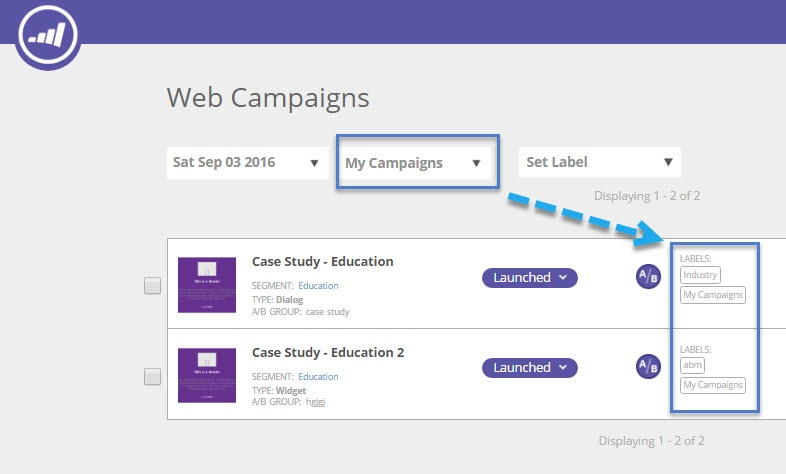

# Anzeigen von Web-Kampagnen über ein bestimmtes Label {#view-web-campaigns-from-a-specific-label}

Sie möchten Ihre Kampagnen nach einer bestimmten Kennzeichnung anzeigen und filtern?

## Nach vorhandenen Kennzeichnungen filtern {#filter-by-existing-labels}

1. Gehen Sie zu **[!UICONTROL Web-Kampagnen]**.

   

1. Wählen Sie in der Dropdown-Liste Bezeichnungen die gewünschte Bezeichnung aus.

   

1. Beachten Sie, dass wir Ihnen jetzt nur noch die Kampagnen anzeigen, die mit der ausgewählten Kennzeichnung verknüpft sind?

   

>[!MORELIKETHIS]
>
>* [Beschriften Sie Ihre [!UICONTROL Web-Kampagnen]](/help/marketo/product-docs/web-personalization/working-with-web-campaigns/label-your-web-campaigns.md)
>* [Anzeigen von Segmenten über eine bestimmte Beschriftung](/help/marketo/product-docs/web-personalization/using-web-segments/view-segments-from-a-specific-label.md)
>* [Kennzeichnen Sie Ihre Segmente](/help/marketo/product-docs/web-personalization/using-web-segments/label-your-segment.md)
