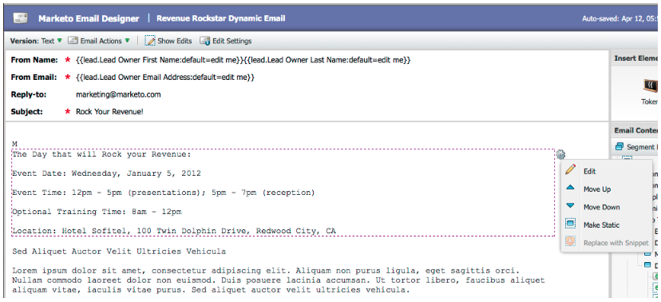

# Versionshinweise: April 2012 {#release-notes-april}

## Segmentierung - Filter und Trigger {#segmentation-filters-and-triggers}

Zielgruppe Sie dieselbe Interessengruppe konsistent? Wenn ja, verwenden Sie die Segmentierung in Ihren intelligenten Listen zum Targeting von Interessenten. Mit der Segmentierung wird Ihre gesamte Interessentendatenbank immer segmentiert und kann zur Konsistenz in allen Programmen wiederverwendet werden. Segmentierungsergebnisse werden schnell abgerufen, da die intelligente Liste zum Zeitpunkt der Anforderung nicht ausgeführt werden muss.

## Fügen Sie externe Werte über erweiterte API-Funktionen {#insert-external-values-into-email-content-and-other-flow-steps-through-expanded-api-capabilities} in E-Mail-Inhalte und andere Flussschritte ein.

* Mit der Anforderungs-Kampagne-API können Sie nun Werte für &quot;Meine Tokens&quot;für den jeweiligen Ausführung der Kampagne senden - dies ist besonders hilfreich, um E-Mail-Inhalte über die API zu füllen.
* Die neuen APIs zum Hochladen in die Liste und Planen der Kampagne unterstützen die oben genannten Funktionen für Listen von Interessenten und Batch-Kampagnen.

## Einfachere Bestätigungs-E-Mails für GoToWebinar und WebEx (Adobe Connect und ON24 in Kürze!) {#easier-confirmation-emails-for-gotowebinar-and-webex-adobe-connect-and-on-coming-soon}

Wir haben die Bestätigungs-URL vereinfacht, indem wir ein Mitglieds-Token erstellen, das die eindeutige Registrierungsbestätigungs-URL für jeden Interessenten anzeigt. Sie müssen diese URL nicht mehr mit verschiedenen Token erstellen. Diese Version ist derzeit für GoToWebinar- und WebEx-Kunden verfügbar und wird in unserer nächsten Version für Adobe Connect und ON24 verfügbar sein.

## Laden Sie mehrere Bilder und Dateien mit einem Klick hoch! {#upload-multiple-images-and-files-with-a-single-click}

Sparen Sie Zeit und sparen Sie beim Importieren von Bildern und Dateien in Marketo! Wenn Sie Firefox oder Google Chrome verwenden, können Sie Dateien mehrmals auswählen und alle gleichzeitig hochladen. Obwohl die Anzahl der hochzuladenden Dateien unbegrenzt ist, beträgt die maximale Größe pro Datei 50 MB.

Hinweis: Derzeit wird diese Funktion im Internet Explorer aufgrund von Einschränkungen des Browsers nicht unterstützt.

## Text in einer E-Mail {#move-text-in-an-email} verschieben

Sie können Textblöcke in einer E-Mail neu anordnen. Wählen Sie im Texteditor einen Textblock aus. Wenn Sie auf das Bearbeitungssymbol klicken, sehen Sie die Option zum Verschieben des Blocks nach oben oder unten.

## Salesforce-Referenzen für Benutzer, die keine Salesforce-Benutzer sind {#salesforce-references-removed-for-non-salesforce-users} entfernt

Wenn Sie Ihr Abonnement nicht mit Salesforce synchronisieren, werden Sie bemerken, dass alle Ordner und Flussaktionen, die Salesforce referenzieren, entfernt wurden.

## Marketo-Umsatzwyklusanalysen {#marketo-revenue-cycle-analytics}

**Verbesserte Gate-Phasen im Umsatzzyklusmodell**

Ermöglicht Benutzern das Definieren einer Reihenfolge für ihre Transition.

