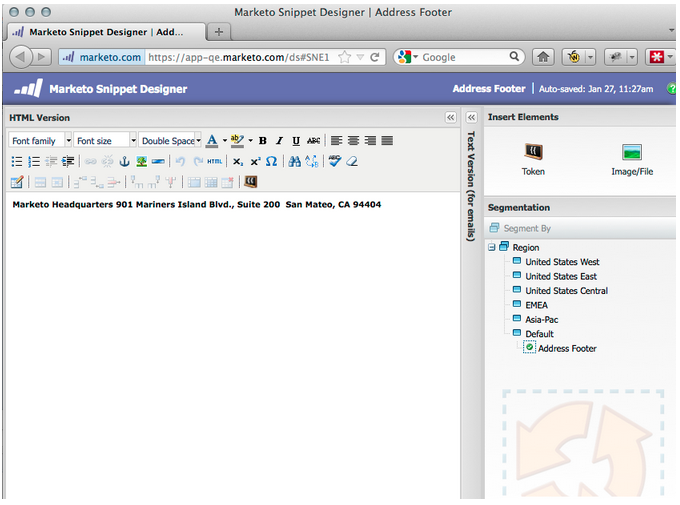

# Versionshinweise: Januar/Februar 2012 {#release-notes-jan-feb}

Die folgenden Funktionen sind in der Januar/Februar-Version enthalten. Überprüfen Sie Ihre Marketo-Edition auf Funktionsverfügbarkeit. Nach der Veröffentlichung finden Sie Links zur ausführlichen Dokumentation der Funktionen.

>[!NOTE]
>
>**Tieftauchen**
>
>Weitere Versionen finden Sie in den [Versionshinweisen](http://docs.marketo.com/display/docs/release+notes) unter Deep Dive.

## Erweiterte dynamische Inhalte {#advanced-dynamic-content}

*Verfügbar für Pro- und Enterprise-Versionen*

Mit fortschrittlichen dynamischen Inhalten können Sie ansprechende E-Mail-Nachrichten und -Landingpages erstellen, die für Ihre Audience relevant sind, ohne mehrere Assets für dieselbe Nachricht erstellen zu müssen. Aktualisierte Viewer ermöglichen die Ansicht jeder einzelnen Version in einem einzigen Bildschirm.

## Segmentierung  {#segmentation}

*Verfügbar für Pro- und Enterprise-Versionen*

Die Segmentierung ist eine Gruppe von Segmenten, bei denen es sich um eine zielgerichtete Gruppe von Einzelpersonen handelt, für die Sie Marketing betreiben. Segmente werden durch Regeln definiert, die auf Filterkriterien basieren, ähnlich wie bei intelligenten Listen. Ihre Segmente können auf demografischen Daten, wie beispielsweise der Berufsbezeichnung oder der Branche, oder auf Verhaltensweisen wie besuchten oder angeklickten Links basieren.

## Snippets {#snippets}

*Verfügbar für Pro- und Enterprise-Versionen*

Speichern Sie Rich-Content, der immer wieder verwendet werden kann, um statische oder dynamische E-Mails und Landingpages zu erstellen.

## PURLs {#purls}

*Verfügbar für Pro- und Enterprise-Versionen*

Mithilfe von personalisierten URLs (PURLs) können Marketingexperten jetzt kontaktspezifische URLs erstellen, um Personalisierung, Messbarkeit und die Steigerung der Reaktionen in Multi-Touch-Marketing-Programmen für Direktversand- und E-Mail-Kampagnen zu fördern.

## Unterstützung der EU-Datenschutzrichtlinie {#eu-privacy-directive-support}

Zu den neuen Funktionen, die die Einstellungen des Browsers &quot;Nicht verfolgen&quot;berücksichtigen, gehört die Möglichkeit, die Verfolgung anonymer Interessenten zu deaktivieren. Dadurch wird die Einhaltung der strengeren EU-Vorschriften zur Verfolgung der Privatsphäre erleichtert.

## Single-Sign-On {#single-sign-on}

Organisationen können jetzt eine nahtlose Anmeldung bei der Marketing-Anwendung mit SAML 2.0 für Single Sign-On über ein Firmenportal unterstützen.

## Aktualisierte Editoren für E-Mail und Landingpage {#updated-email-and-landing-page-editors}

Die Editoren für E-Mail und Landingpage wurden mit einer einladenderen Benutzeroberfläche, intuitiverer Navigation und einer deutlich verbesserten Benutzererfahrung neu gestaltet. Dazu gehören:

Ansicht von HTML und Text nebeneinander

Die Optionen &quot;Von Name&quot;, &quot;Von E-Mail&quot;, &quot;Antwort an&quot;(NEU) und &quot;Betreff&quot;werden im Editor angezeigt. Auf alle anderen Einstellungen kann über die Schaltfläche &quot;Einstellungen bearbeiten&quot;zugegriffen werden.

## Browserunterstützung {#browser-support}

* Mozilla Firefox 9.0
* Google Chrome 16
* Microsoft Internet Explorer 8 &amp; 9
* **Hinweis**: Internet Explorer 7 wird nicht mehr unterstützt

## Programm-Management {#program-management}

Die vereinfachte Verwaltung von Programmen verbessert die Benutzerfreundlichkeit beim Löschen von Token und erleichtert das Löschen von Programmen.

## Abmelden beim Abonnement-Bericht {#unsubscribe-from-subscription-report}

Jetzt können Sie sich vom Abonnement direkt vom Bericht abmelden!

## Munchkin-Aktualisierungen {#munchkin-updates}

Neue Munchkin-Aufrufe reduzieren die Ladezeit von Webseiten und sorgen für eine konsistentere Leistung bei Ereignissen mit Klicklinks.

## Analyse von Programm-Chancen (nur RCA) {#program-opportunity-analysis-rca-only}

Verstehen Sie den Marketingbeitrag zu individuellen Opportunitätseinnahmen.

## Analyse der Programm-Umsatzstufe {#program-revenue-stage-analysis}

Erhalten Sie einen Einblick in die Interessentengeschwindigkeit des Programms, indem Sie verstehen, welche Programm die Antriebsschnellläufe übernommen haben.

