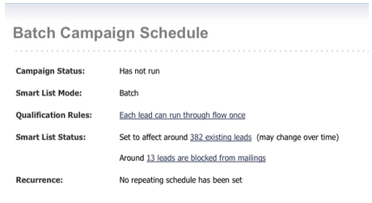

# Versionshinweise: Juni 2012 {#release-notes-june}

>[!NOTE]
>
>**Tieftauchen**
>
>Weitere Versionen finden Sie unter [Versionshinweise](http://docs.marketo.com/display/docs/release+notes) Deep Dive.

## Verbesserungen bei der Marketing-Lead-Verwaltung {#marketo-lead-management-enhancements}

### {#rename} umbenennen

Sie können Ihre Smart-Listen, statischen Listen und Kampagnen umbenennen. Wenn Sie diese Assets in Filtern, Auslösern oder Textflüssen verwenden, wird der Name automatisch auch dort aktualisiert. Sie haben Ihre E-Mails, Formulare und Ordner immer umbenennen können.

Und als Bonus haben wir die Eingabe und Anzeige von Beschreibungstext für Assets verbessert.

## Feldzuordnung importieren {#import-field-mapping}

Wir haben den Import einer Liste nach Marketo sehr viel einfacher gemacht! Während des Importvorgangs können Sie den Namen des Felds &quot;Marketo&quot;dem Spaltenkopfnamen in der Importdatei zuordnen. Darüber hinaus können Sie in Admin Aliasnamen festlegen, die dem Feldnamen in Marketo zugeordnet werden, und sicherstellen, dass Ihre Benutzer jedes Mal das richtige Feld auswählen.

Während Sie weiterhin Felder importieren und zuordnen, speichert Marketo die Zuordnungen während des Imports, um die Verwendung zu vereinfachen. Um das Leben noch einfacher zu machen, können Sie auf die Kopfzeile &quot;Beispielwert&quot;klicken, um die verschiedenen Werte anzuzeigen, die im Feld aufgefüllt werden sollen. Dadurch wird sichergestellt, dass Sie jedes Mal das richtige Feld zuordnen!

## Zusammenfassungsseite für intelligente Listen und statische Listen {#summary-page-for-smart-lists-and-static-lists}

Haben Sie sich schon einmal gefragt, wo Ihre Listen verwendet werden? Oder wer hat die Liste erstellt oder zuletzt geändert? Die neue Zusammenfassungsseite, die auf Smart-Listen und statischen Listen verfügbar ist, bietet Ihnen diese wichtigen Informationen.

Auf den vorhandenen Programm- und Kampagnen-Zusammenfassungsseiten haben wir das Erstellungsdatum/den Erstellungsbenutzer und auch die Letzte Änderung/Benutzerinformationen hinzugefügt!

## Verwendet von für Assets {#used-by-for-assets}

Wir haben eine neue Registerkarte zu unseren Asset-Zusammenfassungsseiten hinzugefügt, die &quot;Verwendet von&quot;!

Beispiel: Verwendet von für statische Listen

## Landingpage-Rasterlinien {#landing-page-gridlines}

Durch die Hinzufügung von Landingpage-Rasterlinien wird die Ausrichtung von Text, Grafiken und Formularen auf Ihrer Landingpage erheblich vereinfacht. Schalten Sie es für jede Landingpage ein und aus und passen Sie auch die Breite zwischen den Linien an!

## Von Mailings blockierte Interessenten {#leads-blocked-from-mailings}

Wenn Sie eine Kampagne planen, können Sie auf den Link klicken, um die Liste der Interessenten anzuzeigen, die von Ihrem Postversand blockiert werden.

## Wait Step - Lead Token und My Token {#wait-step-lead-token-and-my-token}

In unserer Mai-Version haben wir erweiterte Optionen zum Schritt zum Warten hinzugefügt. Mit diesen Änderungen können Sie einen Geschäftstag, ein Datum und eine Uhrzeit angeben. In dieser Version wurde die Möglichkeit hinzugefügt, ein Token im Warteschritt zu verwenden. Beispielsweise können Sie `{{lead.Birthday}}` verwenden, um am Geburtstag eine E-Mail zu senden, oder `{{my.Event Date}}` verwenden, um eine letzte Webinar-Erinnerung zu senden.

## Ansicht als Miniaturansichten in Design Studio {#view-as-thumbnails-in-design-studio}

Wechseln Sie Ihre Ansicht von einer Liste von Bildern zu einer Miniaturansicht-Ansicht!

Hinweis: Ab dieser Version gilt die vorherige Sortierung auf Rastern intelligenter Listen nicht für die nächste von Ihnen Ansicht intelligente Liste. Wenn Sie z. B. eine intelligente Liste nach Firma sortieren, wird die nächste intelligente Liste, die von demselben Feld angezeigt wird, nicht automatisch sortiert.

Erinnerung: Aktualisierung des E-Mail-Leistungsberichts läuft!

## Verbesserungen bei Marketing-zu-Umsatz-Cycle-Analysen {#marketo-revenue-cycle-analytics-enhancements}

### Neue Metriken in der Analyse für Programm-Chancen {#new-metrics-in-program-opportunity-analysis}

Sie können nun Einblicke in die durchschnittliche Anzahl der Marketingkontakte erhalten, bevor Chancen erstellt oder geschlossen werden, sowie den Durchschnittswert einer Marketingberührung.

## Anzeigen von Multi-Charts {#displaying-multi-charts}

Mit der Funktion für mehrere Diagramme können Sie mehrere Diagramme in einem einzigen Bericht für den Umsatz von Cycle Explorer anzeigen. Beispielsweise können Sie diese Funktion verwenden, wenn Sie dieselben Daten über verschiedene Monate anzeigen möchten. Diese Funktion verhindert auch, dass Sie separate Filter und Berichte erstellen müssen.

## Heat-Grid-Diagrammtyp {#heat-grid-chart-type}

Mit den Wärmerastern können Sie Daten visualisieren, um Marketingleistungsmuster zu identifizieren. Dieser Visualisierungstyp zeichnet Ihre Ergebnisse farbcodiert aus, sodass Sie eine komplexe geschäftliche Analyse in einer leicht verständlichen Visualisierung Ansicht haben.

## Streudiagrammtyp {#scatter-chart-type}

Streudiagramme unterstützen Sie bei der Visualisierung von Daten aus mehreren Dimensionen in einem Diagramm. Mit diesem Visualisierungstyp wird basierend auf den verwendeten Attributen eine Blase auf einem Diagramm dargestellt. Sie können dann eine Maßeinheit verwenden, um die Blase zu farbkodieren und/oder eine Maßeinheit verwenden, um die Größe der Blase anzugeben.

