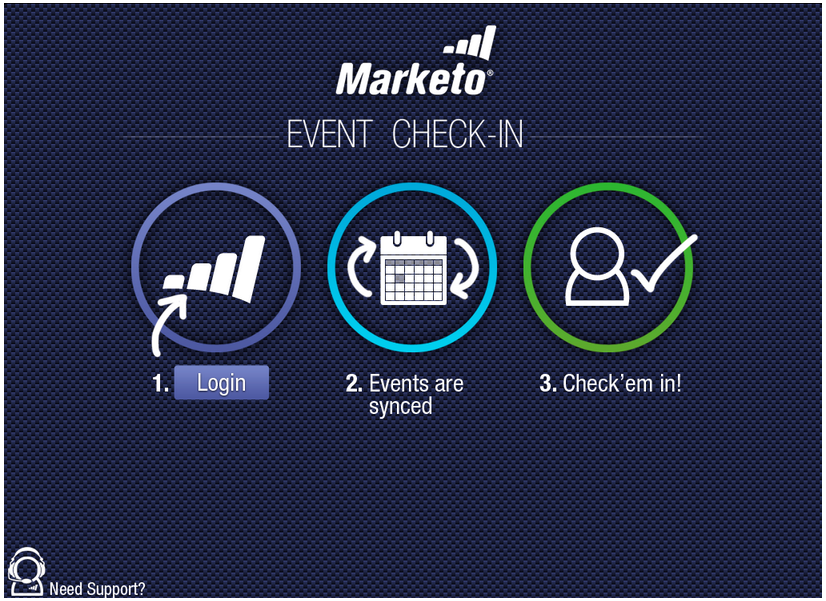

# Versionshinweise: Mai 2012 {#release-notes-may}

>[!NOTE]
>
>**Tieftauchen**
>
>Weitere Versionen finden Sie unter [Versionshinweise](http://docs.marketo.com/display/docs/release+notes) Deep Dive.

## Neugestaltung des E-Mail-Leistungsberichts {#email-performance-report-redesign}

Hinweis: Dies ist eine schrittweise Einführung, beginnend mit der Mai-Version

Die Berichte &quot;E-Mail-Leistung&quot;und &quot;Kampagne-E-Mail-Leistung&quot;wurden schneller ausgeführt. Wir haben außerdem die Definitionen bestimmter Metriken verbessert und die Metriken &quot;Gesendete Nachrichten&quot;und &quot;Gesendete Interessenten&quot;zu einer einzigen Metrik, &quot;Gesendet&quot;, zusammengefasst. Wir haben &quot;Messages Delivered&quot; und &quot;Leads Delivered&quot; zu &quot;Delivered&quot; zusammengeführt.

## Verbesserungen bei Warteschritten {#wait-step-enhancements}

Mit den neuen Eigenschaften für erweiterte Wartezeiten können Sie den Warteschritt in einer Aktion für intelligente Kampagne so konfigurieren, dass er auf einen bestimmten Wochentag, den nächsten Geschäftstag, ein bestimmtes Datum oder eine bestimmte Uhrzeit wartet. Diese Verbesserungen stellen sicher, dass Ihre Pflegeemail während der Geschäftszeiten in den Posteingang eingehen!

Abbildung 1. Festlegen des Warteschritts zum Beenden an einem Geschäftstag

## Archivierte Assets ausgeblendet {#archived-assets-hidden}

Archivierte Assets werden automatisch aus automatischen Vorschlägen, Dropdown-Listen und Berichten gefiltert, um das, was Sie suchen, leichter zu finden!

Abbildung 2. Beispiel des archivierten E-Mail-Filters

## Neue Ereignis-Check-in-App für das iPad {#new-event-check-in-app-for-ipad}

Vereinfachen Sie Ihren Ereignis-Check-in mit unserer neuen iPad-App! Die Ereignis Check-in-App wird mit Ihrem Marketo-Programm synchronisiert und ermöglicht es Ihnen, Registrierungspflichtigen schnell und einfach in ein Ereignis zu checken und neue Interessenten direkt hinzuzufügen.

Erfordert iOS 5.1 oder höher; Nur iPad.

Abbildung 3. Ereignis-Check-in-Startseite

Abbildung 4. Ereignis-Check-in: Wählen Sie Ihr Ereignis aus!

Abbildung 5. Einchecken

## Erweiterte Webinar-Bestätigungs-URL {#enhanced-webinar-confirmation-url}

Jetzt erhältlich für ON24 und Adobe Connect! Fügen Sie mit dem neuen Token `{{member.webinar URL}}` einen eindeutigen Link in die Bestätigungs-E-Mail für jeden registrierten Teilnehmer ein. Zu den Adobe Connect-Erweiterungen gehört auch die Möglichkeit, die E-Mail mit den Kontoinformationen der Adobe, die die Anmelde-ID und das Kennwort für den Benutzer enthält, zu aktivieren/deaktivieren.

Abbildung 6. Personen zu Ihrem Webinar bringen

## Template-Vorschau {#template-preview}

Suchen Sie beim Erstellen Ihrer E-Mail oder Landingpage nach einer bestimmten Vorlage, aber nicht sicher, wie diese aussieht? Mit der neuen Vorlagenfunktion können Sie die ausgewählte Vorschau vor dem Speichern eines neuen Assets überprüfen.

Abbildung 7. Vorschau der ausgewählten Vorlage

## Konfigurierbare Formularvorausfüllung {#configurable-form-prefill}

Kontrollieren Sie die Vorbelegung von Formulardaten auf Abonnement-Ebene und überschreiben Sie sie auf der Ebene der Landingpage. Ohne Vorabpopulation können Sie sicherstellen, dass der Interessent die aktuellsten Informationen bereitstellt.

Abbildung 8. Formularvorausfüllkonfiguration in Admin

Abbildung 9. Vorgabeeinstellungen für Formulare auf einer Landingpage bearbeiten

## Marketo Schatztruhe {#marketo-treasure-chest}

Erhalten Sie Zugriff auf experimentelle Funktionen, die von Marketo Engineers entwickelt wurden, um Ihre Benutzererfahrung zu verbessern. Diese Version beinhaltet die Funktion &quot;Rückgängig machen per E-Mail&quot;sowie die Möglichkeit, Kommentare einzugeben und mit anderen Benutzern an Ihren Landingpages zusammenzuarbeiten.

\

Abbildung 10. Funktionen von Treasure-Test in Admin

## Microsoft Dynamics® CRM-Integration {#microsoft-dynamics-crm-integration}

Synchronisieren Sie Konten, Kontakte und Interessenten zwischen Marketo und Microsoft Dynamics CRM Online mit unserer neuen vordefinierten Integration!

Abbildung 11. Microsoft Dynamics-Konfiguration

## Marketo Sales Insight-Erweiterungen {#marketo-sales-insight-enhancements}

**Optionen zum Abmelden von Fußzeilen**

Konfigurieren Sie, wann und ob die Fußzeile zum Abmelden für E-Mails angezeigt wird, die über Sales Insight gesendet werden.

Abbildung 12. Sales Insight-Einstellungen in Admin

## Ordner für E-Mail-Vorlagen für Vertrieb {#folders-for-sales-email-templates}

Sie können jetzt die E-Mail-Vorlagen, die mit Marketo Sales Insight freigegeben wurden, in bestimmten Ordnern organisieren, um Ihren Vertriebsmitarbeitern die Suche nach der richtigen E-Mail zu erleichtern.

Abbildung 13. Ordner für E-Mails auswählen

## Zugriff auf Opportunity Analyzer über Sales Insight {#access-opportunity-analyzer-from-sales-insight}

Geben Sie Ihren Vertriebsmitarbeitern einen Einblick, welche Marketing-Aktivitäten die Interaktion fördern, indem Sie direkt auf den Opportunity Analyzer von Marketo Sales Insight zugreifen. Hinweis: Erfordert eine Analytics-Lizenz für Umsatz.

## Benutzerdefiniertes Feld für den Kontaktstatus {#custom-field-for-contact-status}

Sie können jetzt ein benutzerdefiniertes Feld in Salesforce zuordnen, um das Feld &quot;Status&quot;für Kontakte in den Ansichten &quot;Meine besten Betten&quot;, &quot;Meine besten Beten&quot;und &quot;Meine Teams&quot;auszufüllen.

Abbildung 14. Benutzerdefiniertes Feld Kontakten zuordnen

Siehe Von anonymen Interessenten besuchte Seiten

Führen Sie einen Drilldown zu den von einem anonymen Lead aus der Ansicht Anonyme Web-Aktivitäten angezeigten Seiten aus.

Abbildung 15. Siehe Anonyme Web-Aktivität

## Verbessertes Lead- und Kontaktabonnement {#enhanced-lead-and-contact-subscribe}

Folgen Sie einem Interessenten oder wenden Sie sich jederzeit mit der neuen Schaltfläche &quot;Abonnieren&quot;auf der Seite mit den Datensatzdetails.

