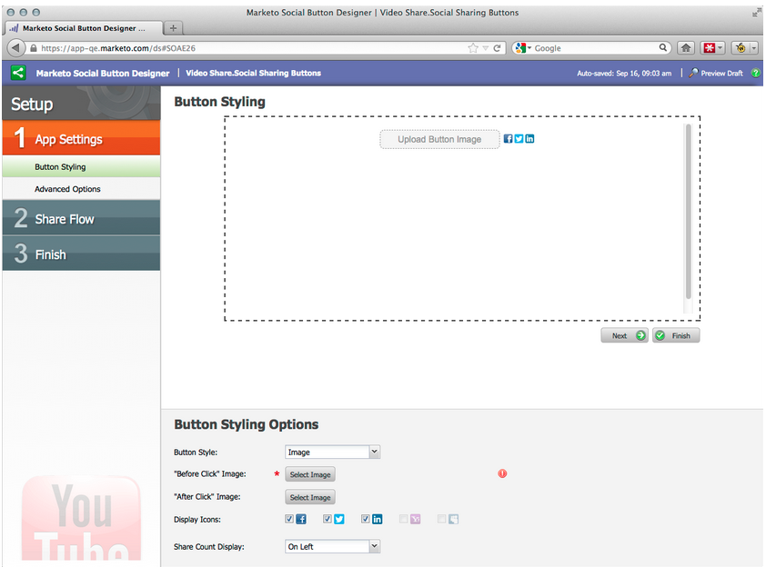

# Versionshinweise: September 2012 {#release-notes-september}

Diese Version enthält hochgradig erwartete, integrierte soziale Funktionen und Lead-Management-Strategien! Hinweis: Social-Funktionen sind als Add-On oder als Teil ausgewählter Pakete verfügbar.

## Veröffentlichen eines YouTube-Videos mit Social Sharing {#publish-a-youtube-video-with-social-sharing}

Erhöhen Sie die Audience für Ihre Videos, indem Sie Ihre Besucher dazu anregen, sie über die neue Videofreigabe auf Ihren Landingpages gemeinsam zu nutzen.

## hinzufügen einer Freigabeschaltfläche {#add-a-share-button}

Passen Sie die Freigabemeldungen vollständig an und erstellen Sie ein neues Erscheinungsbild der Schaltflächen für die Weitergabe in sozialen Netzwerken. Erfassen Sie außerdem Daten zum Social-Profil, wenn Ihre Interessenten Ihre Inhalte gemeinsam nutzen.

## Social-Anmeldung {#social-sign-on}

Profitieren Sie von Erkenntnissen und reduzieren Sie die Reibung, indem Sie Interessenten die Möglichkeit geben, Formulare mit Informationen aus ihren sozialen Netzwerken im Voraus auszufüllen.

## Landingpages auf Facebook veröffentlichen {#publish-landing-pages-to-facebook}

Erweitern Sie die Reichweite Ihrer Landingpages, indem Sie sie direkt auf Facebook veröffentlichen - inklusive Social-Apps, Formularen und der vollständigen Funktionalität der Marketo-Landingpages.

## ReadyTalk-Ereignis-Adapter {#readytalk-event-adapter}

Schließen Sie ein Marketo-Ereignis nahtlos an ein ReadyTalk-Meeting an. Verwenden Sie ein Marketo-Formular, um Registrierungspflichtige zu erfassen und sie automatisch in ReadyTalk zu registrieren. Durch eine bidirektionale Synchronisierung können Anwesenheitsinformationen in Marketo gefüllt werden.

## Microsoft Dynamics on Premise {#microsoft-dynamics-on-premise}

Wir unterstützen Microsoft Dynamics 2011 jetzt vor Ort mit einer Internet-Facing-Bereitstellung.

## Webhooks (Schatztruhe) {#webhooks-treasure-chest}

Ein Webgehaken ist ein benutzerdefinierter HTTP-Rückruf. Es ist eine großartige Möglichkeit, Daten von Marketo an einen anderen Dienst zu übertragen. Diese Funktion ist derzeit in der Schatztruhe verfügbar und wird derzeit nur in Auslöseeinstellungen unterstützt.

Beispiele für die Verwendung von Webhooks: Veröffentlichen von Benutzernamen- und Kennwortinformationen in einem anderen System, um ein Testkonto zu erstellen; Senden einer SMS-Textnachricht, wenn Sie einen neuen Interessenten erhalten.

## Aktualisierung der getMultipleLeads-API {#update-to-getmultipleleads-api}

Dem API-Aufruf getMultipleLeads wurden neue Filterkriterien hinzugefügt. Zusätzlich zum Filtern nach Datum unterstützen wir jetzt zusätzliche Kriterien:

* Datumsbereiche
* Namen der statischen Liste
* Arrays von Lead Keys

