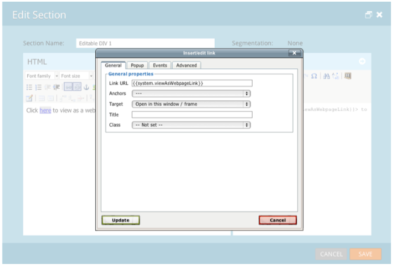

# Versionshinweise: August 2013 {#release-notes-august}

Die folgenden Funktionen sind in der Version vom August 2013 enthalten. Überprüfen Sie Ihre [Marketing Edition](http://docs.marketo.com/display/docs/assets/pricing-1.php) auf Verfügbarkeit der Funktionen.

Achten Sie nach der Veröffentlichung darauf, in der Community auf der Registerkarte &quot; [Neue Version](release-notes-december-2013.md) &quot;detaillierte Knowledge Base-Artikel für jede neue Funktion zu finden!

Nur Text-E-Mails

Jetzt können Sie [nur die Textversion](../../product-docs/email-marketing/general/creating-an-email/create-a-text-only-email.md) einer E-Mail senden. Beachten Sie, dass Links bei Verwendung dieser Option nicht dekoriert werden.

## Verbesserungen an der Kundenbindungs-Engine {#customer-engagement-engine-enhancements}

### Ausgehobene Inhalte ignorieren {#ignore-exhausted-content}

Konfigurieren Sie das Programm für die Interaktion so, dass Erschöpfung [ignoriert](../../product-docs/email-marketing/drip-nurturing/using-engagement-programs/disable-and-enable-exhausted-content-notifications.md)wird, einschließlich der Unterdrückung von Benachrichtigungen.

## Interaktions-Stream-Tests {#engagement-stream-testing}

Verwenden Sie die [neue Testfunktion](../../product-docs/email-marketing/drip-nurturing/engagement-program-streams/test-an-engagement-stream.md) , um eine Besetzung zu simulieren und neu hinzugefügte Inhalte für einen Live-Stream zu testen.

## Personalisierter Senden-Test {#personalized-send-test}

Wenn Sie einen E-Mail-Test senden, können Sie den Namen eines Interessenten auswählen, um die Test-E-Mail zu personalisieren.

## SystemToken &quot;Ansicht E-Mail als Webseite&quot;und &quot;Abmelden&quot; {#view-email-as-web-page-and-unsubscribe-system-tokens}

Nutzen Sie diese [neuen Token](../../product-docs/email-marketing/general/using-tokens/system-tokens-glossary.md) , um ihre Platzierung in E-Mails besser zu kontrollieren.

## Automatische Kampagne-Bereinigung {#automatic-trigger-campaign-cleanup}

Marketo wird Sie nun regelmäßig benachrichtigen und [automatisch auslösende Kampagnen](../../product-docs/core-marketo-concepts/smart-campaigns/using-smart-campaigns/automatic-trigger-campaign-cleanup.md) deaktivieren, die in den letzten sechs Monaten nicht ausgeführt wurden.

## Verbesserung des Finanzmanagements auf dem Markt {#marketo-financial-management-enhancement}

### Aktualisierung der Programm-Kosten  {#program-cost-update}

Die Programm Cost Synchronisation ermöglicht die Verfolgung der Programm-Kosten über mehrere Plattformen hinweg.

### Cobalt-Benutzeroberfläche {#cobalt-user-interface}

Wir setzen die Einführung unserer neuen Cobalt-Schnittstelle fort. Dieses Projekt wird alles in Marketo super Schnappheit! Die Aktualisierung wird das restliche Jahr dauern.
