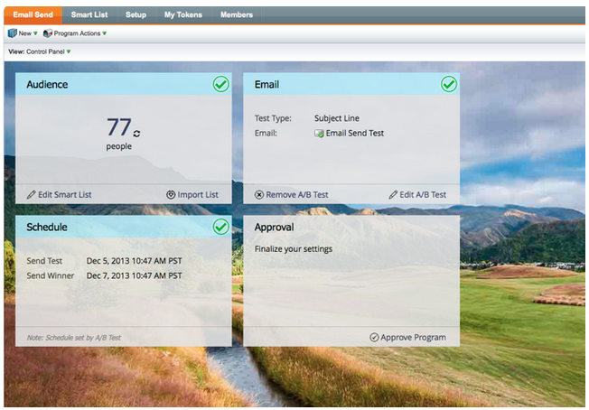

# Versionshinweise: Dezember 2013 {#release-notes-december}

Die folgenden Funktionen sind in der Dezember-Version enthalten. Überprüfen Sie Ihre [Marketing Edition](http://docs.marketo.com/display/docs/assets/pricing.php) auf Verfügbarkeit der Funktionen.

Achten Sie nach der Veröffentlichung darauf, in der Community auf der Registerkarte &quot;Neue Version&quot;detaillierte Knowledge Base-Artikel für jede Funktion zu finden!

## Sweet Background Fotos {#sweet-background-photos}

Wir haben begonnen, unser kreatives Flair in der Anwendung auszudrücken. Jedes Quartal wird ein neuer Künstler vorgestellt. Um uns abzustoßen, haben wir [Trey Ratcliff](http://stuckincustoms.smugmug.com/)ausgewählt.

## E-Mail-Programm {#email-program}

Das Senden einer E-Mail war noch nie einfacher. Verwenden Sie das neue [E-Mail-Programm](/help/marketo/product-docs/email-marketing/email-programs/creating-an-email-program/understanding-email-programs.md) , um eine Batch-E-Mail zu senden, anstelle des Standard-Programms. Definieren Sie die intelligente Liste, E-Mail, planen Sie sie und Sie sind weg!

Sehen Sie sich auch das neue Dashboard [E-Mail-Metriken](/help/marketo/product-docs/email-marketing/email-programs/email-program-data/view-the-email-program-dashboard.md) an, um zu sehen, wie Ihre E-Mail funktioniert.

## E-Mail-A/B-Tests {#email-a-b-testing}

Führen Sie im neuen E-Mail-Programm einen [A/B-Test](/help/marketo/product-docs/email-marketing/email-programs/email-program-actions/email-test-a-b-test/add-an-a-b-test.md) für einen prozentualen Anteil an der Gesamtanzahl der E-Mail-Senden aus. Wählen Sie aus vier verschiedenen Testtypen: Betreffzeile, Von Adresse, Datum/Uhrzeit und gesamte E-Mail. Sie können sogar auswählen, ob Sie den Gewinner manuell bewerben möchten oder ob das System ihn anhand vordefinierter Gewinnkriterien bewerben soll. Das neue E-Mail-Programm, einschließlich A/B-Test, kann in Ereignisse und das Standard-Programm verschachtelt werden, um die E-Mail so einfach zu versenden!

## E-Mail-Champion/Challenger-Test {#email-champion-challenger-testing}

[Champion/Challenger-Tests](/help/marketo/product-docs/email-marketing/general/functions-in-the-editor/email-tests-champion-challenger/add-an-email-champion-challenger.md) ähneln A/B-Tests, aber der Unterschied ist, dass sie für ausgelöste E-Mails verwendet werden und Sie nicht automatisch einen Gewinner senden. Dieser Test ermöglicht es Ihnen, eine etablierte Art, etwas zu tun, genannt Champion, herauszufordern und zu testen, ob es noch die beste ist, indem Sie einen Challenger einführen. Außerdem können Champion/Challenger-E-Mail-Tests innerhalb von Interaktion-Programm-Streams verwendet werden.

## Interessentendetails in der E-Mail-Analyse {#lead-details-in-email-analysis}

In der E-Mail-Analyse haben wir zusätzliche Lead- und Firma-Attribute eingeführt. Sie können jetzt Ihre E-Mail-Statistiken nach neuen Attributen wie Branche und Interessentenquelle gruppieren.

## Verbesserter BrightTALK-Ereignis-Adapter {#enhanced-brighttalk-event-adapter}

Jetzt können Sie von Ihrem BrightTALK-Kanal und -Ereignis aus Registrierungspflichtige nach Marketo ziehen. Sie können diese Informationen verwenden, um andere Marketing-Kampagnen zu informieren!
