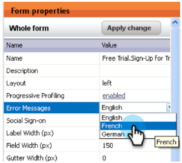
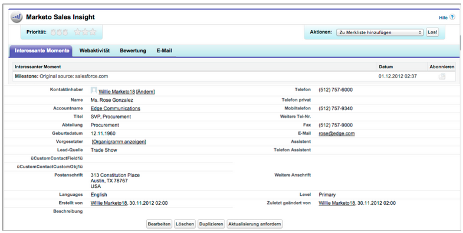

# Versionshinweise: Januar 2013 {#release-notes-january}

Die Januar-Version erweitert unser Social-Angebot um **Verweisende Angebot**. Darüber hinaus können Marketo Lead Management-Benutzer ihre Zeitzone, Sprache und Gebietsschema-Voreinstellung festlegen. Beachten Sie, dass mit einem * gekennzeichnete Funktionen nur in der Select Edition verfügbar sind.

## Empfehlungsangebote {#referral-offers}

Ein **Referrer-Angebot** gibt Ihren Interessenten einen Anreiz, ihre Freunde zu verweisen. Erstellen Sie Ziele und Belohnungen für erfolgreiche Verweise. Sie können es auf Landingpages, Ihrer Website und sogar Facebook verwenden.

## Zeitzonenpräferenz {#time-zone-preference}

Sie können die Standardzeitzone für Ihr persönliches Marketo-Konto ändern. Wenn das Abonnement beispielsweise standardmäßig &quot;Pacific Time&quot;ist, können Sie es für Ihr eigenes Konto in &quot;Eastern Time&quot;ändern.

## Wählen Sie Ihre Marketo Lead Management Language {#select-your-marketo-lead-management-language}

Sie können die Standardsprache für Ihr Marketo-Benutzerkonto ändern. Auch wenn die Standardeinstellung für das Abonnement Englisch ist, können Sie sie für Ihren eigenen Gebrauch in Deutsch oder Französisch ändern.

## Fehlermeldungen bei mehrsprachigen Formularen {#multi-lingual-form-error-messages}

Wenn ein Interessent ein Marketo-Formular ausfüllt, werden einige Überprüfungsmeldungen automatisch integriert. Möglicherweise möchten Sie eine andere Anzeigesprache für diese Fehlermeldungen auswählen. Wir unterstützen jetzt Englisch, Deutsch und Französisch.

Ein Beispiel für ein französisches Formular:

## Wählen Sie Ihre Sales Insight-Sprache (nur Salesforce) {#select-your-sales-insight-language-salesforce-only}

Wenn Ihre Salesforce-Spracheinstellung auf Französisch oder Deutsch eingestellt ist, wird diese Präferenz von Marketo Sales Insight berücksichtigt. Laden Sie das neueste MSI-Paket herunter, um diese Funktion zu erhalten (verfügbar in der Woche vom 14. Januar).

## Name der Feldanzeige {#field-display-name}

Feldanzeigenamen können Text in verschiedenen Sprachen anzeigen (z. B. werden Multibyte-Zeichen unterstützt).

## Programmdaten ändern {#change-program-data}

Mit dem Schritt zum Ändern der Programm-Daten können Sie den Erfolgsstatus und das Erfolgsdatum eines Programm-Mitglieds manuell über eine Kampagne ändern. Sie können diesen Flussschritt verwenden, um einen Fehler zu beheben oder ein Mitglied, das möglicherweise nicht wie gewünscht am Programm teilgenommen hat, manuell zu ändern.

