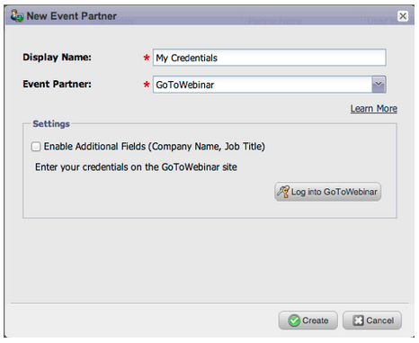

# Versionshinweise: September 2013 {#release-notes-september}

Die folgenden Funktionen sind in der September-Version enthalten. Bitte überprüfen Sie Ihre [Marketo Edition](http://docs.marketo.com/display/docs/assets/pricing.php), um die Funktionsverfügbarkeit zu ermitteln.

Nach der Veröffentlichung sollten Sie sich die Registerkarte [Neue Version](release-notes-december-2013.md) in der Community ansehen, um detaillierte Knowledge Base-Artikel für jede Funktion zu erhalten!

## Kürzere URLs {#shorter-urls}

Für E-Mail-URLs wurde ein Trim zur Klick-freundlichen Verwendung für den Empfänger unter Beibehaltung der gesamten Verfolgungsfunktionalität festgelegt.

>[!CAUTION]
>
>Wenn wir auf Kurz-URLs umstellen, laufen Links in E-Mails, die vor der Septemberversion gesendet wurden, 90 Tage nach dieser Version ab.

Verwenden Sie Daten von Marketing zu benutzerdefinierten Objekten oder fügen Sie Ihrem E-Mail-Inhalt Bedingungslogik in der Velocity-Vorlagensprache hinzu.

## Senden des Tests an Beispiel {#change-send-test-to-send-sample} ändern

Wir haben die Aktion Test senden umbenannt in Beispiel senden

## Personalisierte Beispiel-E-Mail {#personalized-send-sample-email}

Wenn Sie ein E-Mail-Muster senden, können Sie den Namen eines Interessenten auswählen, um die Muster-E-Mail zu personalisieren.

## Zusätzliche Feldsynchronisierung für GoToWebinar {#additional-field-sync-for-gotowebinar}

Sie können den Firmen- und Auftragsnamen aus Ihrem Marketing-Formular mit dem GoToWebinar synchronisieren. Um diese zusätzlichen Felder zu aktivieren, gehen Sie zu Ereignis Partners und aktivieren Sie &quot;Zusätzliche Felder aktivieren&quot;.

## Benutzeranmeldung auf SSO beschränken {#restrict-user-login-to-sso-only}

Abonnement so konfigurieren, dass nur Marketo-Benutzer sich über die einmalige Anmeldung und nicht über den normalen Anmeldebildschirm anmelden können

## Virenprüfung hochgeladener Dateien {#virus-scan-of-uploaded-files}

In Design Studio hochgeladene Dateien werden jetzt automatisch gescannt und blockiert, wenn die Dateien Viren enthalten

## Export Opportunity Influenza Analyzer {#export-opportunity-influence-analyzer}

Sie können die Daten jetzt im Opportunity Influence Analyzer nach Excel exportieren. Jede exportierte Excel-Datei enthält alle Marketing-Interaktionen für alle Interessenten (einschließlich derjenigen, die keine Rolle in der Gelegenheit spielen) sowie alle Möglichkeiten unter dem ausgewählten Konto im Analyzer. Die Anlaufstellen werden grün hervorgehoben. Sie können die nativen Datenfilterfunktionen von Excel verwenden, wenn Sie sich auf bestimmte Interessenten oder Marketing-Aktivitäten konzentrieren müssen.

## Programm-Zuordnungseinstellungen {#program-attribution-settings}

Sie können die Art und Weise ändern, wie Marketo Kontakte und Möglichkeiten für First Touch- und Multi-Touch-Zuordnungsmetriken verknüpft, einschließlich der Fähigkeit, eine kontobasierte Zuordnung vorzunehmen. Diese Einstellungen wirken sich auf die Zuordnungsmetriken in Umsatz-Explorer-Berichten im Bereich &quot;Analyse für Programm-Chancen&quot;und im Bereich &quot;Analyse für Chancen&quot;aus. Dies wirkt sich auch auf die Zuordnungsmetriken in Programm Analyzer aus.

Sie können die Programm-Zuordnungseinstellungen in eine von drei Optionen ändern. Wenn Sie diese Einstellung ändern, werden keine Marketing- oder CRM-Daten geändert. Sie ändert lediglich die Ausführung Ihrer Berichte und kann jederzeit rückgängig gemacht werden.

Bei der Einstellung Explizit werden nur Kontakte mit Rollen geprüft (aktuelles Verhalten). Implizit prüft alle mit dem Konto verbundenen Kontakte unabhängig von der Rolle. Es wird dringend empfohlen, nach Möglichkeit den Expliziten Modus zu verwenden. Die Verwendung von Impliziten kann falsche positive Ergebnisse hervorrufen, Menschen, die für eine Chance verschrieben werden, obwohl sie keinen wirklichen Einfluss auf die Chancen haben.

## Sales Insight verfügbar in Französisch und Deutsch (nur Salesforce) {#sales-insight-available-in-french-and-german-salesforce-only}

Laden Sie die aktuelle Version von Marketo Lead Management und Marketo Sales Insight von AppExchange herunter, damit Ihre französischen und deutschen Vertriebsmitarbeiter Sales Insight-Inhalte in ihrer bevorzugten Sprache anzeigen können.

## Cobalt-Benutzeroberfläche {#cobalt-user-interface}

In den nächsten Monaten wird ein neues Thema in verschiedenen Anwendungsbereichen eingeführt. In diesem Monat werden Sie vielleicht mehr neue blaue modale Fenster bemerken.
