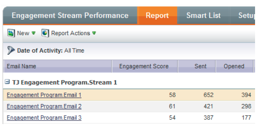

# Versionshinweise: Februar 2014 {#release-notes-february}

Die folgenden Funktionen sind in der Version vom Februar 2014 enthalten. Überprüfen Sie Ihre Marketing Edition auf Verfügbarkeit der Funktionen. Stellen Sie nach der Veröffentlichung sicher, dass Sie wieder zu den Links zu detaillierten Artikeln der Wissensdatenbank für jede Funktion zurückkehren!

## Interaktionsbewertung als Gewinnkriterien {#engagement-score-as-winning-criteria}

[Verwenden Sie den Interaktionswert, ](../../product-docs/email-marketing/email-programs/email-program-actions/email-test-a-b-test/define-the-a-b-test-winner-criteria.md) um die Gewinner-Variante im A/B-Split-Test oder im Champion/Challenger-Test zu ermitteln. Der Test muss mindestens 24 Stunden lang ausgeführt werden, um einen angemessenen Interaktionswert zu erhalten.

## Registerkarte &quot;Ergebnisse des E-Mail-Programms&quot; {#email-program-results-tab}

[Ansicht der ](../../product-docs/email-marketing/email-programs/email-program-data/view-email-program-results.md) Ergebnisse und Aktivitäten, die für das E-Mail-Programm protokolliert wurden.

## Personen/Interessenten, die sich beim Versenden von {#people-leads-blocked-from-mailing} blockiert haben

[Klicken Sie auf die Personen/Interessenten, die von der ](../../product-docs/email-marketing/email-programs/managing-people-in-email-programs/define-an-audience-with-a-smart-list.md) Postleitzahl blockiert wurden, um zu sehen, wer die E-Mail nicht erhalten wird, weil er nicht abonniert wurde, in der schwarzen Liste aufgeführt ist, eine ungültige oder leere E-Mail-Adresse hat oder das Marketing ausgesetzt wurde.

## E-Mail-Programm-Daten exportieren {#export-email-program-data}

[Exportieren Sie E-Mail-Metriken in Excel](../../product-docs/email-marketing/email-programs/email-program-data/export-email-program-dashboard-to-excel.md), einschließlich AB-Test-Variantendaten.

## Interaktionsbewertung im Interaktions-Stream-Leistungsbericht {#engagement-score-in-engagement-stream-performance-report}

Der Interaktionswert wurde dem Bericht [Leistung des Interaktions-Streams](../../product-docs/email-marketing/drip-nurturing/reports-and-notifications/engagement-stream-performance-report.md) hinzugefügt, damit Sie sehen können, wie effektiv der Inhalt in Ihrem Interaktions-Programm ist.

## Programm-Details in der E-Mail-Analyse {#program-details-in-email-analysis}

[Jetzt können Sie Ihre E-Mail-Metriken nach Programm, Kanal und Tags](../../product-docs/reporting/revenue-cycle-analytics/email-analysis/build-an-email-analysis-report-that-shows-program-information.md) gruppieren. Der Name des Programms wird dem Feld &quot;E-Mail-Name&quot;hinzugefügt, wenn es sich bei der E-Mail um ein lokales Asset für das Programm handelt. Das neue Feld &quot;Name des Programms&quot;zeigt den Programm der intelligenten Kampagne an, die die E-Mail gesendet hat. Dies kann sich vom Programm im Feld &quot;E-Mail-Name&quot;unterscheiden, wenn es sich bei der E-Mail um ein lokales Asset eines anderen Programms handelt.

## Aktualisieren auf Klicks Link-Filter und Auslösen {#update-to-clicks-link-filters-and-trigger}

Die folgenden Filter- und Auslösenamen wurden aktualisiert:

* Klicks Link zu Klicks Link auf der Webseite
* Klicken auf Link zum angeklickten Link auf der Webseite
* Nicht auf Link geklickt, um nicht auf Link auf der Webseite geklickt zu werden

## Forms 2.0-Verbesserungen {#forms-enhancements}

Mit dieser Version haben wir Forms 2.0 mehrere &quot;Quality of Life&quot;-Updates bereitgestellt. Neben der Aktivierung der progressiven Profilerstellung für eingebettete Formulare haben wir Workflow- und UX-Änderungen vorgenommen, die die Verwendung der erweiterten Funktionen im Editor, [einschließlich der Sichtbarkeitsregeln](../../product-docs/demand-generation/forms/form-fields/dynamically-toggle-visibility-of-a-form-field.md), der erweiterten Dankeseiten und der ausgeblendeten Felder erleichtern.

