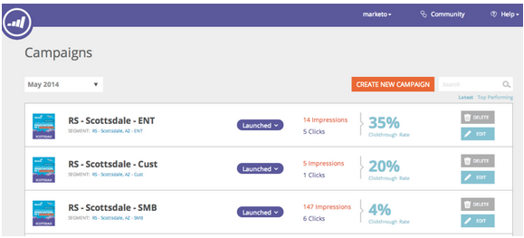

# Versionshinweise: Juni 2014 {#release-notes-june}

Die folgenden Funktionen sind in der Version vom Juni 2014 enthalten. Überprüfen Sie Ihre Marketing Edition auf Verfügbarkeit der Funktionen.

## Die Benutzeroberfläche wurde aktualisiert - bald verfügbar! {#updated-ui-coming-soon}

Ein neues Erscheinungsbild, einschließlich der Navigation für das Marketing Lead Management, kommt bald in einer späteren Version!

## Sales Insight-Plugin für Outlook 2013 {#sales-insight-plugin-for-outlook}

Dies erfordert einen Download des neuen Plug-ins. Sie können es von [hier](../../product-docs/marketo-sales-insight/msi-outlook-plugin/install-the-marketo-email-add-in-for-outlook-with-a-registration-code.md)herunterladen.

## Token-Auflösung {#token-resolution}

Wenn Sie eine Test-E-Mail von Sales Insight senden, werden die Token in der E-Mail nicht aufgelöst und der Standardwert wird gesendet. Diese Verbesserung stellt sicher, dass Token in Test-E-Mails aufgelöst werden.

## Anpassen der Prozentsätze für Sterne und Flammen {#customize-percentages-for-stars-and-flames}

[Stellen Sie den Prozentsatz](../../product-docs/marketo-sales-insight/msi-for-salesforce/features/stars-and-flames/customize-stars-and-flames.md) der Leads ein, die 1, 2 oder 3 Sterne und Flammen erhalten.

## Interessentenwiederkehrungs-API {#lead-rest-api}

Erstellen, lesen und aktualisieren Sie Interessenten programmatisch über unsere neue ReST-API. Um mit ReST beginnen zu können, müssen Sie einen benutzerdefinierten Dienst [in Marketo](../../product-docs/administration/additional-integrations/create-a-custom-service-for-use-with-rest-api.md) erstellen. Rufen Sie dann die [Entwicklersite](http://developers.marketo.com/documentation/rest/) auf, um Einzelheiten zur Verwendung dieser API zu erfahren.

## Aktualisierung der Kampagnen-Seite für die Marketing-to-Real-Time-Personalisierung {#marketo-real-time-personalization-rtp-campaigns-page-update}

RTP-Kampagnen enthalten jetzt ein neues Design mit Miniaturansicht-Ansichten und Kampagne-Performance. Darüber hinaus können Sie Ihre Kampagnen [je nach Datum oder Leistung](../../product-docs/web-personalization/working-with-web-campaigns/sort-web-campaigns-by-latest-or-top-performing.md) organisieren.

## Webanalyseintegrationen {#web-analytics-integrations}

Hängen Sie alle RTP-Daten in Ihre Webanalyseplattform an.

Die Integration mit [Google Analytics](../../product-docs/web-personalization/reporting-for-web-personalization/web-analytics-integrations/integrate-rtp-with-google-analytics.md) (GA) ist jetzt standardmäßig aktiviert. Aktivieren Sie daher unter &quot;Kontoeinstellungen&quot;den Switch, über den Daten an benutzerdefinierte Variablen und Ereignis für GA gesendet werden sollen.

Wir haben die Integration auch mit [Adobe SiteCatalyst](../../product-docs/web-personalization/reporting-for-web-personalization/web-analytics-integrations/integrate-with-adobe-analytics.md)abgeschlossen.
