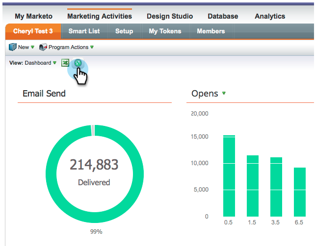

# Versionshinweise: März 2014 {#release-notes-march}

Die folgenden Funktionen sind in der Version vom März 2014 enthalten. Überprüfen Sie Ihre Marketo Edition auf Verfügbarkeit der Funktionen. Stellen Sie nach der Veröffentlichung sicher, dass Sie für jede Funktion auf Links zu Artikeln in der Wissensdatenbank zurückkommen.

## Schaltfläche zum Aktualisieren des E-Mail-Programm-Dashboards {#email-program-dashboard-refresh-button}

Verwenden Sie die [Aktualisierungsschaltfläche](/help/marketo/product-docs/email-marketing/email-programs/email-program-data/use-the-email-program-dashboard.md), um aktuelle E-Mail-Metriken zu Ihrem E-Mail-Versand oder Ihrem AB-Test zu erhalten!

## Rückgängig/Wiederholen im E-Mail-Editor und im Snippet-Editor {#undo-redo-in-the-email-editor-and-snippet-editor}

[Rückgängig oder ](/help/marketo/product-docs/email-marketing/general/email-editor-2/edit-elements-in-an-email.md) Duplizieren Sie 50 Aktionen für die aktuelle Sitzung.

## Programmstatusspalten im Programmleistungsbericht {#program-status-columns-in-program-performance-report}

Wenn Sie den [Programm Performance Report](/help/marketo/product-docs/core-marketo-concepts/programs/program-performance-report/add-program-status-columns-to-a-program-report.md) verwenden, können Sie jetzt sehen, wie viele Personen in welchem Programm-Status sind.

## Enthaltene und betriebliche Programme für Analytics {#inclusive-and-operational-programs-for-analytics}

Sie können jetzt [Programm ohne Periodenkosten](/help/marketo/product-docs/reporting/revenue-cycle-analytics/program-analytics/make-a-program-without-a-period-cost-available-in-revenue-explorer-and-analyzers.md) in Umsatz-Explorer und Analyzern einschließen, indem Sie die Option Analytics-Verhalten auf &quot;Einschließen&quot;einstellen, wenn Sie Programm-Kanal bearbeiten. Sie können betriebliche Programme auch durch Auswahl von &quot;Operativ&quot;ganz aus dem Berichte ausschließen.

## Hybride und implizite Optionen für die Interessentenumrechnung {#hybrid-and-implicit-options-for-lead-conversion}

Sie können die Art und Weise ändern, wie Marketo Kontakte und Möglichkeiten für die Interessentenumrechnungsmetriken in der Interessentenumrechnungsmetrik verknüpft. Sie können [die Zuordnungseinstellung](/help/marketo/product-docs/administration/settings/change-attribution-settings-for-analytics.md) in eine von drei Optionen ändern. Durch Ändern dieser Einstellung werden keine Marketo- oder CRM-Daten geändert. Sie ändert lediglich die Ausführung Ihrer Berichte und kann jederzeit rückgängig gemacht werden.

Die Einstellung Explizit behandelt Kontakte mit Rollen nur in einer Gelegenheit als konvertierte Interessenten (Standardverhalten). Implizit behandelt alle mit dem Konto verbundenen Kontakte in der Gelegenheit, unabhängig von der Rolle, als konvertiert. Hybrid behandelt Kontakte mit Rollen so, als wären sie konvertiert, wenn verfügbar; Wenn keine, behandeln wir alle Kontakte in dem Konto als konvertiert.

Zur Erinnerung: Diese Einstellung ändert auch die Metriken zur Programm-Zuordnung.

## Zusätzliche Benutzersprache {#additional-user-language}

Wählen Sie Ihre [Marketo-Anwendungssprache](/help/marketo/product-docs/administration/settings/select-your-language-locale-and-time-zone.md). Ansicht der Marketo Lead Management-Oberfläche in Ihrer bevorzugten Sprache - jetzt wird Japanisch unterstützt.

## Marketo Developer-Blog {#marketo-developer-blog}

Das [Marketo Developer Blog](https://developers.marketo.com/blog/) ist speziell für Webentwickler und Softwareingenieure gedacht, die die sich schnell entwickelnden Anforderungen des modernen Marketingexperten unterstützen. Sie können Ankündigungen zu neuen Integrationsoptionen, Aktualisierungen der API-Version und eine neue Reihe von Anleitungen abonnieren, die Codebeispiele und Best Practices zur Integration mit der Marketo-Plattform enthalten.

Der [erste Artikel](https://developers.marketo.com/blog/retrieving-customer-and-prospect-information-from-marketo-using-the-api/) in dieser Reihe erläutert Ihnen, wie Sie mithilfe der API effizient Informationen zu den Personen (Kunden/Kontakte/Interessenten) abrufen können, die in Marketo gespeichert werden.
