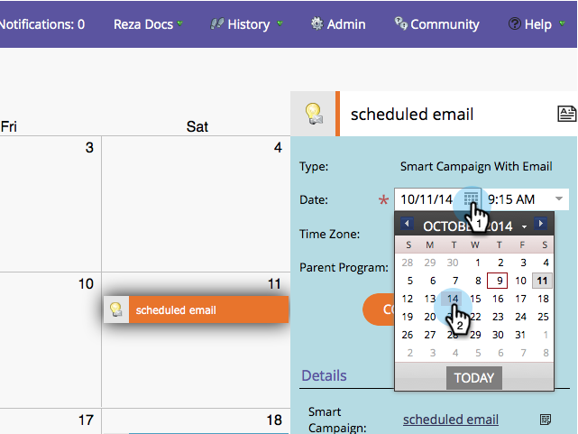

# Versionshinweise: Oktober 2014 {#release-notes-october}

Überprüfen Sie Ihre Marketo-Edition auf Funktionsverfügbarkeit. Die Dokumentation wird zum Zeitpunkt der Veröffentlichung veröffentlicht.

## Programm-Fokus im Marketingkalender {#program-focus-in-marketing-calendar}

[Erstellen und bearbeiten Sie ](../../product-docs/core-marketo-concepts/marketing-calendar/understanding-the-calendar/understand-enable-program-focus.md) Einträge direkt im Marketingkalender.

## Neue ReST-API-Aufrufe {#new-rest-api-calls}

Verwenden Sie die API, um neue Aktivitäten oder Änderungen an Interessenten abzurufen:

* Interessentenänderungen abrufen
* Interessentenanwerbung - Aktivitäten
* Abrufen von Aktivitäten
* Paging-Token abrufen

Vollständige Details sind nach der Veröffentlichung unter [developer.marketo.com](http://developers.marketo.com/documentation/rest/) verfügbar.

## MSI - Senden von Marketo E-Mail an Microsoft Dynamics {#msi-send-marketo-email-for-microsoft-dynamics}

[Senden und verfolgen Sie ](../../product-docs/marketo-sales-insight/msi-for-microsoft-dynamics/setting-up-and-using/send-a-marketo-sales-email-from-microsoft-dynamics.md) E-Mails zu Interessenten und Kontakten von Microsoft Dynamics.

## MSI - Hinzufügen zu Marketo-Kampagnen für Microsoft Dynamics {#msi-add-to-marketo-campaigns-for-microsoft-dynamics}

[hinzufügen führt und kontaktiert Marketo Smart ](../../product-docs/marketo-sales-insight/msi-for-microsoft-dynamics/setting-up-and-using/add-a-lead-contact-to-a-marketo-campaign-from-microsoft-dynamics.md) Kampagnen direkt von Microsoft Dynamics. Marketing kann auswählen, welche Marketo-Kampagnen für den Vertrieb verfügbar sind.

## Benutzerdefinierte Entitätsunterstützung für Microsoft Dynamics Sync {#custom-entity-support-for-microsoft-dynamics-sync}

[Verwenden Sie benutzerdefinierte Objektdaten ](../../product-docs/crm-sync/microsoft-dynamics-sync/microsoft-dynamics-sync-details/microsoft-dynamics-sync-custom-entity-sync/enable-sync-for-a-custom-entity.md) von Microsoft Dynamics zum Filtern und Auslösen in intelligenten Listen, intelligenten Kampagnen, Programmen...

## Aktionärsunterstützung für Microsoft Dynamics Sync {#shareholder-support-for-microsoft-dynamics-sync}

Synchronisieren Sie die Aktionärsdaten von Dynamics. Unterstützt werden auch Möglichkeiten, die über das Feld &quot;Primär Account&quot; mit einem Konto verbunden sind, sowie Kontaktmöglichkeiten über die Synchronisierung &quot;Primär Contact&quot;.

## RTP - Dashboard-Erweiterungen {#rtp-dashboard-enhancements}

Das Dashboard wurde jetzt erweitert und enthält nun weitere Daten auf einen Blick:

* Gesamtzahl der Organisationsbesuche
* Die fünf leistungsfähigsten Branchen
* Gesamtzahl der beteiligten Besucher

## RTP - Neue Mobilvorlagen für Kampagnen {#rtp-new-mobile-templates-for-campaigns}

Erstellen Sie mit diesen neuen Vorlagen schnell und einfach mobile Kampagnen[.](../../product-docs/web-personalization/using-templates/using-templates-to-create-web-campaigns.md)

## RTP - User Context API {#rtp-user-context-api}

Verwenden Sie einen neuen Aufruf, der den Verlauf des letzten Besuchs des Besuchers verfolgt. Personalisieren Sie Kampagnen auf Basis des Besuchers:

* Vorige Seiten angezeigt
* Produkte, die
* Welche RTP-Kampagnen sie gesehen haben

Ausführliche Informationen finden Sie unter [developer.marketo.com](http://developers.marketo.com/documentation/websites/rtp-js-api/).

