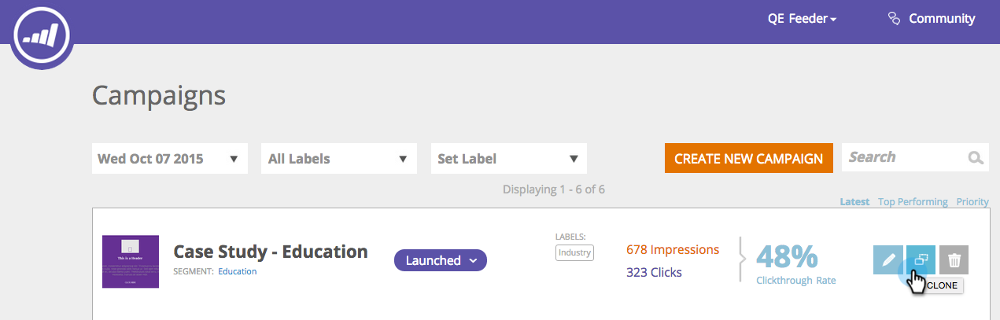

# Versionshinweise: Herbst 2015 {#release-notes-fall}

Die folgenden Funktionen sind in der Version Herbst 15 enthalten. Überprüfen Sie Ihre Marketing Edition auf Verfügbarkeit der Funktionen.

## Eine intelligente Liste abonnieren {#subscribe-to-a-smart-list}

[Eine intelligente Liste abonnieren](../../product-docs/reporting/basic-reporting/report-subscriptions/subscribe-to-a-smart-list.md)

Mit dem Abonnement für intelligente Liste können Marketingexperten eine intelligente Liste exportieren und per E-Mail an Interessenvertreter senden, die z. B. keine Marketing-Produkte verwenden, z. B. Verkaufs- oder Telemarketing-Teams.

Der Export kann täglich, wöchentlich oder monatlich geplant werden, das Enddatum haben und für die Freigabe einer begrenzten Spaltenanzahl angepasst werden.


Mehrere Abonnements können auf einer intelligenten Liste erstellt werden. Es gibt eine Beschränkung von 100 Abonnements mit 100.000 Interessenten pro Abonnement, über Arbeitsbereiche hinweg, pro Marketo-Instanz.


## Zu benutzerdefinierten Objekten markieren {#marketo-custom-objects}

[Zu benutzerdefinierten Objekten markieren](http://docs.marketo.com/display/docs/marketo+custom+objects)

Benutzerdefinierte Objekte lassen sich einfach über die Admin-Benutzeroberfläche erstellen. Wir unterstützen derzeit die Möglichkeit, ein 1:N-benutzerdefiniertes Objekt in Marketo zu erstellen und es mit einem Interessenten oder einer Firma zu verbinden.

>[!NOTE]
>
>&quot;Markieren zu benutzerspezifischen Objekten&quot;steht für Spark nicht zur Verfügung.


## Marketo Insights for Google Chrome {#marketo-insights-for-google-chrome}

[Marketo Insights for Google Chrome](../../product-docs/marketo-sales-insight/msi-chrome-plugin/using-marketo-insights-for-google-chrome.md)

Wir freuen uns, die Veröffentlichung eines Updates für unsere Google Mail Sales Insight Erweiterung bekannt geben zu können! Ansicht im [Chrome Store](https://nation.marketo.com/external-link.jspa?url=https://chrome.google.com/webstore/detail/marketo-insights-for-goog/jjkfbhajlmoeegbjgjipliamplidmbjb).

Dieses Update umfasst viele neue Funktionen:

* Vor dem Kontakt können Verkäufer relevante Informationen über ihre Potenzieller Kunde direkt in Google Mail anzeigen, einschließlich Auftragstitel, Twitter-Profile, Informationen zur Firma, Fotos und mehr.
* Vertriebsmitarbeiter können in Echtzeit sehen, mit welchen Inhalten Potenzieller Kunde über Kanal hinweg interagieren, wie z. B. geöffnete oder angeklickte E-Mails, besuchte Online- oder persönliche Ereignisse, besuchte Webseiten, heruntergeladene eBooks und vieles mehr.
* Über Google Mail gesendete E-Mails werden in Marketo protokolliert und in Echtzeit verfolgt. So können Verkäufer sehen, wann Potenzieller Kunde ihre E-Mails ansehen, damit sie genau zum richtigen Zeitpunkt nachverfolgen können. Marketo Sales Insight für Google Mail macht es Vertriebsmitarbeitern auch leicht, durch Marketing erstellte Vorlagen zu nutzen, um schöne Einladungen, Angebote und andere Inhaltstypen zu senden.


## Marketing-Mobile-Interaktion - Tokens, Beispiel senden und Vorschau {#marketo-mobile-engagement-tokens-send-sample-preview}

* [Tokens](../../product-docs/mobile-marketing/push-notifications/configure-mobile-push-notification.md)
* [Beispiel senden](../../product-docs/mobile-marketing/push-notifications/send-a-push-notification-sample.md)
* [Vorschau](../../product-docs/mobile-marketing/push-notifications/preview-a-push-notification.md)

Push-Benachrichtigungen lassen sich einfach mit [Token](https://docs.marketo.com/pages/viewpage.action?pageId=7512454)personalisieren.


Sie können auch eine [Vorschau](../../product-docs/mobile-marketing/push-notifications/preview-a-push-notification.md) durchführen oder eine [Beispiel](../../product-docs/mobile-marketing/push-notifications/send-a-push-notification-sample.md) -Push-Benachrichtigung senden, bevor Sie sie für Kunden bereitstellen.


## Intelligente Kampagnen in Momenten {#smart-campaigns-in-moments}

[Intelligente Kampagnen in Momenten](../../product-docs/core-marketo-concepts/mobile-apps/marketo-moments/understanding-moments/understanding-smart-campaign-cards.md)

Statistiken zu E-Mails, die über Smart-Kampagnen gesendet werden, sind jetzt in Moments verfügbar. Weitere Funktionen dieses Upgrades:

* Blättern Sie durch. Haben Sie zu viele Karten in Ihrem Stream? Du kannst sie jetzt wegwischen!
* Senden eines Beispiels direkt vom Bildschirm &quot;Vorschau&quot;
* Details zur intelligenten Liste, die zu E-Mail-Programm-Karten hinzugefügt wurden
* Unterstützung für den Status &quot;Abgebrochen&quot;für E-Mail-Programm hinzugefügt


## RTP - Inhaltsanalyse und Recommendations {#rtp-content-analytics-and-recommendations}

[Content Analytics](../../product-docs/web-personalization/understanding-web-personalization/understanding-content-analytics.md) und Recommendations

RTP Content Analytics zeigt Ihnen die Leistung Ihrer Webinhalt-Assets aus regelmäßigen Webbesuchen und Besuchen, die Sie auch über die Inhaltsempfehlung-Engine von RTP erhalten haben.

* Erkennen, welche Inhalte am leistungsfähigsten sind und die meisten Interessenten einbringen
* Steigern Sie Ihren Inhaltskonsum, indem Sie Inhalte in der Predictive Content Engine von RTP aktivieren, um automatisch die besten Inhalte den richtigen Besuchern zu empfehlen.
* Drilldown für jedes Inhaltselement, um tiefere Metriken, Grafiken und Leistung zu sehen.

Die Seite &quot;Assets&quot;von RTP ist jetzt in Content Analytics und Content Recommendations unterteilt.

* **Inhaltsanalyse:** Zeigt die Ansichten und direkten Interessenten aller entdeckten und definierten Webinhalte an, sodass Sie Ihre leistungsstärksten Inhalte analysieren können.
* **Content Recommendations**: Zeigt Impressionen und Klicks von RTP empfohlenen Inhalten und der zugehörigen Interessentenzuordnung. Sie können auch Inhaltsempfehlungen auf dieser Seite für die Empfehlungen [der Leiste](https://docs.marketo.com/display/DOCS/Enabling+the+Content+Recommendation+Engine) und [Rich-Media](https://docs.marketo.com/display/DOCS/Enabling+the+Rich+Media+Recommendation+Engine) bearbeiten und aktivieren.

* Alle direkten Interessentendaten auf diesen beiden Seiten wurden seit dem Beginn des Jahres (1. Januar 2015) nachträglich aktualisiert.

## RTP - Clone an RTP-Kampagne {#rtp-clone-an-rtp-campaign}

[RTP - Clone an RTP-Kampagne](../../product-docs/web-personalization/working-with-web-campaigns/clone-a-web-campaign.md)

Durch das Klonen einer RTP-Kampagne können Sie schneller und effizienter personalisierte Web-Kampagnen erstellen. Verwenden Sie die Klonfunktion auf der Seite &quot;Kampagne&quot;von RTP, um die Einstellungen für die Kampagne zu kopieren und den Inhalt für die Optimierung der Teilung zu ändern, oder klonen Sie eine Kampagne mit demselben Inhalt und Zielgruppe zu einem anderen Segment. Erstellen Sie Kampagnen in Sekunden!



## Rich-Text-Editor-Verbesserungen {#rich-text-editor-improvements}

Der Rich-Text-Editor wurde um einige Verbesserungen ergänzt. Nachdem wir den aktualisierten Editor im Juli veröffentlicht haben, erhielten wir großes Feedback und konnten diese Änderungen in diese Aktualisierung aufnehmen. In den nächsten Monaten gibt es noch viel mehr. Hier eine Liste der neuen Funktionen im 4. Quartal:

* VML wird jetzt in Ihrem HTML-Code unterstützt:

   ```
   <v:background xmlns:v="urn:schemas-microsoft-com:vml" fill="t">
   ```

   ```
   <v:fill type="tile" src="<a href="http://i.imgur.com/YJOX1PC.png" rel="nofollow">http://i.imgur.com/YJOX1PC.png</a>" color="#7bceeb"/>
   ```

   ```
   </v:background>
   ```

* In einen gültigen HTML-Kommentar kann nun alles eingefügt werden (bestimmte Syntaxen wie unten gezeigt wurden zuvor entfernt):

   ```
   <!--[if gte mso 9]> 
   ```

   ```
   <![endif]-->
   ```

* Leere Tabellenzellen nicht mit `**`

* Schaltfläche &quot;Maximieren/Minimieren&quot;zum HTML-Quell-Editor hinzugefügt
* Bereits vorhandene Tabelleneigenschaften werden jetzt im Dialogfeld &quot;Tabelleneigenschaften&quot;identifiziert und angezeigt
* Beide Schaltflächenzeilen werden jetzt standardmäßig angezeigt.
* Der Editor akzeptiert jetzt alle Elemente (auch nicht mehr unterstützte oder nicht standardmäßige Elemente):

   ```
   <myCustomElement>Hello World!</myCustomElement>
   ```

* Der Editor akzeptiert jetzt alle Attribute (auch nicht mehr unterstützte oder nicht standardmäßige Attribute):

   ```
   <myCustomElement myCustomAttribute="foo">Hello World!</myCustomElement>
   ```

   ```
   <td background="someImage.png"> 
   ```

## Microsoft Dynamics - Synchronisierung überprüfen {#microsoft-dynamics-validate-sync}

[Microsoft Dynamics - Synchronisierung überprüfen](../../product-docs/crm-sync/microsoft-dynamics-sync/sync-setup/validate-microsoft-dynamics-sync.md)

Dieses neue Admin-Tool führt eine Reihe von Prüfungen durch, um festzustellen, ob die Synchronisierungskonfigurationen korrekt eingerichtet wurden.


## hinzufügen Felder für die benutzerdefinierte CRM-Objektsynchronisierung {#add-fields-to-crm-custom-object-sync}

Fügen Sie benutzerspezifischen Objekten, die aus Salesforce und Dynamics synchronisiert werden, ganz einfach neue Felder hinzu. Sie können Ihrer benutzerdefinierten Objektsynchronisierung jetzt neue Felder hinzufügen, ohne das gesamte benutzerdefinierte Objekt zu deaktivieren und zu aktivieren.

## Änderungen an Sicherheitsfunktionen {#changes-to-security-features}

* Kennwortversuche sind auf 5 beschränkt. Nach dem fünften Versuch wird der Benutzer gesperrt.
* Der inaktive Sitzungs-Timeout kann jetzt für das Abonnement konfiguriert werden.


## Unterstützung für IE 11 (und veraltete Unterstützung für IE 9) {#ie-support-and-deprecating-support-for-ie}

Wir unterstützen jetzt offiziell den Microsoft Internet Explorer 11 Browser und entfernen die Unterstützung für den Microsoft Internet Explorer 9 Browser.

## Unterstützung der Blitzoberfläche für MSI {#lightning-ui-support-for-msi}

Das neueste MSI-Paket zum Austausch von Apps funktioniert sowohl mit Blitzen als auch mit älteren Versionen der Salesforce-Benutzeroberfläche.

## Neues Dynamics-Plug-in {#new-dynamics-plug-in}

Dieses neue Plug-in führt verschiedene Aktionen im asynchronen Modus aus, um die Leistung zu erhöhen.

## Nach URL der Landingpage in Design Studio suchen {#search-by-url-of-landing-page-in-design-studio}

Im Raster Landingpage von Design Studio können Sie jetzt nach Seiten-URL suchen, um Ihre Landingpages zu finden. Dies ist auch exportierbar.
