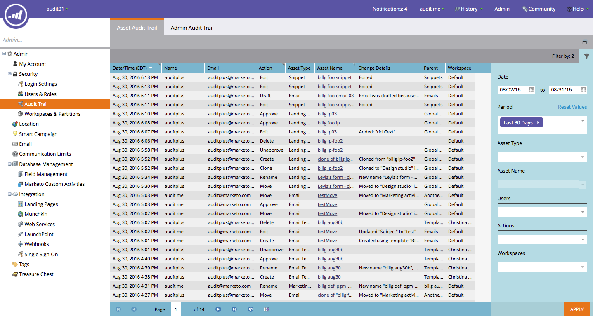

# Versionshinweise: Summer &#39;16 {#release-notes-summer}

Die folgenden Funktionen sind in der Sommerversion &#39;16 enthalten. Überprüfen Sie Ihre Marketo-Edition auf Funktionsverfügbarkeit. Bitte klicken Sie auf die Titellinks, um detaillierte Ansichten zu den einzelnen Funktionen anzuzeigen.

## [Kontobasiertes Marketing](http://docs.marketo.com/display/docs/account+based+marketing) {#account-based-marketing}

Marketo Account-basiertes Marketing bietet alle wesentlichen Komponenten einer einheitlichen Plattform:

* **Zielgruppe**  - Kontoerfassung, Interessenten-zu-Konto-Übereinstimmung und Listen für benannte Konten
* **Interagieren**  - Kontobasierte Personalisierung, Interaktion mit anderen Kanälen und kontospezifische Workflows
* **Messen**  - Auswirkungen auf Konto und Liste, Kontointeraktions-Score und Pipeline- und Umsatz-Ebene

>[!NOTE]
>
>ABM ist als Add-On für Ihr Marketo-Abonnement erhältlich. Wenden Sie sich daher an Ihren Vertriebsmitarbeiter, um es implementieren zu lassen.

## [Prüfpfad](http://docs.marketo.com/display/docs/audit+trail) {#audit-trail}

Der Audit-Protokoll liefert einen umfassenden Überblick über die in Ihrem Marketing-Abonnement vorgenommenen Änderungen. Es schafft Rechenschaftspflicht bei Benutzern und Administratoren, hilft bei der Identifizierung der Ursache unerwarteten Verhaltens und bietet die Sicherheit zu wissen, wer was und wann tut. Diese Informationen stehen jederzeit zur Verfügung und können zur Beantwortung von Fragen wie:

* Was ist mit diesem Asset oder dieser Einstellung passiert und wer hat es zuletzt aktualisiert?
* Was hat Benutzer X bisher gemacht?
* Wer meldet sich bei unserem Konto an?

## [Marketing-Vibes SMS LaunchPoint-Integration](http://docs.marketo.com/display/docs/vibes+sms+messages) {#marketo-vibes-sms-launchpoint-integration}

Erstellen Sie ganz einfach SMS-Nachrichten direkt in Marketo. Personalisieren und Zielgruppe Ihrer Nachricht mit Ihren Rich-Marketing-Daten und einfache Überwachung der Leistung mithilfe des SMS-Dashboards.

>[!NOTE]
>
>Diese Funktion erfordert, dass Sie über ein bestehendes Vibes SMS-Konto verfügen.

## [Verbesserungen in Email 2.0](/help/marketo/product-docs/email-marketing/general/email-editor-2/email-editor-v2-0-overview.md) {#email-enhancements}

**Variablen auf Modulebene**

Zuvor waren alle in E-Mail 2.0-Vorlagen angegebenen Variablen &quot;global&quot;im Gültigkeitsbereich. Wenn Variablen in Modulen verwendet werden, ist dies nicht immer wünschenswert, wenn Sie mehrere Instanzen des Moduls verwenden möchten. Mit dieser Version können Variablen jetzt als &quot;Modulebene&quot;angegeben werden. Dadurch können Sie angeben, dass der Benutzer eindeutige Werte für jedes Modul festlegen kann, in dem er verwendet wird.

**Syntaxaktualisierungen**

* Sie können nun &quot;mktoAddByDefault&quot;für Module verwenden, die in E-Mail 2.0-Vorlagen angegeben sind, um anzugeben, welche Module standardmäßig in neuen E-Mails angezeigt werden sollen. Dies ist viel bequemer, wenn Sie eine E-Mail-Vorlage mit einer großen Anzahl von Modulen erstellen.
* Bei Bildelementen können Sie jetzt angeben, ob die &quot;height&quot;- und &quot;width&quot;-Eigenschaften des zugrunde liegenden ``-HTML-Elements für den Endbenutzer gesperrt oder bearbeitbar sein sollen. mktoLockImgSize=&quot;true&quot; bewirkt, dass Höhe/Breite gesperrt werden (auch wenn das Bild geändert wird). Ebenso führt mktoLockImgStyle=&quot;true&quot; dazu, dass die Eigenschaft &quot;style&quot;gesperrt wird.

**Codesuche**

Verwenden Sie neue Suchfunktionen, um Inhalte im E-Mail-Code effizient zu finden und zu ersetzen. Diese Funktion ist auch im Editor für E-Mail-Vorlagen verfügbar.

**Token-Unterstützung in Bildelementen**

Tokens können jetzt im Bereich &quot;Externe URL&quot;des Erlebnisses zum Einfügen von Bildern verwendet werden! Wenn Sie Bilder mit `{{my.tokens}}` angegeben haben, können Sie jetzt auf diese Token in Email Editor 2.0 verweisen. Beachten Sie, dass das Bild weiterhin auf der Arbeitsfläche des E-Mail-Editors 2.0 beschädigt angezeigt wird. Sie sehen jedoch, wie sie in Vorschau gerendert und als Beispiel gesendet werden, bevor Sie Ihre E-Mail versenden.

## [Mehrere Branding-Domänen](http://docs.marketo.com/display/docs/add+multiple+branding+domains) {#multiple-branding-domains}

E-Mail-Tracking-Links können nur mit einer einzigen Markendomäne versehen werden. Sie können jetzt mehrere Markendomänen hinzufügen, um das Vertrauen der Verbraucher zu steigern, ein optimiertes Erscheinungsbild zu schaffen, den Fokus auf die Marke zu legen, die E-Mail-Zustellbarkeit zu verbessern und auf E-Mail-Basis auszuwählen, welche Markendomäne für die Verfolgungslinks jeder E-Mail verwendet werden soll.

## [Programm-Tokens](/help/marketo/product-docs/demand-generation/landing-pages/personalizing-landing-pages/tokens-overview.md) {#program-tokens}

Wir haben einen neuen Token-Typ für Programm erstellt. Sie können jetzt Programm-Name, Beschreibung und ID in Assets und intelligenten Kampagnen-Flussschritten wiedergeben.

## [Enterprise-Schlüssel](/help/marketo/product-docs/marketo-sales-insight/msi-outlook-plugin/authorize-the-marketo-outlook-plugin.md) {#enterprise-key}

Die Installation des Sales Insight Plugins für Outlook durch jeden Mitarbeiter Ihres Vertriebsteams kann mühsam sein. Wir haben eine neue Möglichkeit eingeführt, das Plugin für Outlook remote mit einem Unternehmensschlüssel zu installieren. Senden Sie Ihrem IT-Team Ihren einzigartigen Schlüssel, den Sie im Abschnitt Marketo Sales Insight von Admin finden, und lassen Sie sie den Rest erledigen.

## [Kampagnen zur Web-Personalisierung](/help/marketo/product-docs/web-personalization/working-with-web-campaigns/create-a-new-dialog-web-campaign.md) {#web-personalization-campaigns}

Geben Sie eine Verzögerung an, auf die Web-Kampagnen auf Ihrer Website reagieren können.

## [Content Analytics und Recommendations Export](/help/marketo/product-docs/web-personalization/understanding-web-personalization/understanding-content-analytics.md) {#content-analytics-and-recommendations-export}

Ansicht von Inhaltsanalysen- und Empfehlungsdaten offline.

## [API-Unterstützung für Email Editor 2.0](http://developers.marketo.com/documentation/asset-api/) {#api-support-for-email-editor}

Bereits vorhandene Asset-APIs, die zuvor nur mit E-Mails und Vorlagen der Version 1.0 kompatibel waren, sind jetzt für E-Mail-Assets der Version 2.0 aktiviert.

## [Website von Marketing-Entwicklern](http://developers.marketo.com/) {#marketo-developers-site}

Neu und verbessert!

## [Datenschutzeinstellungen](/help/marketo/product-docs/administration/settings/understanding-privacy-settings.md) {#privacy-settings}

Marketingexperten können mithilfe der Datenschutzeinstellungen entscheiden, ob Besucher mithilfe der Funktionen Munchkin und Web-Personalisierung verfolgt werden sollen. Die Verfolgung wird über die Einstellung &quot;Keine Verfolgung&quot;des Browsers, ein Ausschluss-Cookie oder eine nicht spezifische IP gesteuert. Diese Methoden können sich auf den Wert und die Funktionalität von Marketo in bestimmten Bereichen auswirken. Wenn der Marketingspezialist jedoch nichts ändert, bleibt die Funktion von Marketo gleich.

Diese Funktion wird Kunden über einen Zeitraum von sechs Wochen schrittweise zur Verfügung gestellt. Wenn Sie es sofort benötigen, wenden Sie sich bitte an den Support von Marketo.
