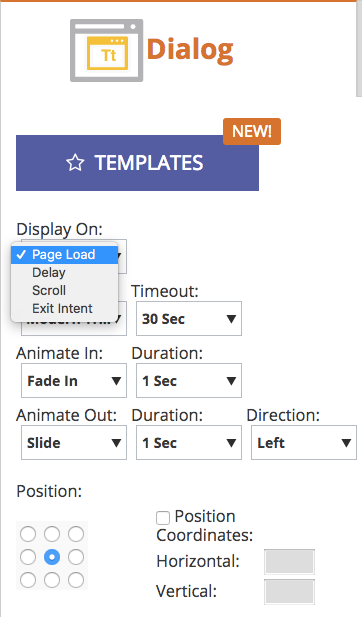

# Versionshinweise: Spring &#39;17 {#release-notes-spring}

Die folgenden Funktionen sind in der Version Frühjahr 17 enthalten. Überprüfen Sie Ihre Marketo Edition auf Funktionsverfügbarkeit.

Bitte klicken Sie auf die Titellinks, um detaillierte Ansichten zu den einzelnen Funktionen anzuzeigen. **Hinweis**: Wenn ein Thema mehrere Unterüberschriften enthält, werden die Links dort platziert.

## [linkedIn Lead Gen Forms](/help/marketo/product-docs/demand-generation/social/social-functions/set-up-linkedin-lead-gen-forms.md) {#linkedin-lead-gen-forms}

[linkedIn Lead Gen ](https://business.linkedin.com/marketing-solutions/native-advertising/lead-gen-ads) Forms sind eine direktere Möglichkeit für ein Unternehmen, Kampagnen zur Interessentenanwerbung auf LinkedIn zu führen. Personen können Formulare ausfüllen, um Interesse an einem Produkt oder einer Dienstleistung zu bekunden, sodass das Unternehmen die Daten der Person erfassen und mit Marketo synchronisieren kann, wo automatisierte Folgeprozesse und Aktivitäten von Interessentenanwerbungen stattfinden können.

Die Marketo-Integration mit LinkedIn Lead Gen Forms erfasst automatisch die Informationen, die ein Interessent im Lead Gen-Formular bereitstellt. Folgeaktionen und Benachrichtigungen können dann mithilfe des neuen Triggers **Ausfüllen des LinkedIn-Interessentenformulars** automatisiert werden.

## [MSI-Vorlage abgelaufen](/help/marketo/product-docs/marketo-sales-insight/msi-for-salesforce/features/actions-in-the-msi-panel/send-marketo-email/publish-an-email-to-sales-insight.md) {#expire-msi-template}

Die Tage der Bereinigung veralteter Vorlagen in Sales Insight sind vorbei. Legen Sie ein Ablaufdatum fest, wenn Sie Ihre E-Mail veröffentlichen, und wir werden dafür sorgen, dass die Veröffentlichung für Sie rückgängig gemacht wird, wenn das Ablaufdatum umlaufbar ist.

>[!NOTE]
>
>Das Festlegen des Ablaufdatums für den 31.05.17 bedeutet, dass die Vorlage am Ende des Tages am 31.05.17 aus Sales Insight entfernt wird.

## [Massenextrahierungs-APIs für Personen und Aktivitäten](https://developers.marketo.com/rest-api/bulk-extract/) {#bulk-extract-apis-for-people-and-activities}

Übermitteln Sie auf einfache Weise große Mengen an Personen- und Aktivitäten-Daten von Marketo an Ihre externen Systeme.

## ABM-Verbesserungen {#abm-enhancements}

**[Benutzerdefinierte Felder für von ABM benannte Konten](https://docs.marketo.com/x/1wnG)**

Mit Marketo ABM können Sie jetzt bis zu 10 benutzerdefinierte Felder in Ihren benannten Konten erstellen. Sie können diese benutzerdefinierten Felder Feldern in Ihrem CRM-Kontoobjekt zuordnen, und Marketo ABM synchronisiert die Daten, sodass Sie Ihre ABM-benannten Konten erweitern und Ihr Marketing fördern können.

**[Perzentile Scoring bei von ABM benannten Konten](https://docs.marketo.com/display/docs/assets/abmpercentiles.png)**

Benannte Kontowerte können stark variieren. Marketo ABM errechnet nun automatisch einen Perzentil für jede Ihrer Bewertungen, sodass Sie auf einen Blick sehen können, wo jedes benannte Konto zu Ihren anderen benannten Konten gehört.

**[ABM-Konto-Listen-APIs](https://developers.marketo.com/rest-api/lead-database/named-account-lists/)**

Profitieren Sie von umfassenden und robusten ABM-Partnerintegrationen mit verbesserter API-Unterstützung für Named Account-Listen.

## Verbesserte Web-Personalisierung {#web-personalization-enhancements}

**[Web-Kampagne bei Bildlauf](/help/marketo/product-docs/web-personalization/working-with-web-campaigns/set-how-your-web-campaign-displays.md)**

Neue Web-Kampagne-Effekte bieten Ihren Web-Besuchern ein personalisierteres Erlebnis. Stellen Sie Ihre personalisierten Web-Kampagnen so ein, dass sie nur angezeigt werden, wenn ein Web-Besucher einen Bildlauf nach unten auf Ihrer Webseite durchführt. Sie können Ihre Web-Kampagnen für Dialogfelder so einrichten, dass sie bei einem Bildlauf angezeigt werden, basierend auf:

* Prozentsatz der durchlaufbaren Seite
* Pixel erreicht
* Bildlauf unter der Kante der Seite

**[Web-Kampagne bei Exit-Absicht](/help/marketo/product-docs/web-personalization/working-with-web-campaigns/set-how-your-web-campaign-displays.md)**

Erfassen Sie die Aufmerksamkeit Ihres Besuchers, bevor er Ihre Seite schließt. Stellen Sie Ihre personalisierten Web-Kampagnen so ein, dass sie nur angezeigt werden, wenn eine Mausbewegung darauf hinweist, dass der Besucher die Seite verlässt.

**[Animationseffekte für Web-Kampagnen](/help/marketo/product-docs/web-personalization/working-with-web-campaigns/create-a-new-dialog-web-campaign.md)**

Legen Sie die Animationseffekte für Ihre Dialog-Web-Kampagne fest, um festzulegen, wie eine Kampagne angezeigt wird, wenn Sie Ihre Webseite aufrufen oder verlassen. Sie können zwischen 6 verschiedenen Effekten wählen und die Timing- und Richtung des Dialogfelds steuern.

**[Anpassung des Schließen-Dialogs](/help/marketo/product-docs/web-personalization/working-with-web-campaigns/create-a-new-dialog-web-campaign.md)**

Passen Sie die Schaltfläche &quot;Schließen&quot;für Dialogfelder an. Wählen Sie aus einer Reihe von Optionen aus, die in Web-Kampagnen mit transparentem Dialogfeldstil verwendet werden. Wählen Sie das Symbol, die Farbe und die Position für die Schaltfläche &quot;Schließen&quot;aus. Sie können auch ein eigenes Schaltflächenbild hinzufügen.

**[Web-Kampagnen-Archiv](/help/marketo/product-docs/web-personalization/working-with-web-campaigns/archive-a-web-campaign.md)**

Archiv ist ein neuer Web-Kampagne-Status, mit dem Sie Web-Kampagnen archivieren und von der standardmäßigen Web-Kampagne-Ansicht ausblenden können. Dadurch können Sie sich auf Ihre relevantesten, aktiven Kampagnen konzentrieren und ältere archivierte Kampagnen nach Bedarf abrufen.

**[Lokalisierung](/help/marketo/product-docs/administration/settings/select-your-language-locale-and-time-zone.md)**

Web-Personalisierung wird jetzt in allen von Marketo unterstützten Sprachen angeboten (Englisch, Japanisch, Deutsch, Spanisch, Französisch und Portugiesisch).

## Prognostische Verbesserungen {#predictive-enhancements}

**[Lokalisierung](/help/marketo/product-docs/administration/settings/select-your-language-locale-and-time-zone.md)**

Predictive Content wird jetzt in allen von Marketo unterstützten Sprachen (Englisch, Japanisch, Deutsch, Spanisch, Französisch und Portugiesisch) angeboten.

## [Veraltete Rich Text Editor- und Form Editor 1.0-Aktualisierung](https://nation.marketo.com/docs/DOC-4315) {#legacy-rich-text-editor-and-form-editor-deprecation}

Ab dem 1. August 2017 werden Kunden, die weiterhin den alten Rich Text Editor und Form Editor 1.0 verwenden, automatisch auf das neue Erlebnis umgestellt.
