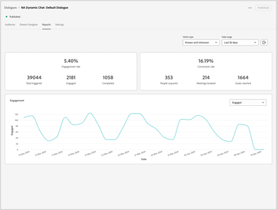

# Dynamic Chat-Versionshinweise {#dynamic-chat-release}

Adobe Dynamic Chat-Releases basieren auf einem kontinuierlichen Bereitstellungsmodell, das einen skalierbareren Ansatz für die Implementierung von Funktionen ermöglicht. Manchmal gibt es mehrere Versionen in einem Monat. Schauen Sie daher regelmäßig nach, um aktuelle Informationen zu erhalten.

Die standardmäßige Seite mit Versionshinweisen für Marketo Engage [finden Sie hier .](/help/marketo/release-notes/current.md){target="_blank"}.

## Version Mai 2024 {#may-release}

**Veröffentlichungsdatum: 15. Mai 2024**

### Vorab genehmigte Antwortbibliothek {#pre-approved-response-library}

[Erstellen einer Bibliothek, die für das Marketing genehmigt wurde](/help/marketo/product-docs/demand-generation/dynamic-chat/generative-ai/response-library.md){target="_blank"} von KI generierten Fragen und Antworten, um die Einrichtung eines generativen KI-Chat in Minuten zu unterstützen.

## Unbeantwortete Fragen {#unanswered-questions}

[Verwenden eines Repositorys unbeantworteter Fragen](/help/marketo/product-docs/demand-generation/dynamic-chat/generative-ai/unanswered-questions.md){target="_blank"} aus früheren Konversationen, um neue vorab genehmigte Antworten zu generieren und eine Antwortbibliothek mit den neuesten Informationen zu verwalten.

### Konversationszusammenfassungen {#conversation-summaries}

[Kundenbetreuer können zusammengefasste Gespräche führen](/help/marketo/product-docs/demand-generation/dynamic-chat/live-chat/agent-inbox.md#conversation-summary){target="_blank"} Einblicke in wichtige Diskussionsthemen im Vorfeld von Sitzungen, um die Vorbereitungszeit zu verkürzen und Vertriebsmitarbeiter mit den neuesten Informationen besser zu rüsten.

### Tastenkombinationen für GenAI {#genai-sales-shortcuts}

[Schnellere Bereitstellung von Live-Chat-Agenten](/help/marketo/product-docs/demand-generation/dynamic-chat/live-chat/agent-inbox.md#shortcuts){target="_blank"} Um auf KI-generierte Antworten zuzugreifen, bearbeiten Sie vorhandene generierte Antworten und suchen Sie nach zusätzlichen Inhalten, die während der Konversation an Käufer gesendet werden.

### Unterhaltungshilfe {#conversation-assist}

Hilfe für Vertriebsmitarbeiter bei Live-Unterhaltungen mit von Ihrem Marketing-Team vorab genehmigten Antworten.

### Diskussionsforen {#conversation-nudges}

Fügen Sie Webbesuchern einen Aktionsaufruf hinzu, um Gespräche zum Abschluss zu bringen.

## Version April 2024 {#april-release}

**Veröffentlichungsdatum: 23. April 2024**

### Konversationsflüsse jetzt für alle Benutzer verfügbar {#conversational-flows-available-to-all-users}

Gestalten Sie Ihre Formulare und Landingpages kommunikativer und verkürzen Sie den Verkaufstrichter, indem Sie qualifizierten Leads erlauben, ein Meeting oder einen Chat mit Sales unmittelbar nach einer Formularübermittlung mit Conversational Forms zu buchen, die jetzt vollständig verfügbar ist.&#42; für alle Dynamic Chat-Benutzer.

_&#42;Zuvor als Testfunktion mit 100 Lebensdauerinteraktionen verfügbar. Die Interaktionen mit dem Konversationsfluss werden jetzt auf die monatliche Begrenzung von 250 Interaktionen angerechnet, die für Benutzer im Paket Auswählen verfügbar sind._

### Callback-Funktionen {#callback-functions}

[Callback-Funktionen](/help/marketo/product-docs/demand-generation/dynamic-chat/setup-and-configuration/callback-functions.md){target="_blank"} ermöglichen es Ihnen, Dynamic Chat-Analyseereignisse in externen Systemen wie Adobe Analytics oder Google Analytics zu erfassen, wenn Besucher mit Dynamic Chat-Konversationen interagieren. Sie aktivieren Dynamic Chat-Analytics-Ereignisse, indem Sie einen Callback mit der API registrieren, um die Ereignisse zu überwachen. Auf diese Weise können Sie eine ganzheitlichere Sicht auf Ihre Dynamic Chat-Interaktion im Zusammenhang mit anderen wichtigen Daten wie dem Web-Traffic haben.

### Verfügbarkeitsbedingungen für Live-Agenten zu bedingter Verzweigung hinzugefügt {#live-agent-availability-conditional-branching}

Zusätzlich zu nativen und benutzerdefinierten Marketo Engage-Feldern können Sie jetzt bedingte Verzweigungen verwenden, um Verzweigungen basierend auf der Verfügbarkeit von Agenten zu erstellen. Dies ist nützlich, wenn Sie Besuchern nur die Möglichkeit bieten möchten, mit einem Live-Agenten zu sprechen, wenn Live-Agenten verfügbar sind.

### Bedingung für intelligente Liste zu bedingter Verzweigung hinzugefügt {#smart-list-condition}

Durch das Hinzufügen der neuen Marketo Engage-Smart-List-Bedingung zur bedingten Verzweigung können Sie Verzweigungen erstellen, die auf bereits in Marketo Engage erstellten bereits bestehenden Zielgruppen basieren, anstatt die Verzweigungsbedingungen für Zielgruppen im Dynamic Chat zu definieren.

### Bedingte Verzweigung für konversale Flüsse {#conditional-branching-for-conversational-flows}

Wir haben Anfang dieses Jahres bedingte Verzweigungen für Dialoge veröffentlicht, und jetzt können Sie auch die bedingte Verzweigung in Konversationsflüssen nutzen! Bedingte Verzweigungen ermöglichen es Ihnen, Verzweigungen in Ihrem Fluss basierend auf unterschiedlichen Bedingungen zu erstellen.

### Live-Chat für Konversationsflüsse {#live-chat-for-conversational-flows}

Wir haben 2023 die Live-Chatfunktion für Dialoge veröffentlicht und jetzt können Sie auch Live-Chatinteraktionen zu Ihren Konversationsflüssen hinzufügen. Wenn Sie Konversionsflüsse mit Ihren Marketo Engage-Formularen verwenden, können Sie jetzt qualifizierten Besuchern erlauben, unmittelbar nach der Formularübermittlung mit einem Live-Agenten zu chatten!

### Letzte Marketo Engage-Aktivitäten im Agent-Posteingang {#recent-marketo-engage-activities-in-agent-inbox}

Wir haben die letzten Marketo Engage-Aktivitäten zum Abschnitt &quot;Letzte Aktivitäten&quot;des Agenten-Posteingangs hinzugefügt. Wenn ein Site-Besucher also einen Chat mit einem Agenten anfordert, kann der Agent schnell erkennen, ob der Besucher kürzlich eine der folgenden Marketo Engage-Aktivitäten ausgeführt hat (letzte 25 Aktivitäten):

* Hat E-Mail geöffnet
* Besuchte Webseite
* Ausgefülltes Formular
* Hatte interessanten Moment

### Verbindungsstatus des Kalenders in der Agentenverwaltung {#calendar-connection-status-in-agent-management}

Administratoren können nun leicht erkennen, welche Agenten mit Buchungsberechtigungen für Meetings ihre Kalender in Dynamic Chat verbunden haben. Dadurch können Sie sicherstellen, dass Ihr gesamtes Vertriebsteam verbunden ist und die Möglichkeit hat, Besprechungsanfragen von Dynamic Chat zu akzeptieren.

### Mindestmeldeeinstellung in der Konfiguration des Agentkalenkalenders {#minimum-notice-setting-in-agent-calendar-configuration}

Benutzer berichteten, dass Webbesucher mit nur 10 Minuten erweiterter Benachrichtigung Sitzungen in ihrem Kalender buchten. Daher haben wir in die Agentenkalenderkonfiguration eine Mindestwarnungseinstellung eingeführt und die standardmäßige Vorlaufzeit auf 24 Stunden festgelegt.

### Benutzerverhalten aktualisiert hinzufügen/entfernen {#add-remove-user-behavior-updated}

Einige Benutzer gaben an, dass beim Hinzufügen und Entfernen von Agenten im dynamischen Chat Probleme aufgetreten seien. Daher haben wir einige Änderungen vorgenommen, um diese Probleme zu beheben.

Wenn ein Benutzer zur Admin Console mit einer Live-Chat- oder Sitzungsbuchungsberechtigung hinzugefügt wird, wird er sofort in der Liste der Agentenverwaltung angezeigt und kann zu Dialogfeldern, Gesprächsflüssen, Routing-Regeln und Teams hinzugefügt werden.

Wenn ein Benutzer mit einer Sitzungsbuchung oder Live-Chat-Berechtigung aus der Admin Console entfernt wird, wird er sofort aus dem Dynamic Chat entfernt, ist nicht mehr für Live-Chat oder Meeting-Routing verfügbar und wird nicht mehr mit Lizenzbeschränkungen gezählt.

### Verbesserte Berichtleistung auf Konversationsebene {#improved-conversation-level-report-performance}

Berichte auf Ebene einzelner Dialogfelder und Konversationsflüsse sind jetzt leistungsfähiger und genauer. Bisher konnte das Laden von Dialogfeldberichten mehrere Sekunden dauern und die Daten waren gelegentlich nicht mit den globalen Leistungsberichten konsistent. Jetzt werden Ihre einzelnen Dialogfeldberichte sofort geladen und die Daten werden immer mit den globalen Berichtsdaten abgestimmt.

### Berechtigungsaktualisierungen {#permission-updates}

Wir haben die Berechtigungsstruktur und -benennung in Adobe Admin Console bereinigt, um die Berechtigungsverwaltung intuitiver zu gestalten.

* Die Kategorie &quot;Unterhaltungsverwaltung&quot;heißt nun &quot;Konversationen&quot;.
* Die Kategorie &quot;Meetings&quot;heißt jetzt &quot;Aktivitäten&quot;
* Die Kategorie &quot;Agenteneinstellungen&quot;heißt jetzt &quot;Agenten&quot;.
* Die Kategorie &quot;Admin-Einstellungen&quot;heißt jetzt &quot;Konfiguration&quot;
* Die Kategorie &quot;Live-Chat&quot;wurde entfernt und alle Live-Chat-Berechtigungen wurden in die Kategorie &quot;Agenten&quot;verschoben.

### Unterstützung für Hyperlinks im Agent Inbox {#support-for-hyperlinks-in-agent-inbox}

Wenn jetzt Live-Chat-Agenten URLs mit Besuchern im Chat teilen, werden diese URLs per Hyperlink verknüpft, sodass Besucher einfach auf sie klicken können, um zur Seite zu navigieren, anstatt die URL kopieren und in ihren Browser einfügen zu müssen.

### Eingabe des Schlüsselverhaltens, das im Agent-Posteingang aktualisiert wurde {#enter-key-behavior-updated-in-agent-inbox}

Wir haben das Verhalten der Eingabetaste im Agent Inbox umgestellt. Drücken Sie also die Eingabe- oder Eingabetaste, um Ihre Nachricht zu senden, und drücken Sie Umschalt+Eingabetaste, um einen Zeilenumbruch zu erzeugen.

### Round Robin-Seite entfernt {#round-robin-page-removed}

Mach dir keine Sorgen! Das Round Robin Routing ist noch voll funktionsfähig und funktioniert genauso wie immer. Wir haben gerade die Seite entfernt, die eine häufig ungenaue Liste von Agenten und deren Reihenfolge in der Round Robin Routing-Warteschlange anzeigte.

Als wir 2022 Dynamic Chat herausbrachten, gab es keine Unterstützung für Live-Chat, nur Meetingbuchungen, und die Round Robin Routing-Seite wurde nur unter Berücksichtigung der Buchung konzipiert. Mit der Einführung des Live-Chat im letzten Jahr wurde die Round Robin-Seite überholt, da sie nicht genau die komplexere Art des Round Robin Routing zwischen Agenten mit sowohl Sitzungsbuchung als auch Live-Chat-Berechtigungen widerspiegelt. Wir haben verschiedene Möglichkeiten untersucht, um dieses Problem zu lösen, aber letztlich beschlossen wir, dass die vollständige Abschaffung die beste Option ist, um Verwirrung zu minimieren.

## Version Februar 2024 {#february-release}

**Veröffentlichungsdatum: 22. Februar 2024**

### Seite &quot;Konversationen&quot; {#conversations-page}

Auf der neuen Seite &quot;Konversationen&quot;finden Sie eine zentrale Anlaufstelle, um Transkripte für alle Konversationen (automatisiert und live) anzuzeigen, die für Ihre Instanz stattgefunden haben, sowohl für bekannte als auch für anonyme Leads. So erhalten Sie eine bessere Übersicht darüber, wie Ihre Kunden mit Ihren Dialogfeldern, Konversationsflüssen und Live-Agenten interagieren.

### Der Datumsbereich im globalen Dashboard wurde von 90 Tagen auf 24 Monate erhöht {#date-range-in-global-dashboard}

Du hast gefragt, und wir haben geliefert. Sie können jetzt Dynamic Chat-Interaktionsdaten für bis zu zwei Jahre in allen Analyse-Dashboards sehen.

### Bedingte Verzweigung in Dialogfeldern {#conditional-branching-in-dialogues}

Die bedingte Verzweigung ermöglicht es Ihnen, Verzweigungen in Ihren Dialogfeldern basierend auf unterschiedlichen Bedingungen zu erstellen. Jetzt können Sie verschiedene Inhalte für verschiedene Personen im selben Dialogfeld darstellen, basierend auf den Lead- und Firmenattributen in Marketo Engage.

## Version Januar 2024 {#january-release}

**Veröffentlichungsdatum: 24. Januar 2024**

### Begrenzung für gleichzeitige Live-Chat-Vorgänge in der Agentenverwaltung {#Concurrent-live-chat-limit-setting}

Standardmäßig kann jeder Live-Chat-Agent in Ihrer Instanz maximal fünf Live-Chat-Sitzungen gleichzeitig abhalten. Wir haben eine neue Einstellung für die Agentenverwaltung eingeführt, mit der Sie diese Grenze von 1 auf 10 anpassen können.

