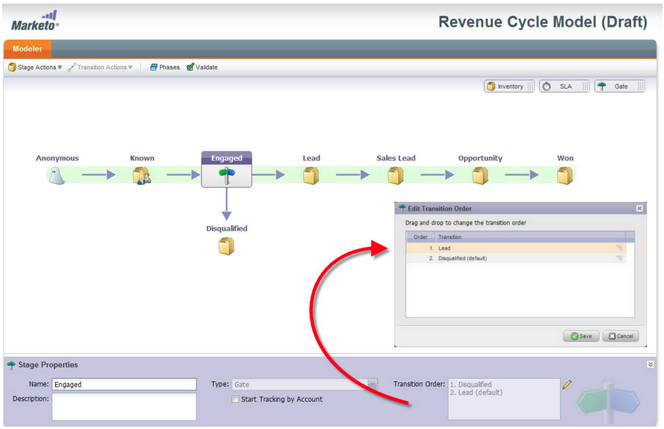

# Versionshinweise – April 2012 {#release-notes-april}

## Segmentierungsfilter und -Trigger {#segmentation-filters-and-triggers}

Sprechen Sie dieselbe Gruppe von Leads konsistent an? Ist dies der Fall, verwenden Sie die Segmentierung in Ihren Smart Lists für das Targeting von Leads. Bei der Segmentierung wird die gesamte Lead-Datenbank immer segmentiert und kann programmübergreifend wiederverwendet werden, um Konsistenz zu gewährleisten. Segmentierungsergebnisse werden schnell abgerufen, da die Smart-Liste zum Zeitpunkt der Anfrage nicht ausgeführt werden muss.

## Einfügen externer Werte in E-Mail-Inhalte und andere Flussschritte durch erweiterte API-Funktionen {#insert-external-values-into-email-content-and-other-flow-steps-through-expanded-api-capabilities}

* Mit der Request Campaign-API können Sie jetzt Werte für meine Token für diesen bestimmten Kampagnenvorgang senden. Dies ist besonders nützlich, um E-Mail-Inhalte über die API zu füllen
* Die neuen APIs zum Hochladen in Listen und Planen von Kampagnen unterstützen die oben genannten Listen von Leads und Batch-Kampagnen.

## Einfachere Bestätigungs-E-Mails für [!DNL GoToWebinar] und [!DNL WebEx] (Adobe Connect und [!DNL ON24] in Kürze!) {#easier-confirmation-emails-for-gotowebinar-and-webex-adobe-connect-and-on-coming-soon}

Wir haben die Bestätigungs-URL vereinfacht, indem wir ein Mitglieds-Token erstellt haben, das die eindeutige Registrierungs-Bestätigungs-URL für jeden Lead anzeigt. Sie müssen diese URL dann nicht mehr mit anderen Token erstellen. Dies ist derzeit für [!DNL GoToWebinar] und [!DNL WebEx] Kunden verfügbar und wird in unserer nächsten Version für Adobe Connect und [!DNL ON24] verfügbar sein.

## Laden Sie mehrere Bilder und Dateien mit einem Klick hoch! {#upload-multiple-images-and-files-with-a-single-click}

Sparen Sie Zeit und arbeiten Sie effizienter beim Importieren von Bildern und Dateien in Marketo! Wenn Sie [!DNL Firefox] oder [!DNL Google Chrome] verwenden, können Sie mehrere Dateien auswählen und sie alle gleichzeitig hochladen. Die Anzahl der Dateien, die Sie hochladen können, ist nicht beschränkt. Die individuelle Größenbeschränkung pro Datei beträgt jedoch 50 MB.

Hinweis: Aufgrund von Einschränkungen des Browsers wird diese Funktion derzeit nicht in [!DNL Internet Explorer] unterstützt.

## Text in eine E-Mail verschieben {#move-text-in-an-email}

Sie können Textblöcke in einer E-Mail neu anordnen. Wählen Sie im Texteditor einen Textblock aus. Wenn Sie auf das Bearbeitungssymbol klicken, wird die Option angezeigt, den Block nach oben oder unten zu verschieben.

## [!DNL Salesforce] für Nicht-[!DNL Salesforce]-Benutzer entfernt {#salesforce-references-removed-for-non-salesforce-users}

Wenn Sie Ihr Abonnement nicht mit [!DNL Salesforce] synchronisieren, werden Sie feststellen, dass alle Ordner und Flussaktionen, die auf [!DNL Salesforce] verweisen, entfernt werden.

## Marketo-Umsatzzyklusanalyse {#marketo-revenue-cycle-analytics}

**Verbesserte Gate-Stadien im Umsatzzyklus Modeler**

Ermöglicht Benutzenden, eine Reihenfolge für ihre Übergangsregeln zu definieren.

