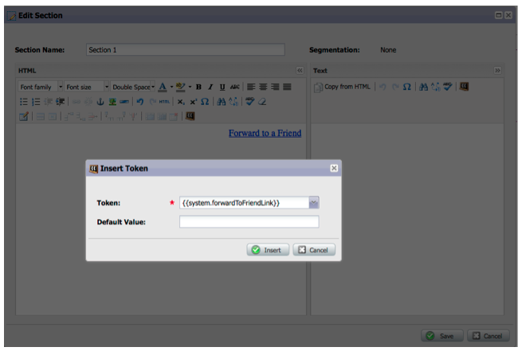

# Versionshinweise: Dezember 2012 {#release-notes-december}

Die Dezember-Version enthält die viel erwarteten **Weiterleiten an Freunde** und einige weitere Goodies! Beachten Sie, dass Funktionen, die mit einem Sternchen (&#42;) sind nur in der Select Edition und in RCA (Revenue Cycle Analytics) verfügbar.

## An einen Freund weiterleiten {#forward-to-friend}

Aktivieren Sie die Freigabe von Inhalten für andere, indem Sie eine **Weiterleiten an Freunde** in Ihren E-Mails. Das Hinzufügen neuer Filter und Trigger hilft Ihnen dabei, Ihre Einflussnehmer zu identifizieren, indem Sie sowohl die Benutzer, die eine E-Mail weitergeleitet haben, als auch diejenigen identifizieren, die die weitergeleiteten E-Mails erhalten haben.

So fügen Sie eine **Weiterleiten an Freunde** Einladung in Ihre E-Mail, öffnen Sie sie im Editor und fügen Sie die `{{system.forwardToFriendLink}}` Token.

Verwenden Sie die entsprechenden Trigger und Filter, um Benutzer zu identifizieren, die die **Weiterleiten an Freunde** und denen, die die E-Mail erhalten haben.

## Granulare Administratorberechtigungen {#granular-admin-permissions}

Unsere neueste Version bietet Ihnen mehr Zugriff und mehr Kontrolle über Admin-Rollen, indem Sie den Zugriff auf verschiedene Funktionen im Marketo Admin-Bereich für jede Rolle steuern. Wenn Sie eine neue Rolle erstellen, können Sie bestimmte Admin-Funktionen zuweisen, auf die diese Rolle zugreifen kann.

>[!NOTE]
>
>Standardmäßig haben vorhandene Rollen mit der Berechtigung &quot;Zugriff auf Admin&quot;Zugriff auf alle Admin-Funktionen, bis und sofern sie nicht geändert wurden.

## BrightTALK-Adapter {#brighttalk-adapter}

Mit dem Marketo BrightTALK-Adapter können Sie Besucherinformationen von einem Live- oder On-Demand-Webcast direkt in ein Marketo-Ereignis erfassen!

## Marketo Sales Insight für Microsoft Dynamics {#marketo-sales-insight-for-microsoft-dynamics}

Sales Insight ist jetzt für Microsoft Dynamics-Kunden verfügbar!

## Dynamics Opportunity Sync {#dynamics-opportunity-sync}

Synchronisieren von Opportunitätsdaten zwischen Marketo und Microsoft Dynamics.

## Bericht über Marketing-Einflussmöglichkeiten&#42; {#marketing-influenced-opportunities-report}

Zeigen Sie an, welcher Prozentsatz der Pipeline und des Umsatzes Ihres Unternehmens von Ihren Marketingprogrammen beeinflusst wurde. In **Umsatz-Explorer** können Sie nun benutzerdefinierte Berichte mit dem neuen gelben Punkt &quot;Marketing-beeinflusst-Chancen&quot;in der Opportunity Analysis erstellen. Sie können auch die beiden folgenden Berichte im Ordner Standard verwenden:

* Marketing-Einfluss auf erstellte Chancen
* Marketing-Einfluss auf Chancen - Abgeschlossen

## Benutzerdefinierte Opportunity-Felder in der Analyse von Programmchancen&#42; {#custom-opportunity-fields-in-program-opportunity-analysis}

Fügen Sie benutzerdefinierte Opportunity-Felder hinzu, um Ihre Berichte zur Analyse von Programmchancen in Umsatz Explorer anzureichern.

## Kampagnenprüfung {#campaign-inspector}

Haben Sie sich schon einmal gefragt, welche Kampagnen eine bestimmte Flow-Aktion verwenden, z. B. &quot;Score ändern&quot;oder &quot;Kampagne anfordern&quot;? Oder wo wird ein bestimmter Filter verwendet? Mit dem neuen Kampagneninspektor (verfügbar über die Schatzkiste) können Sie diese Kampagnen sowie aktive Kampagnen und Kampagnen mit Fehlern identifizieren.

Navigieren Sie zu **Admin** > **Schatztruhe** um die **Kampagneninspektor**.

