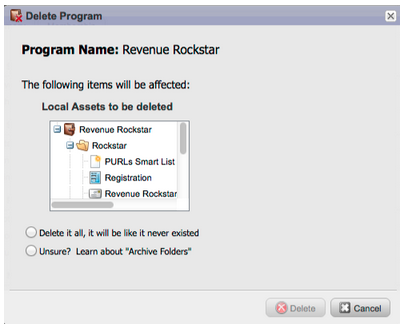

# Versionshinweise: Januar/Februar 2012 {#release-notes-jan-feb}

Die folgenden Funktionen sind in der Version vom Januar/Februar enthalten. Überprüfen Sie Ihre Marketo Edition auf die Verfügbarkeit der Funktionen. Kehren Sie nach der Veröffentlichung wieder zurück, um Links zu detaillierten Funktionsdokumentationen zu erhalten.

## Erweiterte dynamische Inhalte {#advanced-dynamic-content}

_Verfügbar für Pro- und Enterprise-Versionen_

Mit erweiterten dynamischen Inhalten können Sie ansprechende E-Mail-Nachrichten und Landingpages erstellen, die für Ihre Audience relevant sind, ohne mehrere Assets für dieselbe Nachricht erstellen zu müssen. Aktualisierte Previewer ermöglichen es Ihnen, jede einzelne Version in einem einzigen Bildschirm anzuzeigen.

## Segmentierung  {#segmentation}

_Verfügbar für Pro- und Enterprise-Versionen_

Die Segmentierung ist eine Gruppe von Segmenten, d. h. eine Zielgruppe von Einzelpersonen, an die Sie vermarkten. Segmente werden durch Regeln definiert, die durch Filterkriterien ähnlich wie Smart Lists gesteuert werden. Ihre Segmente können auf demografischen Daten basieren, z. B. Berufsbezeichnung oder Branche, oder auf Verhaltensweisen wie besuchten Web-Seiten oder angeklickten Links.

## Ausschnitte {#snippets}

_Verfügbar für Pro- und Enterprise-Versionen_

Speichern Sie umfangreiche Inhalte, die immer wieder verwendet werden können, um statische oder dynamische E-Mails und Landingpages zu erstellen.

## PURLs {#purls}

_Verfügbar für Pro- und Enterprise-Versionen_

Marketing-Experten können jetzt mithilfe von personalisierten URLs (PURLs) kontaktspezifische URLs erstellen, um die Personalisierung, Messbarkeit und Steigerung von Antworten in Multi-Touch-Marketing-Programmen sowohl für Briefpost- als auch für E-Mail-Kampagnen zu fördern.

## Unterstützung der EU-Datenschutzrichtlinie {#eu-privacy-directive-support}

Zu den neuen Funktionen zur Einhaltung der Einstellungen für „Do Not Track“ im Browser gehört die Möglichkeit, das Tracking für anonyme Leads zu deaktivieren. Dies erleichtert die Einhaltung der strengeren EU-Vorschriften zum Datenschutz-Tracking.

## Single Sign-on {#single-sign-on}

Unternehmen können jetzt über SAML 2.0 eine nahtlose Anmeldung bei der Marketo-Anwendung für einmaliges Anmelden über ein Unternehmensportal unterstützen.

## Aktualisierte E-Mail- und Landingpage-Editoren {#updated-email-and-landing-page-editors}

Die E-Mail- und Landingpage-Editoren wurden überarbeitet und bieten eine einladendere Benutzeroberfläche, eine intuitivere Navigation und ein deutlich verbessertes Benutzererlebnis. Dazu gehören:

Eine HTML- und Textansicht nebeneinander

Die Felder Absendername, Absender-E-Mail, Antwort an (NEU) und Betreff werden im Editor angezeigt. Alle anderen Einstellungen sind über die Schaltfläche Einstellungen bearbeiten verfügbar.

## Browser-Unterstützung {#browser-support}

* [!DNL Mozilla Firefox] 9,0
* [!DNL Google Chrome] 16
* [!DNL Microsoft Internet Explorer] 8 und 9
* **Hinweis**: [!DNL Internet Explorer] 7 wird nicht mehr unterstützt

## Programm-Management {#program-management}

Vereinfachte Programmverwaltung verbessert die Benutzerfreundlichkeit durch Token-Löschung und das einfachere Löschen von Programmen.

## Abonnement-Bericht kündigen {#unsubscribe-from-subscription-report}

Jetzt können Sie sich direkt aus dem Bericht vom Abonnement abmelden!

## Munchkin-Updates {#munchkin-updates}

Neue Munchkin-Aufrufe reduzieren die Ladezeiten von Web-Seiten und bieten eine konsistentere Leistung bei Link-Klickereignissen.

## Opportunity-Analyse im Programm (nur RCA) {#program-opportunity-analysis-rca-only}

Verstehen des Marketing-Beitrags zum individuellen Opportunity-Umsatz

## Stadienanalyse zum Programmumsatz {#program-revenue-stage-analysis}

Gewinnen Sie insight in die Geschwindigkeit der Programmleitung, indem Sie verstehen, welche Programme die schnellen Einsteiger erworben haben

