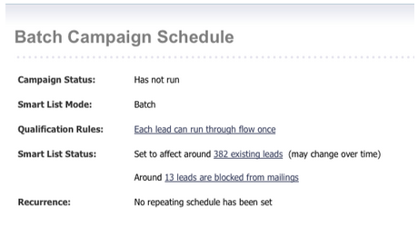

# Juni 2012 - Versionshinweise {#release-notes-june}

## Verbesserungen bei der Marketo-Lead-Verwaltung {#marketo-lead-management-enhancements}

### Umbenennen {#rename}

Sie können Ihre Smart-Listen, statischen Listen und Kampagnen umbenennen. Wenn Sie diese Assets in Filtern, Triggern oder Flüssen verwenden, wird der Name ebenfalls automatisch aktualisiert. Sie haben Ihre E-Mails, Formulare und Ordner immer umbenennen können.

Und als Bonus haben wir die Eingabe und Anzeige von Beschreibungstext für Assets verbessert.

## Feldzuordnung importieren {#import-field-mapping}

Wir haben den Listenimport in Marketo viel einfacher gemacht! Während des Importvorgangs können Sie den Namen des Marketo-Felds dem Spaltenüberschriftnamen in der Importdatei zuordnen. Darüber hinaus können Sie in Admin Aliasnamen festlegen, die dem Feldnamen in Marketo zugeordnet sind, und sicherstellen, dass Ihre Benutzer jedes Mal das richtige Feld auswählen.

Während Sie weiterhin Felder importieren und zuordnen, speichert Marketo die Zuordnungen während des Imports und zeigt sie an, um die Verwendung zu vereinfachen. Um das Leben noch einfacher zu gestalten, können Sie auf die Kopfzeile &quot;Beispielwert&quot;klicken, um die verschiedenen Werte anzuzeigen, die im Feld aufgefüllt werden sollen. Dadurch wird sichergestellt, dass Sie jedes Mal das richtige Feld zuordnen.

## Zusammenfassungsseite für Smart-Listen und statische Listen {#summary-page-for-smart-lists-and-static-lists}

Haben Sie sich schon einmal gefragt, wo Ihre Listen verwendet werden? Oder wer hat die Liste erstellt oder zuletzt geändert? Die neue Zusammenfassungsseite, die auf Smart-Listen und statischen Listen verfügbar ist, liefert Ihnen diese wichtigen Details.

Auf den vorhandenen Zusammenfassungs-Seiten für das Programm und die Kampagne haben wir das Erstellungsdatum/den Benutzer und auch die Informationen zum letzten Änderungsdatum/Benutzer hinzugefügt!

## Wird von für Assets verwendet {#used-by-for-assets}

Wir haben zu unseren Asset-Zusammenfassungsseiten eine neue Registerkarte namens Verwendet von hinzugefügt.

Beispiel: Verwendet von für statische Listen

## Einstiegsseiten-Rasterlinien {#landing-page-gridlines}

Durch das Hinzufügen von Raster-Linien für Landingpages wird die Ausrichtung von Text, Grafiken und Formularen auf Ihrer Landingpage deutlich vereinfacht. Aktivieren und deaktivieren Sie sie für jede Landingpage und passen Sie auch die Breite zwischen den Zeilen an!

## Von Sendungen blockierte Leads {#leads-blocked-from-mailings}

Wenn Sie eine Kampagne planen, können Sie auf den Link klicken, um die Liste der Leads anzuzeigen, die von Ihrem Mailing ausgeschlossen sind.

## Warteschritt: Lead-Token und My Token {#wait-step-lead-token-and-my-token}

In unserer Mai-Version haben wir dem Schritt Wartefluss erweiterte Optionen hinzugefügt. Mit diesen Änderungen können Sie einen Geschäftstag, ein Datum und eine Uhrzeit angeben. In dieser Version haben wir die Möglichkeit hinzugefügt, ein Token im Warteschritt zu verwenden. Sie können beispielsweise `{{lead.Birthday}}` um eine E-Mail zum Geburtstag zu senden oder `{{my.Event Date}}` , um eine endgültige Webinar-Erinnerung zu senden.

## Als Miniaturansichten in Design Studio anzeigen {#view-as-thumbnails-in-design-studio}

Schalten Sie Ihre Ansicht von einer Bildliste in eine Miniaturansicht um!

Hinweis: Ab dieser Version gilt die vorherige Sortierung bei Smart-List-Rastern nicht mehr für die nächste angezeigte Smart-Liste. Wenn Sie beispielsweise eine Smart-Liste nach Unternehmensname sortieren, wird die nächste angezeigte Smart-Liste nicht automatisch nach demselben Feld sortiert.

Erinnerung: E-Mail-Leistungsbericht wird aktualisiert!

## Verbesserungen bei Marketo-Umsatzwyklus Analytics {#marketo-revenue-cycle-analytics-enhancements}

### Neue Metriken in der Analyse von Programmchancen  {#new-metrics-in-program-opportunity-analysis}

Sie können jetzt Einblicke in die durchschnittliche Anzahl von Marketing-Touches erhalten, bevor Chancen erstellt oder geschlossen werden, sowie in den Durchschnittswert eines Marketing-Touches.

## Anzeigen mehrerer Diagramme {#displaying-multi-charts}

Mit der Funktion für mehrere Diagramme können Sie mehrere Diagramme in einem einzigen Umsatz-Cycle-Explorer-Bericht anzeigen. Beispielsweise können Sie diese Funktion verwenden, wenn Sie die gleichen Daten über verschiedene Monate hinweg anzeigen möchten. Diese Funktion verhindert auch, dass Sie separate Filter und Berichte erstellen müssen.

## Heatraster-Diagrammtyp  {#heat-grid-chart-type}

Mit Heatgrid können Sie Daten visualisieren, sodass Sie Muster der Marketing-Leistung identifizieren können. Mit diesem Visualisierungstyp können Sie Ihre Ergebnisse farbcodieren, sodass Sie komplexe Geschäftsanalysen in einer leicht verständlichen Visualisierung anzeigen können.

## Streudiagramm-Typ  {#scatter-chart-type}

Streudiagramme helfen Ihnen bei der Visualisierung von Daten über mehrere Dimensionen in einem Diagramm. Dieser Visualisierungstyp zeichnet basierend auf den verwendeten Attributen eine Blase in einem Diagramm. Sie können dann eine Kennzahl verwenden, um die Blase zu farbkodieren und/oder eine Kennzahl verwenden, um die Größe der Blase anzugeben.

