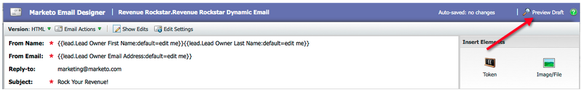
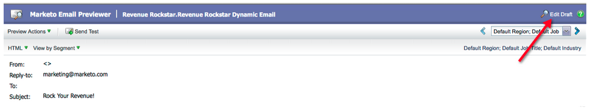

# Versionshinweise – März 2012 {#release-notes-march}

## Meine Token auflösen {#resolve-my-tokens}

Meine Token (Programm-Token) werden bei der Vorschau einer E-Mail, beim Senden einer Test-E-Mail und beim Senden einer lokalen E-Mail über eine einzelne Flussaktion aufgelöst. Sie müssen nicht mehr eine intelligente Kampagne innerhalb des Programms erstellen, um Ihre My Tokens zu testen!

## Zwischen Vorschau und Editor in E-Mails und Landingpages wechseln {#toggle-between-previewer-and-editor-in-emails-and-landing-pages}

Mit einem Klick können Sie ganz einfach zwischen Editor und Vorschau hin und her wechseln.

Editor für Vorschau:

Vorschau für Editor:

## Snippet-Vorschau {#snippet-previewer}

Wenn Sie im Menü „Ausschnitt in der Vorschau“ auswählen, können Sie einen Ausschnitt anzeigen, ohne ihn zu einem Entwurf zu machen. Wenn Sie nur Lesezugriff auf einen freigegebenen Ausschnitt (über Arbeitsbereiche) haben, können Sie den Ausschnitt mit dieser Aktion anzeigen.

## Mehrere Test-E-Mails senden {#send-multiple-test-emails}

Durch das Hinzufügen dynamischer Inhalte wird es immer wichtiger, alle Varianten der E-Mails, die an Ihre Leads gesendet werden können, in der Vorschau anzuzeigen und zu testen. Bei der Vorschau mit Nach Lead-Detail anzeigen haben Sie die Möglichkeit, einen Test für die Varianten aus der Lead-Liste zu senden (bis zu 100 Test-E-Mails).

## Dynamische Landingpages auf der Grundlage von URL-Parametern {#dynamic-landing-pages-based-on-url-parameter}

Anonyme Leads machen einen erheblichen Teil Ihrer Landingpage-Besuche aus. Durch das Hinzufügen dynamischer Inhalte und die Möglichkeit, die Segmentierung als Parameter in Ihre URL einzufügen, können Sie den Inhalt Ihrer Landingpage dynamisch anzeigen, wenn ein anonymer oder bekannter Lead auf den Link klickt.
