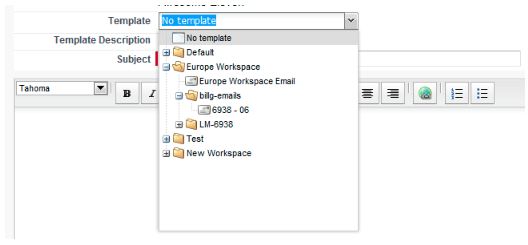

# Versionshinweise – Mai 2012 {#release-notes-may}

## Umgestaltung des E-Mail-Leistungsberichts {#email-performance-report-redesign}

Hinweis: Dies wird ein gestaffelter Rollout sein, beginnend mit der Mai-Version

Die Berichte E-Mail-Performance und Kampagnen-E-Mail-Performance wurden beschleunigt. Außerdem haben wir die Definitionen bestimmter Metriken verbessert und die Metriken „Gesendete Nachrichten“ und „Leads gesendet“ zu einer einzigen Metrik, „Gesendet“, zusammengefasst. Wir haben „Zugestellte Nachrichten“ und „Leads zugestellt“ zu „Zugestellt“ zusammengeführt.

## Verbesserungen bei Warteschritten {#wait-step-enhancements}

Mit den neuen erweiterten Warteeigenschaften können Sie den Warteschritt in einer Smart Campaign Flow-Aktion so konfigurieren, dass er bis zu einem bestimmten Wochentag, dem nächsten Werktag, einem bestimmten Datum oder einer bestimmten Uhrzeit „wartet“. Diese Verbesserungen stellen sicher, dass Ihre Pflege-E-Mails während der Geschäftszeiten im Posteingang eingehen!

Abbildung 1. Angeben, welcher Warteschritt an einem Geschäftstag beendet werden soll

## Archivierte Assets ausgeblendet {#archived-assets-hidden}

Archivierte Assets werden automatisch aus AutoSuggest, Dropdown-Menüs und Berichten gefiltert, was das Auffinden Ihrer gesuchten Inhalte erleichtert!

Abbildung 2. Beispiel für den Filter „Archivierte E-Mails“

## Neue App zum Einchecken von Ereignissen für iPad {#new-event-check-in-app-for-ipad}

Vereinfachen Sie Ihren Check-in-Prozess für Veranstaltungen mit unserer neuen iPad-App! Die Event Check-in-App synchronisiert sich mit Ihrem Marketo-Programm und ermöglicht Ihnen das einfache Einchecken von Teilnehmern in eine Veranstaltung sowie das spontane Hinzufügen neuer Leads.

Erfordert iOS 5.1 oder höher; nur iPad.

Abbildung 3. Startseite zum Einchecken von Ereignissen

Abbildung 4. Event-Check-In: Wählen Sie Ihre Veranstaltung!

Abbildung 5. Check sie in

## URL zur Bestätigung von erweiterten Webinaren {#enhanced-webinar-confirmation-url}

Jetzt für [!DNL ON24] und Adobe Connect verfügbar! Fügen Sie für jeden registrierten Teilnehmer mithilfe des neuen `{{member.webinar URL}}`-Tokens einen eindeutigen Link in die Bestätigungs-E-Mail ein. Zu den Adobe Connect-Verbesserungen gehört auch die Möglichkeit, die E-Mail mit den Adobe-Kontoinformationen, die die Anmelde-ID und das Passwort für den Benutzer enthalten, ein-/auszuschalten.

Abbildung 6. Personen zu Ihrem Webinar hinzufügen

## Vorlagenvorschau {#template-preview}

Sie suchen beim Erstellen Ihrer E-Mail oder Landingpage nach einer bestimmten Vorlage, sind sich aber nicht sicher, wie sie aussieht? Mit der neuen Vorlagenvorschau-Funktion können Sie die ausgewählte Vorlage überprüfen, bevor Sie ein neues Asset speichern!

Abbildung 7. Vorschau der ausgewählten Vorlage

## Konfigurierbares Vorbefüllen von Formularen {#configurable-form-prefill}

Steuern Sie das Vorausfüllen von Formulardaten auf Abonnementebene und das Überschreiben auf der Landingpage-Ebene. Ohne Vorausfüllen können Sie sicherstellen, dass der Lead die aktuellsten Informationen bereitstellt.

Abbildung 8. Konfiguration zum Vorbefüllen von Formularen in Admin

Abbildung 9. Bearbeiten der Einstellung zum Vorbefüllen von Formularen auf einer Landingpage

## Marketo Treasure Chest {#marketo-treasure-chest}

Zugriff auf experimentelle Funktionen, die von Marketo-Technikern entwickelt wurden, um das Anwendererlebnis zu verbessern. Diese Version umfasst das Rückgängigmachen von E-Mails sowie die Möglichkeit, Kommentare einzugeben und mit anderen Benutzern auf Ihren Landingpages zusammenzuarbeiten.

\

Abbildung 10. Manager Treasure Chest-Funktionen in Admin

## [!DNL Microsoft Dynamics]® CRM-Integration {#microsoft-dynamics-crm-integration}

Synchronisieren Sie Konten, Kontakte und Leads zwischen Marketo und [!DNL Microsoft Dynamics] CRM Online mithilfe unserer neuen vordefinierten Integration!

Abbildung 11. [!DNL Microsoft Dynamics]

## Marketo[!DNL Sales Insight]Produktverbesserungen {#marketo-sales-insight-enhancements}

**Optionen für Fußzeile abmelden**

Konfigurieren Sie, wann und ob die Abmelde-Fußzeile für E-Mails angezeigt wird, die über [!DNL Sales Insight] gesendet werden.

Abbildung 12. [!DNL Sales Insight] in Admin

## Ordner für Verkaufs-E-Mail-Vorlagen {#folders-for-sales-email-templates}

Sie können jetzt die mit Marketo [!DNL Sales Insight] freigegebenen E-Mail-Vorlagen in bestimmten Ordnern organisieren, um Ihren Vertriebsmitarbeitern die Suche nach der richtigen E-Mail zu erleichtern.

Abbildung 13. Ordner für E-Mails auswählen

## Zugriff auf Opportunity Analyzer über [!DNL Sales Insight] {#access-opportunity-analyzer-from-sales-insight}

Stellen Sie Ihren Vertriebsmitarbeitern insight zur Verfügung, in das die Marketing-Aktivitäten die Interaktion fördern, indem Sie direkten Zugriff auf den Opportunity Analyzer von Marketo [!DNL Sales Insight] aus nutzen. Hinweis. Erfordert die Lizenz für Revenue Cycle Analytics.

## Benutzerdefiniertes Feld für Kontaktstatus {#custom-field-for-contact-status}

Sie können jetzt ein benutzerdefiniertes Feld in zuordnen, [!DNL Salesforce] das Feld Status für Kontakte in den Meine besten Bets, Die besten Bets meines Teams und die benutzerdefinierten Ansichten auszufüllen.

Abbildung 14. Zuordnen eines benutzerdefinierten Felds zu Kontakten

Siehe von anonymen Leads besuchte Seiten

Führen Sie einen Drilldown zu den Seiten durch, die von einem anonymen Lead in der Ansicht [!UICONTROL Anonyme Web-Aktivität] angezeigt wurden.

Abbildung 15. Siehe Anonyme Web-Aktivität

## Verbesserter Lead und Kontakt Abonnieren {#enhanced-lead-and-contact-subscribe}

Folgen Sie einem Lead oder Kontakt jederzeit über die neue Schaltfläche Abonnieren auf der Seite Datensatzdetails .
