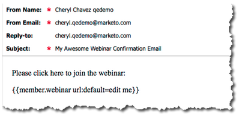

# Mai 2012 - Versionshinweise {#release-notes-may}

## Neugestaltung von E-Mail-Leistungsberichten {#email-performance-report-redesign}

Hinweis: Dies ist ein statisches Rollout, beginnend mit der Mai-Version

Die Berichte E-Mail-Leistung und E-Mail-Leistung von Campaign wurden schneller ausgeführt. Wir haben auch die Definitionen bestimmter Metriken verbessert und die Metriken &quot;Gesendete Nachrichten&quot;und &quot;Gesendete Nachrichten&quot;zu einer einzigen Metrik, &quot;Gesendet&quot;, zusammengefasst. Wir haben &quot;Zugestellte Nachrichten&quot; und &quot;Zugestellte Interessenten&quot; zu &quot;Zugestellt&quot; zusammengeführt.

## Verbesserungen beim Warten {#wait-step-enhancements}

Mit den neuen erweiterten Warteeigenschaften können Sie den Warteschritt in einer Aktion mit intelligentem Kampagnenfluss so konfigurieren, dass bis zu einem bestimmten Wochentag, dem nächsten Geschäftstag, einem bestimmten Datum oder einer bestimmten Uhrzeit gewartet wird. Diese Verbesserungen stellen sicher, dass Ihre Pflege-E-Mails während der Geschäftszeiten im Posteingang ankommen!

Abbildung 1. Festlegen des Warteschritts zum Beenden am Geschäftstag

## Archivierter Assets ausgeblendet {#archived-assets-hidden}

Archivierte Assets werden automatisch aus automatischen Vorschlägen, Dropdown-Menüs und Berichten gefiltert, um die Suche nach dem, was Sie suchen, zu vereinfachen!

Abbildung 2. Beispiel des archivierten E-Mail-Filters

## Neue Ereigniseincheckanwendung für iPad {#new-event-check-in-app-for-ipad}

Vereinfachen Sie Ihren Ereigniseincheckvorgang mit unserer neuen iPad-App! Die Check-in-App für Ereignisse wird mit Ihrem Marketo-Programm synchronisiert und ermöglicht es Ihnen, Registrierungspflichtige einfach in ein Ereignis einzuchecken sowie direkt neue Leads hinzuzufügen.

Erfordert iOS 5.1 oder höher; nur iPad.

Abbildung 3. Startseite für Ereigniseinchecken

Abbildung 4. Event Check In: Wählen Sie Ihr Event aus!

Abbildung 5. Einchecken

## Verbesserte Bestätigungs-URL des Webinars {#enhanced-webinar-confirmation-url}

Jetzt erhältlich für ON24 und Adobe Connect! Fügen Sie für jeden registrierten Teilnehmer mithilfe des neuen `{{member.webinar URL}}` -Tokens einen eindeutigen Link in die Bestätigungs-E-Mail ein. Adobe Connect-Verbesserungen umfassen auch die Möglichkeit, die E-Mail mit den Adobe-Kontoinformationen, die die Anmelde-ID und das Kennwort für den Benutzer enthält, zu aktivieren bzw. zu deaktivieren.

Abbildung 6. Personen in Ihr Webinar holen

## Vorlagenvorschau {#template-preview}

Suchen Sie beim Erstellen Ihrer E-Mail oder Landingpage nach einer bestimmten Vorlage, aber nicht sicher, wie sie aussieht? Mit der neuen Vorlagenvorschaufunktion können Sie die ausgewählte Vorlage vor dem Speichern eines neuen Assets überprüfen!

Abbildung 7. Vorschau der ausgewählten Vorlage anzeigen

## Konfigurierbare Formularvorfüllung {#configurable-form-prefill}

Steuerung der Vorpopulation von Formulardaten auf Abonnementebene und Überschreiben auf Landingpage-Ebene. Ohne Vorbelegung können Sie sicherstellen, dass der Lead die aktuellsten Informationen bereitstellt.

Abbildung 8. Vorfüllungskonfiguration für Formulare in Admin

Abbildung 9. Vorausgefüllte Formulareinstellung auf einer Landingpage bearbeiten

## Marketo Schatztruhe {#marketo-treasure-chest}

Erhalten Sie Zugriff auf experimentelle Funktionen, die von Marketo-Technikern entwickelt wurden, um Ihr Benutzererlebnis zu verbessern. Diese Version beinhaltet E-Mail-Rückgängig sowie die Möglichkeit, Kommentare einzugeben und mit anderen Benutzern auf Ihren Landingpages zusammenzuarbeiten.

\

Abbildung 10. Manager Treasure-Brustfunktionen in Admin

## Microsoft Dynamics® CRM-Integration {#microsoft-dynamics-crm-integration}

Synchronisieren Sie Konten, Kontakte und Leads zwischen Marketo und Microsoft Dynamics CRM Online mithilfe unserer neuen vordefinierten Integration!

Abbildung 11. Microsoft Dynamics-Konfiguration

## Verbesserungen bei Marketo Sales Insight {#marketo-sales-insight-enhancements}

**Fußzeilenoptionen abmelden**

Konfigurieren Sie, wann und ob die Abmelde-Fußzeile für E-Mails angezeigt wird, die über Sales Insight gesendet werden.

Abbildung 12. Sales Insight-Einstellungen in Admin

## Ordner für E-Mail-Vorlagen für Vertrieb {#folders-for-sales-email-templates}

Sie können jetzt die mit Marketo Sales Insight geteilten E-Mail-Vorlagen in bestimmten Ordnern organisieren, sodass Ihre Vertriebsmitarbeiter die richtige E-Mail finden können.

Abbildung 13. Ordner für E-Mails auswählen

## Zugriff auf Opportunity Analyzer aus Sales Insight {#access-opportunity-analyzer-from-sales-insight}

Stellen Sie Ihren Vertriebsmitarbeitern mithilfe des direkten Zugriffs auf Opportunity Analyzer aus Marketo Sales Insight Einblicke in die Marketingaktivitäten bereit, die die Interaktion fördern. Hinweis: Erfordert eine Analytics-Lizenz für den Umsatzzyklus.

## Benutzerdefiniertes Feld für den Kontaktstatus {#custom-field-for-contact-status}

Sie können jetzt ein benutzerdefiniertes Feld in Salesforce zuordnen, um das Feld Status für Kontakte in den &quot;Meine besten Bets&quot;, &quot;Besten Beten meines Teams&quot;und benutzerdefinierten Ansichten auszufüllen.

Abbildung 14. Benutzerdefiniertes Feld Kontakten zuordnen

Siehe Von anonymen Leads besuchte Seiten

Führen Sie über die Ansicht &quot;Anonyme Web-Aktivität&quot;einen Drilldown zu den von einem anonymen Lead angezeigten Seiten durch.

Abbildung 15. Siehe Anonyme Web-Aktivität .

## Verbessertes Lead- und Kontaktabonnement {#enhanced-lead-and-contact-subscribe}

Verwenden Sie die neue Schaltfläche Abonnieren auf der Seite mit den Datensatzdetails , um einen Lead zu folgen oder sich jederzeit an Sie zu wenden.
