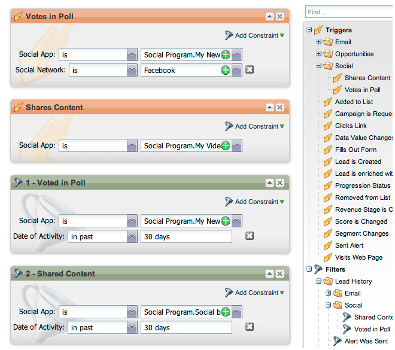
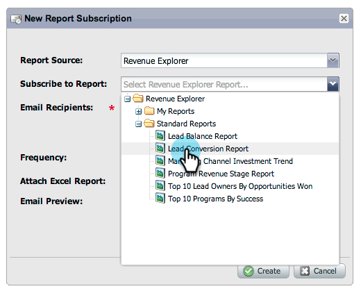

# Versionshinweise: Oktober 2012 {#release-notes-october}

Die Oktober-Version enthält weitere aufregende neue Funktionen! Social-Media-Funktionen sind als Add-on oder als Teil ausgewählter Bundles verfügbar.

## Programme und Programmaustausch importieren {#import-programs-and-program-exchange}

Ein Programm kann von einem Marketo-Abonnement in ein anderes importiert werden. Sie können beispielsweise ein Programm in einer Sandbox erstellen und es dann in Ihr Live-Abonnement importieren. Außerdem können Sie ein vordefiniertes Programm aus der Marketo-Programmbibliothek importieren.

>[!NOTE]
>
>Nur Marketo-Benutzer, denen von einem Marketo-Admin-Benutzer die Berechtigung erteilt wurde, können Programme importieren.
>
>Wenden Sie sich an den Marketo-Support, um ein Sandbox-Konto mit Ihrem Live-Abonnement zu verbinden.

## Benachrichtigungen {#notifications}

Benachrichtigungen halten Sie über Systemereignisse in Ihrem Marketo-Abonnement auf dem Laufenden. Beispielsweise benachrichtigt Sie das System automatisch, wenn eine Kampagne fehlschlägt oder Ihre CRM-Synchronisierung bearbeitet werden muss. Benachrichtigungen sind auf der Registerkarte Meine Marketo verfügbar. Darüber hinaus können Sie eine Benachrichtigung abonnieren, damit Sie sie in Echtzeit in Ihrer E-Mail erhalten können.

## Umfragen {#polls}

Erstellen Sie Umfragen, um Ihre Leads mit Ihren Inhalten zu interagieren! Sie können für ihr Lieblingsnetzwerk oder -film stimmen und dann die Umfrage über ihre sozialen Netzwerke mit Freunden teilen. Sie können umfangreiche Analysen darüber sammeln, wofür Ihre Leads gestimmt haben.

## Verfolgen von Social-Media-Aktivitäten {#track-social-activities}

Finden Sie heraus, wer Ihre Inhalte und Ihre Stimme in Ihren Umfragen geteilt hat, indem Sie Smart Lists erstellen, die auf bestimmten sozialen Aktivitäten basieren. Erstellen Sie beispielsweise eine intelligente Kampagne, um die Punktzahl der Leads zu erhöhen, die Ihre Inhalte am häufigsten teilen!

## Soziale Profile {#social-profiles}

Sie können jetzt Informationen über Ihre Leads sammeln, wenn diese Inhalte teilen oder Formulare mithilfe ihrer Social-Media-Profile ausfüllen. Dazu gehören [!DNL Facebook]-, [!DNL LinkedIn]- und [!DNL Twitter]-Griffe, die Anzahl der Freunde und mehr.

## [!UICONTROL Revenue Explorer] Berichtsabonnements {#revenue-explorer-report-subscriptions}

Erstellen Sie Berichtsabonnements und senden Sie [!UICONTROL Revenue Explorer]-Berichte regelmäßig an Ihre wichtigsten Stakeholder, einschließlich Nicht-Marketo-Benutzender. Die E-Mail enthält eine Vorschau Ihrer Berichtsdatentabelle(n) und eine [!DNL Excel] Tabelle mit allen Berichtsdaten.

>[!NOTE]
>
>Nur für Benutzer verfügbar, die [!UICONTROL Umsatz-Explorer] durch den Kauf von Umsatzzyklusanalysen mit Enterprise oder Select Edition haben.
