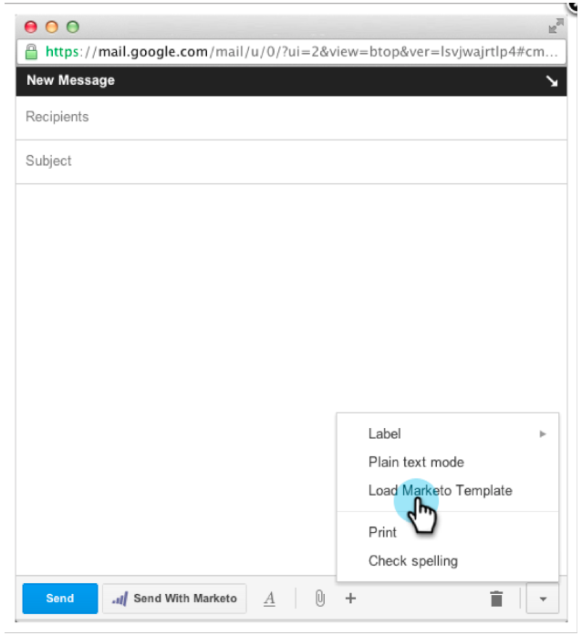

# Versionshinweise – April 2013 {#release-notes-april}

Die folgenden Funktionen sind in der Version vom April enthalten.

## [!DNL Box]-Integration {#box-integration}

Verbinden Sie Marketo mit Ihrem [!DNL Box]-Konto, um Dateien einfach in das Design-Studio zu kopieren.

## Plug-in [!DNL Gmail] {#gmail-plugin}

Wenn Sie sowohl Marketo [!DNL Sales Insight] als auch [!DNL Gmail] verwenden, können Sie unser neues [!DNL Gmail]-Plug-in über den [!DNL Chrome] Store installieren. Mit dem Plug-in können Sie Nachrichten mit Marketo protokollieren, Marketo-E-Mail-Vorlagen laden und Nachrichten mit Marketo-Tracking-Funktionen senden.

## E-Mail-Analyse {#email-analysis}

Erweiterte E-Mail-Berichte im [!UICONTROL Umsatz-Explorer] erstellen, z. B. den Bericht zum Klick-Aktivitäts-Wärmenraster . Dieser Bericht gibt insight Aufschluss über den Tag und die Uhrzeit, zu der Personen auf Links in Ihren E-Mails klicken.

Die E-Mail-Analysefunktion wird während der Migration Ihrer E-Mail-Daten für 2012 und 2013 schrittweise im April und Mai aktiviert. Mit anderen Worten, einige Kunden werden früher Zugriff auf diese Funktion haben als andere.

## Programm-APIs {#program-apis}

Unterstützung für Programme im SOAP-API-Aufruf, einschließlich Nur-Lese-Zugriff auf Programmdaten wie: Anzahl der Programmmitgliedschaften, Erworben von, Erfolg, Einstellungen, Kanäle, Tags, Token und Kosten. Weitere Informationen finden Sie in der Dokumentation zur SOAP-API .

## [!DNL ON24] {#on-enhancement}

Tätigkeitsbezeichnung und Firmenname werden mit [!DNL ON24] aus Ihrem Marketo-Registrierungsformular synchronisiert.
