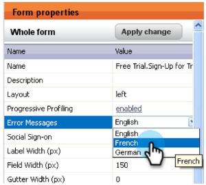

# Versionshinweise: Januar 2013 {#release-notes-january}

Die Version vom Januar erweitert unser Social-Media-Angebot um **Empfehlungsangebote**. Darüber hinaus können Benutzende der Marketo-Lead-Verwaltung die Voreinstellungen für Zeitzone, Sprache und Gebietsschema festlegen. Bitte beachten Sie, dass Funktionen, die mit einem &#42; gekennzeichnet sind, nur in der Select Edition verfügbar sind.

## Empfehlungsangebote {#referral-offers}

Ein **Empfehlungsangebot** bietet Ihren Leads einen Anreiz, ihre Freunde zu verweisen. Erstellen Sie Ziele und Belohnungen für erfolgreiche Empfehlungen. Sie können ihn auf Landingpages, auf Ihrer Website und sogar in Facebook verwenden.

## Voreinstellung für Zeitzone {#time-zone-preference}

Sie können die Standardzeitzone für Ihr persönliches Marketo-Konto ändern. Selbst wenn der Standardwert für das Abonnement beispielsweise Pacific Time ist, können Sie ihn für Ihr eigenes Konto in Eastern Time ändern.

## Marketo Lead-Management-Sprache auswählen {#select-your-marketo-lead-management-language}

Sie können die Standardsprache für Ihr Marketo-Benutzerkonto ändern. Selbst wenn der Standardwert für das Abonnement Englisch ist, können Sie ihn für den Eigengebrauch in Deutsch oder Französisch ändern.

## Mehrsprachige Formularfehlermeldungen {#multi-lingual-form-error-messages}

Wenn ein Lead ein Marketo-Formular ausfüllt, werden einige Validierungsmeldungen automatisch integriert. Sie können für diese Fehlermeldungen eine andere Anzeigesprache auswählen. Wir unterstützen jetzt Englisch, Deutsch und Französisch.

Beispiel für ein französisches Formular:

## Wählen Sie Ihre Sales Insight-Sprache aus (nur Salesforce) {#select-your-sales-insight-language-salesforce-only}

Wenn Ihre Salesforce-Spracheinstellung auf Französisch oder Deutsch festgelegt ist, wird diese Einstellung von Marketo Sales Insight berücksichtigt. Laden Sie das neueste MSI-Paket herunter, um diese Funktion zu erhalten (verfügbar in der Woche vom 14. Januar).

## Anzeigename des Feldes {#field-display-name}

Anzeigenamen in Feldern können Text in verschiedenen Sprachen anzeigen (z. B. werden Multi-Byte-Zeichen unterstützt).

## Programmdaten ändern {#change-program-data}

Mit dem Schritt Programm-Datenfluss ändern können Sie den Erfolgsstatus und das Erfolgsdatum eines Programmmitglieds manuell über eine Kampagne ändern. Sie können diesen Flussschritt verwenden, um einen Fehler zu korrigieren oder ein Mitglied, das möglicherweise nicht wie vorgesehen am Programm teilgenommen hat, manuell zu ändern.

