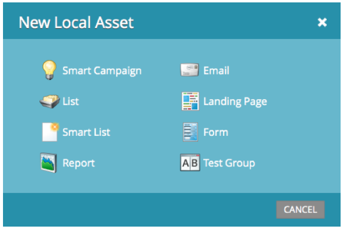

# Versionshinweise – Juli 2013 {#release-notes-july}

Die folgenden Funktionen sind in der Juli-Version enthalten, die für Freitag, den 26. Juli, geplant ist.

## Widget „Erschöpfter Inhalt“ im Dashboard {#exhausted-content-widget-on-the-dashboard}

Enthält Informationen dazu, wann Leads den Inhalt im Stream abschließen. Das System informiert Sie darüber, wie viele Leads bald erschöpfte Inhalte erreichen werden oder wie lange die Leads erschöpft sind.

## Kommunikationsbeschränkungen {#communication-limits}

Möchten Sie verhindern, dass Leads zu oft per E-Mail verschickt werden? Jetzt ist es einfach, die Frequenz automatisch auf jeden einzelnen zu begrenzen. Legen Sie einfach ein tägliches und wöchentliches Kommunikationslimit fest, und das System erledigt den Rest. Verfügbar in Select, Enterprise und mit dem Add-On-Paket für Standard-Kunden.

## Cobalt-Benutzeroberfläche {#cobalt-user-interface}

In den nächsten Monaten werden Sie feststellen, dass mehr von unserem neuen Thema in verschiedenen Teilen der Anwendung eingeführt wird. Es werden keine Funktionen verschoben oder entfernt.

## Datumsspalte für Programmteilnehmer {#program-member-date-column}

Zeigen Sie das Elementraster an und sortieren Sie es nach dem Datum, an dem der Lead hinzugefügt wurde.

## Änderungen an der Rechtschreibprüfung im WYSIWYG-Editor {#changes-to-spell-check-in-wysiwyg-editor}

Der vom WYSIWYG-Editor für die Rechtschreibprüfung verwendete Service wurde eingestellt. Wir haben die Schaltfläche für die Rechtschreibprüfung aus dem Editor entfernt, bis wir einen Ersatz gefunden haben.
