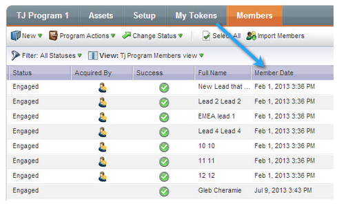

# Juli 2013 - Versionshinweise {#release-notes-july}

Die folgenden Funktionen sind in der Juli-Version enthalten, die für einen Freitag, den 26. Juli geplant ist.

## Widget &quot;Abgelaufener Inhalt&quot;im Dashboard {#exhausted-content-widget-on-the-dashboard}

Bietet Informationen darüber, wann Leads den Inhalt im Stream ausfüllen. Das System stellt Ihnen Informationen darüber bereit, wie viele Leads bald erschöpfte Inhalte erreichen werden oder wie lange Leads erschöpft sind.

## Kommunikationsbeschränkungen {#communication-limits}

Möchten Sie verhindern, dass Leads übermäßig per E-Mail versendet werden? Jetzt ist es einfach, die Frequenz automatisch auf jeden einzelnen zu begrenzen. Legen Sie einfach eine tägliche und wöchentliche Kommunikationsgrenze fest, und das System wird den Rest erledigen. Verfügbar in Select, Enterprise und mit dem Add-On-Paket für Standardkunden.

## Cobalt-Benutzeroberfläche {#cobalt-user-interface}

In den nächsten Monaten werden Sie mehr von unserem neuen Thema in verschiedenen Teilen der Anwendung sehen. Es werden keine Funktionen verschoben oder entfernt.

## Spalte mit dem Datum des Programmteilnehmers {#program-member-date-column}

Zeigen Sie das Mitgliederraster nach dem Datum an, an dem der Lead hinzugefügt wurde, und sortieren Sie es.

## Änderungen an der Rechtschreibprüfung im WYSIWYG-Editor {#changes-to-spell-check-in-wysiwyg-editor}

Der vom WYSIWYG-Editor für die Rechtschreibprüfung verwendete Dienst wurde eingestellt. Wir haben die Schaltfläche &quot;Rechtschreibprüfung&quot;aus dem Editor entfernt, bis wir einen Ersatz gefunden haben.
