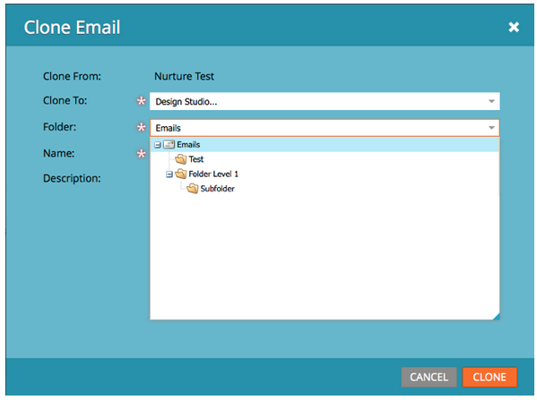

# Versionshinweise – Juni 2013 {#release-notes-june}

Die folgenden Funktionen sind in der Version vom Juni enthalten.

## Zusätzliche Benutzersprachen {#additional-user-languages}

Sehen Sie sich die Marketo-Lead-Management-Oberfläche in Ihrer bevorzugten Sprache an - jetzt wird Spanisch und Portugiesisch unterstützt.

## Cobalt-Benutzeroberfläche {#cobalt-user-interface}

In den nächsten Monaten wird ein neues Design in verschiedenen Teilen des Programms eingeführt werden, was sich beispielsweise auf modale Fenster auswirkt.

## Klonen von Unterordnern {#subfolder-cloning}

Klonen von Assets in Unterordnern.

## Mehrere Modelle {#multiple-models}

Diese Funktion ist eine hervorragende Idee für die Analyse des Umsatzzyklus (Revenue Cycle Analytics, RCA) in der Community und ermöglicht es Ihnen, mehrere Modelle zu erstellen, um einen detaillierteren Überblick über Ihren Umsatz mit funnel nach Produktlinie, Geschäftseinheit oder Region zu erhalten. Die Berichte Leads nach Umsatzstadium, Erfolgspfad-Analyzer, Programm-Analyzer und Umsatz-Explorer unterstützen jetzt die Möglichkeit, ein bestimmtes Berichtsmodell auszuwählen.

Standardmäßig sind zwei Modelle für Select SMB Edition und fünfzehn Modelle für Enterprise Edition verfügbar. Sie können auch zusätzliche Modelle erwerben.

