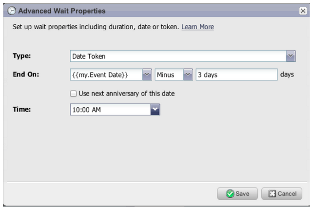

# Versionshinweise – März 2013 {#release-notes-march}

Die folgenden Funktionen sind in der -Version vom März enthalten.

## Marketo-Kalenderdateien {#marketo-calendar-files}

Erstellen Sie eine Kalenderdatei als **Mein Token** zur Verwendung in Ihren Ereignis-Bestätigungs- und Erinnerungs-E-Mails. Diese integrierte Kalenderdatei (z. B. .ics-Datei) rendert alle Token, einschließlich My Tokens und `{{member.webinar URL}}` Token.

## Warten bis +/- {#wait-until}

Erstellen Sie Warteschritte, die eine bestimmte Anzahl von Tagen vor oder nach einem Datumstoken ausführen können. Sie können beispielsweise einen Warteschritt erstellen, der 3 Tage vor dem Ereignisdatum wartet und dann eine Erinnerung sendet!

Sie können einen Warteschritt erstellen, der 14 Tage vor dem Geburtstag des Leads wartet. Durch Auswahl von „Nächsten Jahrestag dieses Datums verwenden“ ignoriert das System automatisch das mit dem Datum verknüpfte Jahr und verwendet stattdessen das aktuelle oder nächste Kalenderjahr.

## Gewinnspiele in sozialen Netzwerken {#social-sweepstakes}

Ein Gewinnspiel gibt Ihren Leads die Chance, einen Preis zu gewinnen und ihre Freunde über Sie zu informieren. Sie wählen aus den Teilnehmern zufällige Gewinner aus und senden ihnen eine E-Mail.

## Zusätzliche [!UICONTROL &#x200B; (Fehlermeldung] Sprachen {#additional-form-error-message-languages}

Mehr als ein Dutzend Sprachen wurden zu den Formularfehlermeldungen hinzugefügt!

## Support-Nachrichten und -Warnhinweise {#support-news-and-alerts}

Bleiben Sie in Verbindung mit dem Marketo-Kunden-Support, indem Sie die Supportnachrichten und Warnhinweise für P1-Warnhinweise, bekannte Probleme, Hinweise und Tipps unserer Support-Experten und Updates vom Marketo-Kunden-Support abonnieren.
