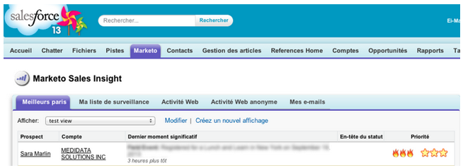

# Versionshinweise: September 2013 {#release-notes-september}

Die folgenden Funktionen sind in der Version vom September enthalten.

## Kürzere URLs {#shorter-urls}

Die E-Mail-URLs wurden gekürzt, um die Benutzerfreundlichkeit für den Empfänger zu erhöhen. Die Funktionen zur Nachverfolgung bleiben hiervon unberührt.

>[!CAUTION]
>
>Wenn wir zu kurzen URLs wechseln, laufen Links in E-Mails, die vor der September-Version gesendet wurden, 90 Tage nach dieser Version ab.

Verwenden Sie Daten aus benutzerdefinierten Marketo-Objekten oder fügen Sie Ihrem E-Mail-Inhalt mithilfe der Velocity-Vorlagensprache eine bedingte Logik hinzu.

## Ändern von „Test senden“ zum Senden von Beispielen {#change-send-test-to-send-sample}

Die Aktion Test senden wurde in Beispiel senden umbenannt

## Personalisierte Beispiel-E-Mail senden {#personalized-send-sample-email}

Wenn Sie ein E-Mail-Beispiel senden, können Sie den Namen eines Leads auswählen, um die Beispiel-E-Mail zu personalisieren.

## Synchronisierung zusätzlicher Felder für GoToWebinar {#additional-field-sync-for-gotowebinar}

Sie können den Firmennamen und die Stellenbezeichnung aus Ihrem Marketo-Formular mit GoToWebinar synchronisieren. Um diese zusätzlichen Felder zu aktivieren, gehen Sie zu Ereignispartner und aktivieren Sie „Zusätzliche Felder aktivieren“.

## Benutzeranmeldung auf SSO beschränken {#restrict-user-login-to-sso-only}

Konfigurieren Sie Abonnements so, dass sich Marketo-Benutzer nur über SSO und nicht über den normalen Anmeldebildschirm anmelden können

## Virenüberprüfung der hochgeladenen Dateien {#virus-scan-of-uploaded-files}

Die in Design Studio hochgeladenen Dateien werden nun automatisch überprüft und im Falle eines Virenfunds blockiert.

## Analyzer für Opportunity-Einfluss exportieren {#export-opportunity-influence-analyzer}

Sie können jetzt die Daten im Opportunity Influence Analyzer nach Excel exportieren. Jede exportierte Excel-Datei enthält alle Marketing-Interaktionen für alle Leads (einschließlich derjenigen ohne Rolle in der Opportunity) sowie alle Opportunitys unter dem ausgewählten Konto im Analyzer. Die Opportunity-Zeilen sind grün hervorgehoben. Sie können die nativen Datenfilterfunktionen von Excel verwenden, wenn Sie sich auf bestimmte Leads oder Marketing-Aktivitäten konzentrieren müssen.

## Programmzuordnung – Einstellungen {#program-attribution-settings}

Sie können die Art und Weise ändern, wie Marketo Kontakte und Chancen für Erstkontakt- und Multi-Touch-Attributionsmetriken verknüpft, einschließlich der Möglichkeit, kontobasierte Attributionen durchzuführen. Diese Einstellungen wirken sich auf Attributionsmetriken in Umsatz-Explorer-Berichten im Programm-Opportunity-Analysebereich und im Opportunity-Analysebereich aus. Dies wirkt sich auch auf die Attributionsmetriken in Program Analyzer aus.

Sie können die Einstellungen für die Programmzuordnung in eine von drei Optionen ändern. Wenn Sie diese Einstellung ändern, werden keine Marketo- oder CRM-Daten geändert. Sie ändern lediglich die Ausführung Ihrer Berichte und können jederzeit rückgängig gemacht werden.

Mit der Einstellung Explizit werden nur Kontakte mit Rollen geprüft (aktuelles Verhalten). Implizit werden alle mit dem Konto verbundenen Kontakte unabhängig von der Rolle untersucht. Es wird dringend empfohlen, nach Möglichkeit den Modus Explizit zu verwenden. Die Verwendung von Implizit kann zu falsch positiven Ergebnissen führen, d. h. zu Personen, die eine Opportunity als kreditwürdig erachten, obwohl sie keinen echten Einfluss auf die Opportunity haben.

## Sales Insight auf Französisch und Deutsch verfügbar (nur Salesforce) {#sales-insight-available-in-french-and-german-salesforce-only}

Laden Sie die neueste Version von Marketo Lead Management und Marketo Sales Insight von AppExchange herunter, damit Ihre französischen und deutschen Vertriebsmitarbeiter Sales Insights in ihrer bevorzugten Sprache anzeigen können.

## Cobalt-Benutzeroberfläche {#cobalt-user-interface}

In den nächsten Monaten wird ein neues Design in verschiedenen Bereichen des Programms eingeführt. In diesem Monat werden Sie möglicherweise mehr neue blaue modale Fenster bemerken.
