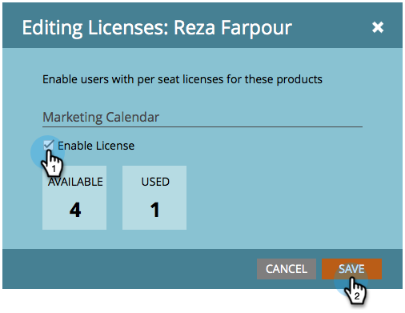

# Versionshinweise: August 2014 {#release-notes-august}

Die folgenden Funktionen sind in der Version vom August 2014 enthalten. Überprüfen Sie Ihre Marketo Edition auf die Verfügbarkeit der Funktionen. Kehren Sie nach der Veröffentlichung wieder zurück, um Links zu detaillierten Funktionsdokumentationen zu erhalten.

## Marketing-Kalender-Lizenzen {#marketing-calendar-licenses}

Nach dem 5. September 2014 haben nur noch 5 Benutzer freien Zugang zum Marketing-Kalender. Stellen Sie sicher[ dass Sie den Benutzern Ihrer Wahl zuvor eine Marketing-Kalender](/help/marketo/product-docs/core-marketo-concepts/marketing-calendar/understanding-the-calendar/issue-revoke-a-marketing-calendar-license.md)Lizenz erteilen/widerrufen, um einen unterbrechungsfreien Zugriff zu erhalten.

## Berechtigungen für neue Benutzer {#new-user-permissions}

Die folgenden neuen Benutzerberechtigungen wurden hinzugefügt:

| Berechtigung | Beschreibung |
|---|---|
| Auf Revenue Explorer zugreifen | Wenn Sie RCA erworben haben, haben Sie jetzt die Kontrolle darüber, wer darauf zugreifen kann. |
| Liste importieren | Benutzer vom Import von Listen in die Lead-Datenbank ausschließen. |
| Listenimport | Benutzer vom Import von Listen über ein Programm unter Marketing-Aktivitäten ausschließen. |
| Auslöser-Kampagne aktivieren | Legen Sie fest, wer Trigger-Kampagnen aktivieren darf und wer nicht. |
| Stapel-Kampagne planen | Kontrollieren, wer Batch-Kampagnendurchgänge planen kann und wer nicht. |

## Benutzer und Rollen aus Admin exportieren {#export-users-and-roles-from-admin}

Sie können jetzt [Liste der Benutzer und Rollen exportieren](/help/marketo/product-docs/administration/users-and-roles/export-a-list-of-users-and-roles.md) aus Marketo. Sie können auch einen Zeitstempel „Letzte Anmeldung“ einfügen, der in den Export aufgenommen wird.

## Löschen von Kanälen und Tags {#delete-channels-and-tags}

Sie können jetzt alle nicht verwendeten Kanäle und Status löschen. Wie immer können Sie nur ein derzeit verwendetes ausblenden.

## Automated DKIM {#automated-dkim}

Um die Zustellbarkeit zu verbessern, werden alle ausgehenden E-Mails mit DKIM (DomainKeys Identified Mail) signiert. Standardmäßig verwenden E-Mails die freigegebene DKIM-Signatur von Marketo. Sie haben die Möglichkeit, diese Signatur anzupassen.

>[!NOTE]
>
>DKIM wird langsam eingeführt. Sie werden es möglicherweise erst in einigen Wochen sehen.

## Echtzeit-Personalization-Updates {#real-time-personalization-updates}

Wir haben der Kampagnenseite Kennzeichnungen hinzugefügt, damit Sie Ihren Heart-Inhalten Tags hinzufügen können.

## Mobile Targeting {#mobile-targeting}

Du hast nach der Community gefragt und wir haben geliefert! Sie können jetzt einen bestimmten Aktionsaufruf für Mobil- und Tablet-Benutzer ein- oder ausschließen oder festlegen.

## Verbesserte 1:1-Segmentierung und -Zielgruppenbestimmung {#enhanced-segmentation-and-targeting}

Sie können jetzt erweiterte Filteroperatoren verwenden, um bekannte Besucher als Zielgruppe anzusprechen.

## Kampagnenfreigabe {#campaign-sharing}

Sie haben jetzt die Möglichkeit, einen Vorschau-Link für eine RTP-Kampagne schnell und einfach freizugeben.

## Bericht zur Inhaltsempfehlungs-Engine {#content-recommendation-engine-report}

Wir haben einen neuen Bericht zur Inhaltsempfehlungs-Engine hinzugefügt, damit Sie eine schöne Zusammenfassung sehen können.

## Verbesserte Benutzerverwaltung {#enhanced-user-administration}

Admin-Benutzer können jetzt Benutzer aufgrund mehrerer fehlgeschlagener Anmeldeversuche sperren. Sie können diese Benutzer bei Bedarf auch entsperren.

## Trackingkontrolle {#tracking-control}

Sie können jetzt bestimmte IPs aus allen Tracking- und Reporting-Funktionen in Real-Time Personalization ausschließen.

